# Lecture 10

- [Lecture 10](#lecture-10)
  - [Video](#video)
  - [Cluster contd](#cluster-contd)
  - [Cluster Middleware](#cluster-middleware)
  - [Features Of SSI](#features-of-ssi)
  - [SSI Support: Options/Layers](#ssi-support-optionslayers)
  - [MOSIX](#mosix)

## Video

[link](https://drive.google.com/file/d/1xaH2Iur7VxUmy5rZ8YBIW-57vyqgyF-v/view)

## Cluster contd

- middleware is responsible to provide a single system view
- interconnect could be ethernet, or high-speed interconnect = infiband, etc(provide cut-through switching etc)

## Cluster Middleware

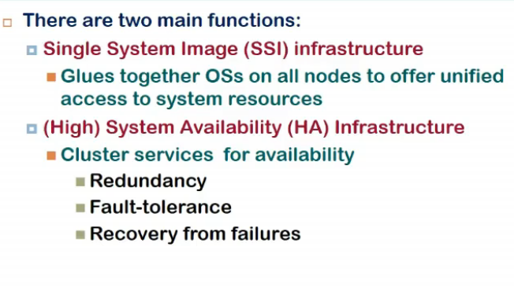

- SSI is difficult to achieve

## Features Of SSI

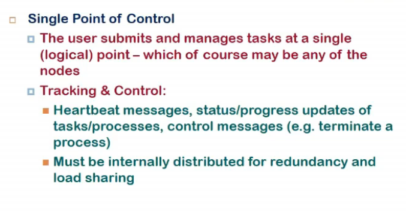

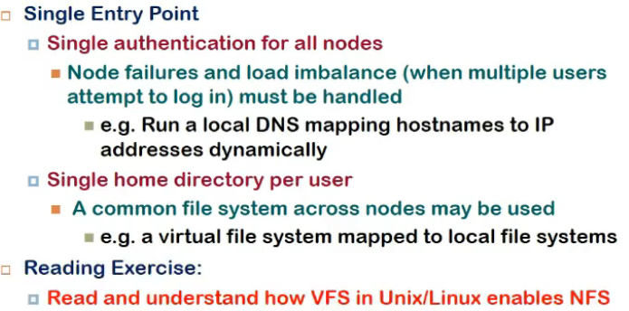

- should provide single point of control
- one should be able to submit job at one point(node) and control/see progress from there
- how implemented?
  - node which is taking job = master node
  - master node should be able to keep track of whether other nodes are alive, what is resource consumption by them, will free node be able to take up job, etc

- Single entry point
  - => single authentication
  - har system ke lie new username pwd nahi chahiye
  - nodes identified with the help of thier IP address
  - a local dns will give a  new system cyclically
  - changing pwd along one system should change in all

- Single home directory per user
  - har system me same view

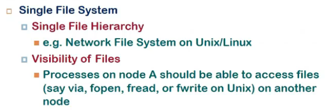

- Single File system
  - har system ka alag alag file system ho sakta but user ke lie ek hi dikhna chahiye
  - NFS se hota na

- Single I/O space
  - USB connect kari ek device pe, sabme dikhni chahiye
  - difficult to implement and hence not common

- Single memory
  - difficult
  - sabki alag alag memory hoti and not accessible from some other computer
  - single address space..
  - overhead hai abhut, dekho address and all, so tradeoff hai, dekho benefit ho bhi ra ya nahi

- Sinle process space
  - all processes across all systems are visible to me
  - I can create a process in sys 1 and send signal to a process to sys2, diff to achieve, overhead hai
  - I can send msg to any process/system, and all

## SSI Support: Options/Layers

- SSI can be implemented at ddifferent levels
- at hardware level 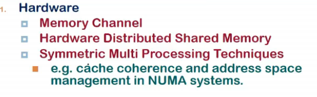
  - it is expensive
  - memory channel
    - h/w itself can over the n/w hear instructions, do the changes, retrieved data etc
    - distributed shared memory
      - similar to NUMA
      - access times will be diff depending upon local access or not

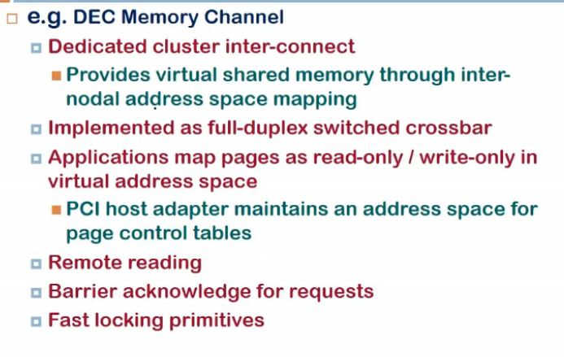

- address mapping
  - all memory mapped to same virtual address space
  - access kia, if in same node, ok, else channel pe bhej de

- OS Level 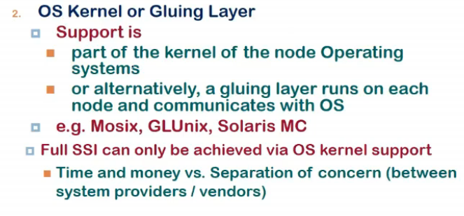
  - os across cluster nodes communicate with each other and provide single image to user atleast for that particular feature
  - implementation?
    - ek module hai running within node that can talk to the os
    - suppose ek system call karni, open a file present in not current os, gluing layer has to interpret ki req kisi aur ko bhejni ya nahi, also os me hanges chahiye, os that comes by default might not understand these things.
- Full SSI can only be achieved using kernel support
  - library level pe difficult
  - single process address space mushkil, bcz os lvel pe treat hota by default

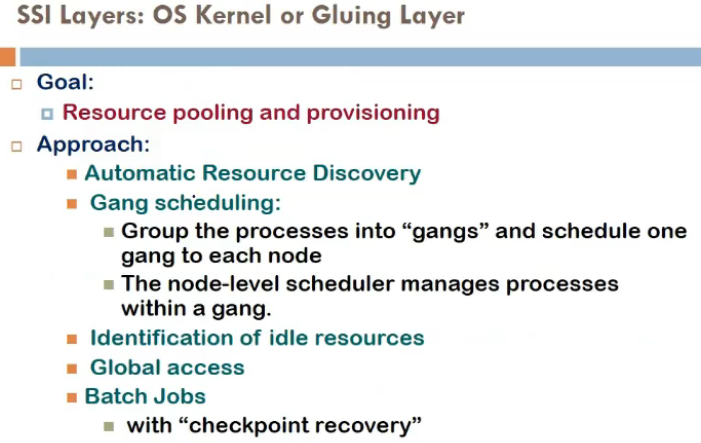

- at the os level, what is approach taken?
  - resource pooling
  - os should identify memory avail across the system and so on
  - automatic resource discovery
    - w/o manual intervention
    - identifying free memory, space, etc
  - gang scheduling
    - dekh coordination hoga kuch jobs ke beech me
      - maan le 10 threads hai and 2-3 bahut communicate kar rahe, unko ek saath schedule kar, this is called **gang scheduling**, then latency involved will reduce and throughput increase

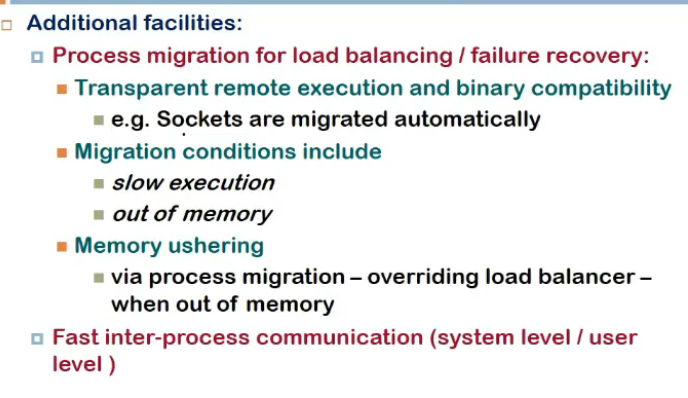

- Process Migration
  - load balancing?
    - agar resources scarce ho gaye ek system pe, toh process ko migrate karna hoga dusre system pe
  - migration should be transparent
    - end user ko pata nahi chalna chahiye, servic einterruption nahi hona chahiye
  - memory ushering
    - bahut thrashing ho rahi, tab bhi migrate karle
  - How to migrate?
    - load balancing
      - no system gets over/under loaded
      - memory with a process is enough to complete task

- Now is User LEvel
  - using libraries and user leve programs
  - efficient to deal with
  - os level pe overhead and all hota
  - shared file kar skta implement user level pe w/o having kernel priveledges
  - system mgmt (monitoring etc)

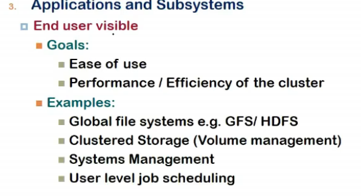

## MOSIX

- os level pe SSI
- changes unix kernel for cluster
- comes up with loadable kernel module w/o changing kernel interface (system call interface same hai)
- consists of
  - algos for adaptive resource scheduling
    - process migration
  - preemptive process migration
    - migrate while in execution

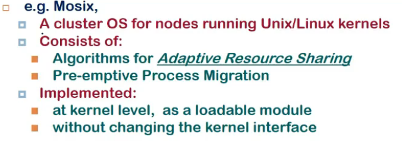

- implemented decentralized manner
- any node user logs in becomes master node, rest slaves

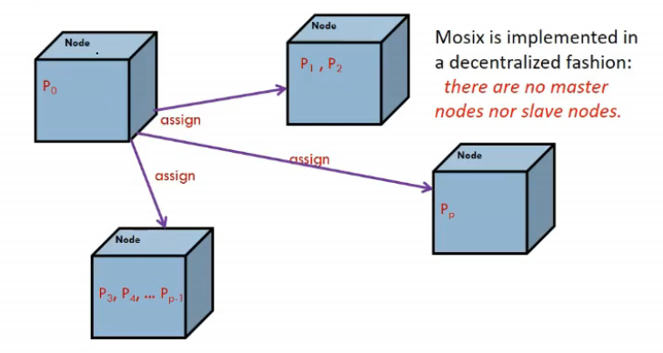

- each node takes care of distributing processes to other systems
- these processes can communicate normally, have shared memory, send signals, etc

- has dynamic load balancing
  - static me b4 process start hone hi decide ho jata ki kaha run karega pure time
  - isme nahi hota aisa
    - it can be scheduled while half way in process

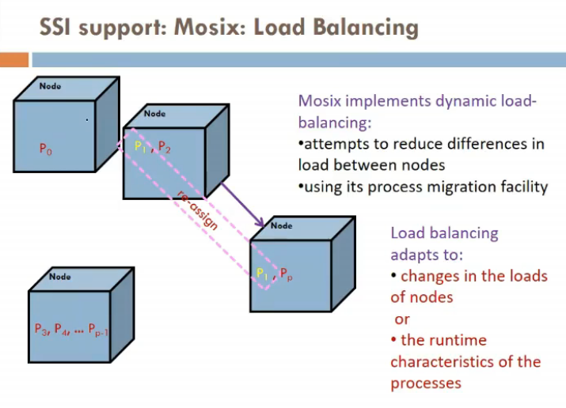

- way it balances?  
  - as manay processes can be allowed, only utne hi kar
  - but agar memory ki bt ho, memory nahi available, then load balancer acts and transfers process to other process

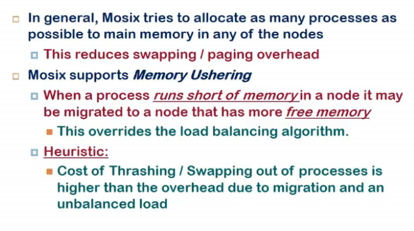

- how is process migration implemented?
- home node = where process initially started
  - each process has unique home node
- migrating process has user and system context (user = code, stack, data , etc, system = jo bhi kernel remembered)
- only user context migrated to other node
- deputy = system context, user context = remote

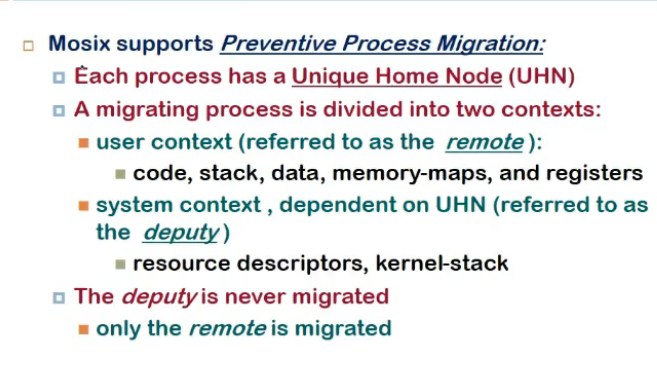

- when remote node executes some system call, forwarded to deputy
- if call is not system dependent (time bata etc), then usi pe execute but otherslike socket write etc, deputy ko bhej dete

- overhead?
  - system calls ko intercept kar, forward kar
  - signal delivery = signal goes to home node, deputy will deliver it to home node

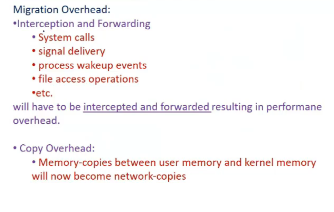

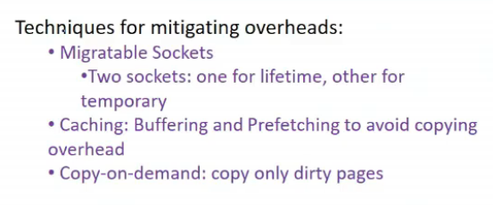

- 2 sockets rakhle prob resolve karne ke lie
  - one lifetime
  - one temporary
  - one at deputy level, one at remote level
  - write into socket locally, it'll go into destn
  - read ke lie deputy se utha
