# Lecture 11

- [Lecture 11](#lecture-11)
  - [Video](#video)
  - [Reliability Availability Servicability (RAS)](#reliability-availability-servicability-ras)
  - [Failures](#failures)
  - [Failover](#failover)
  - [Failover Requirements](#failover-requirements)
  - [Two-Node Failover configurations](#two-node-failover-configurations)
  - [Now, Large cluster configurations](#now-large-cluster-configurations)
    - [N to 1](#n-to-1)
    - [N plus 1](#n-plus-1)
  - [Problem](#problem)

## Video

[link](https://drive.google.com/file/d/15aXSzCwuiO0aJrw8AChP_0RR7bsU-L1r/view)

## Reliability Availability Servicability (RAS)

- any device working ar notmal operation, ails, then gets repaired then normal operation starts
- this is Operate-repair cycle

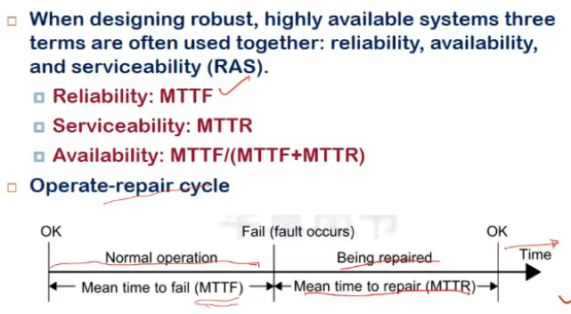

- mttf = reliability
- mttr = servicability
  - time to recover node, to make it work again
- availability = (time it worked)/(total time)

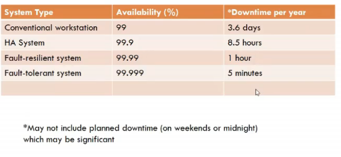

- 9s ke term me
  - 2 9s, 3 9s, 4 9s, etc..

## Failures

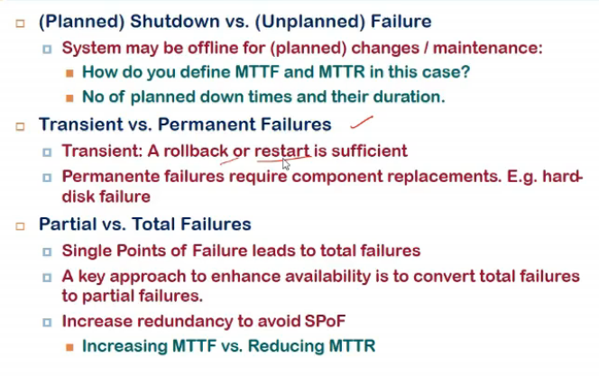

- in both shutdown, and unplanned, system might be offline
- planned one r not included in recover, only in failure

- transient = just restarting a service, rollback is sufficient
- permanent = during the failure, I cannot use system, some imp component has failed

- partial failurres preferred over total
- total happens when Single point of failure hai
- so our goal is to remove SPOF
- to increase availability
  - increase MTTF
  - or, decrease MTTR
    - easier than above
    - MTTF predefined aata device ke saath
    - MTTR? SPOF me recovery takes time (maintenance wale ko bulao woh check karega, fault bataya etc etc)
      - instead if we have 2 systems running parallely, one fails, other chala le, MTTR = 0

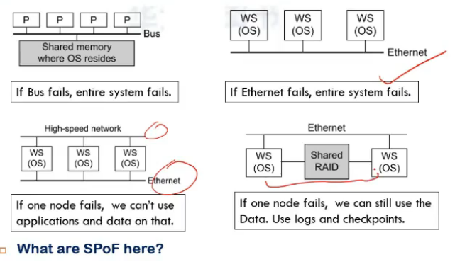

- furst me Shared memory or Bus both are SPOF here
- shmem in gen bmultiple h/w units ki bani hoti, so bus hi main imp hai

- workstations connected to ethernet
- SPOf = ethernet

- third me
  - we have 2 networks in parallel
  - assuming each workstation is provided diff service, then if one node is down, we cannot use applications and data present on it

- fourth me
  - shared RAID
    - shared file system = disk structure hai
    - each ndoe can access other's
  - so agar ek node bhi fails, I can use second, data can be accessed using logs and checkpoints etc

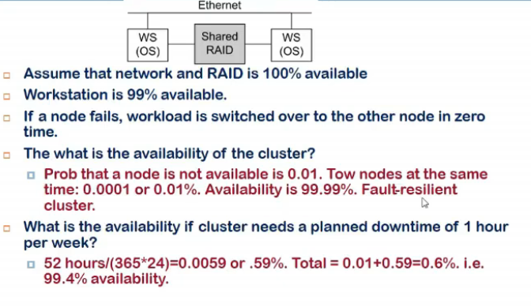

- workstatipon is available 99% of timr
- but if one fails, other is accessible
- how to get availability of whole cluster

- serial me agar hai 2 devices both having avail = 0.99, then total avail = 0.99*0.99 (bcz even if one fails, whole system fails)
- if in parallel
  - failure happens only when both fails
  - so (1-0.99)*(1-0.99)
  - this is failure prob, so avail = 1-0.0001 = 0.9999

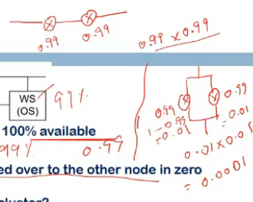

- so serial me total avail goes down, agar parallel me kia (backup hai, stand by pe), avail increases

- last ques me
  - 52 weeks so 52 hours not available in a year out of (365*24) hours, also 0.0001 percent times bhi nahi available

## Failover

- reducing MTTR
- move services which are down to another system

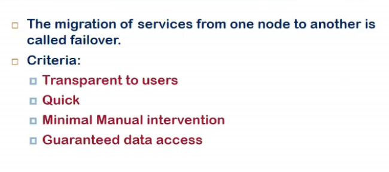

- whatever changes done in prev node, should be visiblle in destination node
- some connections might break (TCP conenction tha, IP changed abhi..)
- so we might have DNS based solution

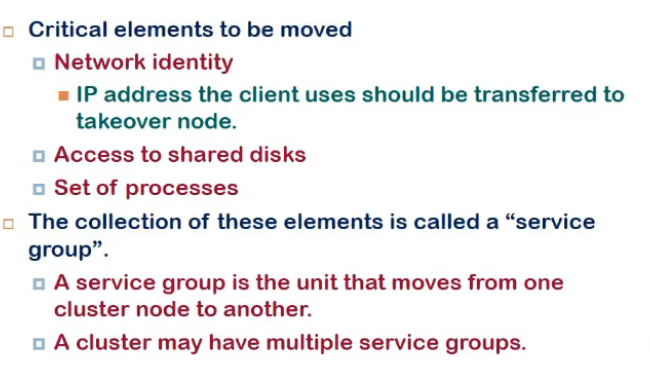

- load balancer can still redirect request to new server
- access to shared disk is imp, bcz agar sab apna local store karegam tehn fail hote hi bt (RAID, SAN vagairah me)
- set of processes
  - process migration is tough to acheive
  - bcz bahut kuch os space me horta related to a process
  - one way is checkpointing
    - store all related details into a file an dfile ko dusri jagah le ja
  - second way is make it stateless
    - process does not remember it
    - request state vagairah maintain karega
    - VM me yeh easy to implement
    - bcz os se independent hote woh

- sErvice group
  - anyth related to a particular service jisko migrate karna

## Failover Requirements

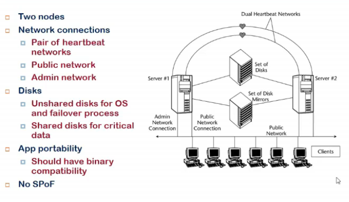

- fual n/w conenctivity chahiye, ek fail hua toh dusre me daalde
- set of disks shared by both, and some local related disks
- portability
  - a service running on server 1, move karna 2 pe, diff library version/new os version etc nahi hona chahiye bt, compatibility honi chahiye executable program ki
- this makes it no sPOF

## Two-Node Failover configurations

- possible cluster configurations
- active passive(hot standby(already ready))
  - primary and standbyy(active and passive)
  - only prim accept requests
  - secondary ka data shared with primary
  - second monitor primary node, if fails it becomes main node
- passive ke failure ke chance kam since kuch kar nahi raha
- but mehnga tabhi
- so only critical applns jinko biulkul downtime nahi dena, unko is mode me run kar

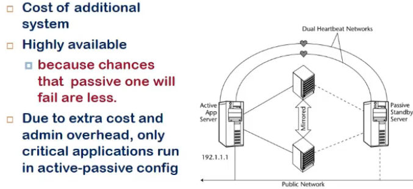

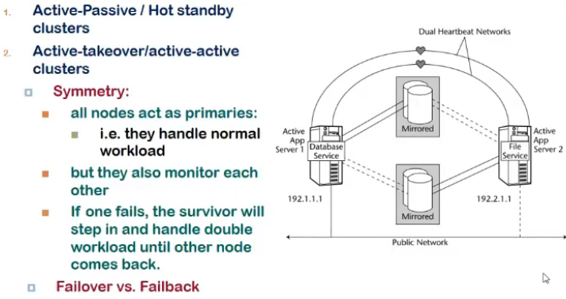

- active active
  - both are receivinf requests
  - they both monitor each other
  - if one fails, other will handle load coming to second

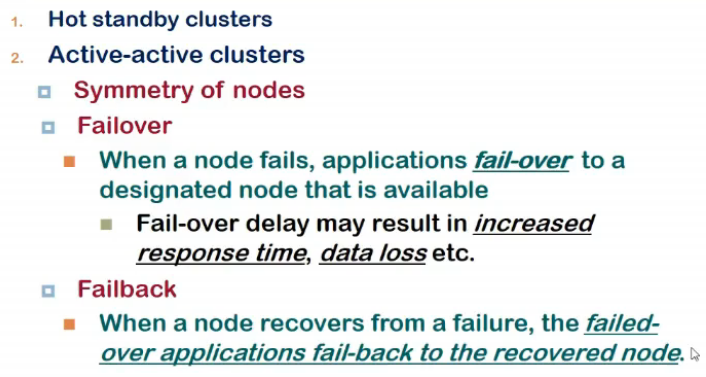

- concept of failback
  - failover me migration tha
  - active-active me when it recovers, applns fail back to original node, since both are active active

- active-acti me manageable cost
- but performance impact when single node handle much load
- and uske fail ke chance increase when one fails

## Now, Large cluster configurations

- 2 se jyada
- ab kaise configure kare
- 2 type se
  - N-to-1
  - N + 1

### N to 1

- a designate dnode acting as standby

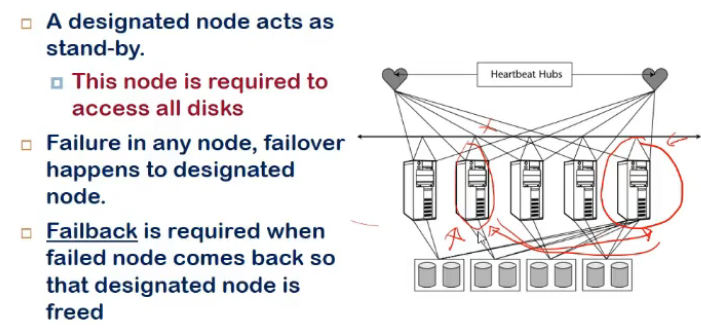

- designated node access all shared data (written by other system)
- if failure hua, failover happens to designated node
- failback is reqd when faile done comes up

### N plus 1

- all node have state storage (SAN use karre maanle)

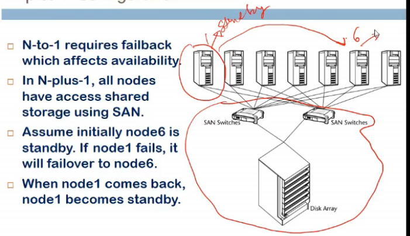

- failback/failover me applns are not available
- yaha pe no failback, so availability increases
- designated node is dynamic
- jab failed node is repaired, it becomes a designated node

- VMs me easy failover vagariah
- waha pe abstraction alag
- yaha pe it is in terms of processes

## Problem

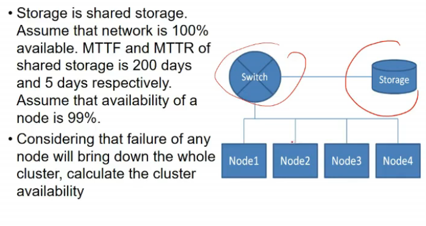

- all nodes are in series, switch failure bhi system fail, storage also
- n/w is 100% avail, MTTf, MTTr of storage given, so avail of storage givem
- so ans is 1*(200/200+5)\*(0.99\*0.99\*0.99\*0.99)

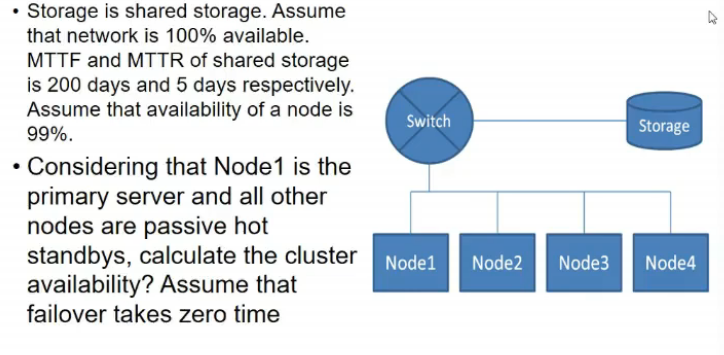

- now parallel thing hai
- when it will fail?
  - switch fail
  - storage fails
  - all the nodes fail
  - so, 1\*(200/205)\*(1-(1-0.99)^4)
