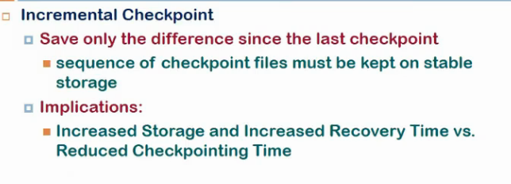

# Lecture 12

- [Lecture 12](#lecture-12)
  - [Video](#video)
  - [Problems](#problems)
  - [Fail Over Management](#fail-over-management)
  - [Checkpointing](#checkpointing)
    - [Levels of implementation](#levels-of-implementation)
      - [OS Kernel](#os-kernel)
      - [Library](#library)
      - [Application](#application)
  - [Failure recovery](#failure-recovery)
  - [Checkp overheads](#checkp-overheads)
  - [How to do it to get less overhead](#how-to-do-it-to-get-less-overhead)
  - [Checkp in msg passing systems](#checkp-in-msg-passing-systems)
  - [Rollback propaagation and domino effect](#rollback-propaagation-and-domino-effect)

## Video

[link](https://drive.google.com/file/d/1P-4ZvtUZt3sNN45NuBJ66x9PwqkvBNCx/view)

## Problems

- node 1 and 2 are in a cluster and a-a configuration
- this fail only when both are not avail
- similarly db server not avail if node 3 and 4 both fails

- so avail = 1\*(200/205)\*(1-(1-0.99)^2)\*(1-(1-0.99)^2) = 97.54%

- node 4 is hot standby node
- failure scenario?
  - 1 node fail, toh no problem
  - so atleast 2 node fail = 4C2\*(1-0.99)^2 + 3node fail + 4 node fail(baki 2 ko ignore karde)
  - so avail = 0.9994 for ndoes then \*(200/205) (for storage)

## Fail Over Management

- diagnosing fault?
  - passive monitor karra active ko
  - how does it know active does not work now
  - heartbeat msg
    - frequently send heartbeats
    - if nahi aye msg within some time or within some retries, bt

- to monitor, monitor h/w components
- h/w components me sensor hote, temp vagairah monitor karke dekh le
- applicaiton lvl monitoring karle
  - webserver is working or not
  - linux me proc file system hota na ki ek process ki state store hoti jisme
  - we can also monitor log files(agar apache hai, for eg), I/O status

- one prob that happens is, agar heartbeat nahi mili, we assume ki node failed, but it might be ki n/w has failed
- disk agar fail hui toh split brain syndrome
  - both are (active-act me) assume other is dead
  - act-pass me pas thinks act is dead
  - both write to disks and corrupt data

- Solution to split brain syndrome?
  - if n/w is spof, these might happen
  - but if dual n/w ho (each system connected to 2 subnets)
  - so heartbeat na aaye toh check kar ki dusre n/w pe gaya ya nahi.. agar nahi so ha bt hai, agar gaya toh n/w me bt

## Checkpointing

- a process can fail at anytime in between
- saves consistent info in stable storage
- one reason is procss migration (Send snapshot as well)
- another is failover - fault tolerance
- do not restart from beginning

- db me bhi hota na lock write wala cheejein
- chp means until that point it has been checked and now is safe data

- How to do checkpointing if idk how process is functioning, can't change source code

### Levels of implementation

#### OS Kernel

- if we have some changes doen to os which can transparently, regularly take snapshots, then it can reload easily
- easy to do in it, bcz iske pas varied view hai and sare main ds isme hai
- but it is not easy to implement

#### Library

- library will do checkpointing
- when compiler is compiling, it will insert checkpointing calls
- that call will go to library and lib wil take snapshots

#### Application

- user himself takes snapshot
- reaally efficient bcz usko aalum kya karna
- but part of source code and might not be avialble all the time

- proc file me store hota ki user space kya, etc, waha se read karle and store in file
- os level registers kaise?
  - using signal handler
  - when signal delivered, kernel stores all on stack
  - access tha area in handler and read stack and save

- hidden copies?

## Failure recovery

- recovery wt checkpoint
- backward or forward recovery
- when failure happens, latest checkp restored and operation restored

- rollback mtlb we will have to start from las checkp but again instructions execute karunga mai

- forward
  - do not look back
  - continue ahead
  - achieved by having redundancy
  - triple modular redundancy
    - 3 bar kar har cheej
    - if majority says smth, minority kuch aur, go with major

- tradeoff hai
- inconsistency kaise resolve and all depends upon application

## Checkp overheads

- time overhead

## How to do it to get less overhead

- shorter intervals => faster recovery
- larger => shorter

- tc = time consumed to take checkpoint
- h = kitna kam karna padega checkp ke bad to recover  from failure
- minimize h and increase mttf

- don't take snapshots from scratch always, take incrementally
- so we need to have every checkp stored, so more storage
- more time
- reduced checkp time

- when taking checkp, I cannot do any computation at that time, so no useful thing at that time
- so fork checkpointing
  - parent forks, child me sab copied, child now does checkp

## Checkp in msg passing systems

- say multiple processes exchanging msgs, and a causal relnship b/w them, so order me lena padega checkp
- process i se chala msg, j me nahi pahuncha

## Rollback propaagation and domino effect

