# Lecture 13

## Video

[link](https://drive.google.com/file/d/1jQqK6YKn2Ap-ATxrG9JMs3eHZpSIY66K/view)

## Slides

[link](https://drive.google.com/file/d/1aXMEGSa4Dlp8CfqRqGvGaBniNAiHbK4S/view?usp=sharing)

## Virtualization

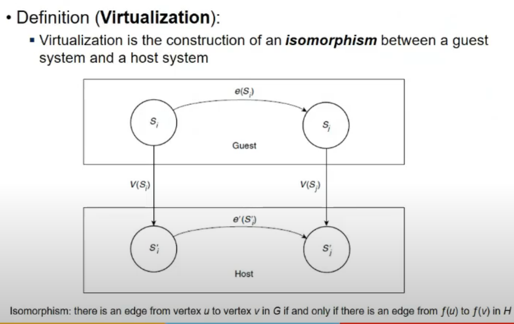

## Virtu and Abstraction

- Virtualization
- Abstraction
- Interface

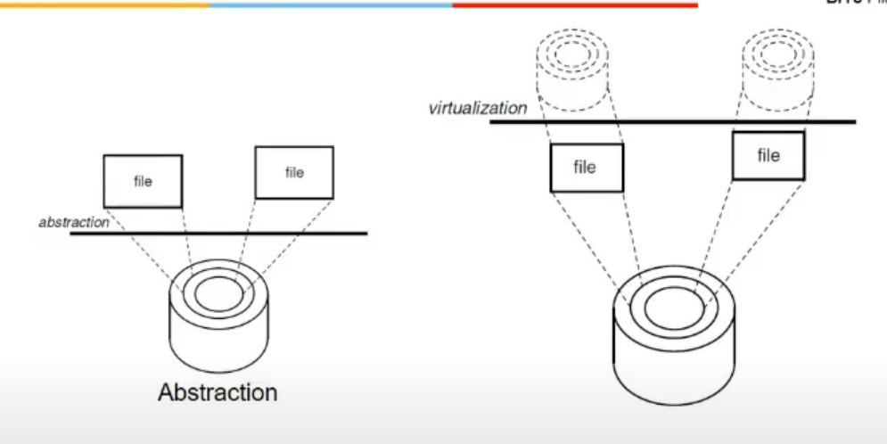

- Disk has tracks and sectiors
- Os ke lie abstraction is in terms of files
- Abstraction hides complex details (internal details)
- file is logical entity, actual is data blocks
- inode hota na, which store info abt of a file
- virtualiztion me
  - we created virtual hard disks(VHDs) from real hard disk
  - vhd is actually a file stored on read hard disk
  - file is presented as hard disk for virtual system
- person dealing with virtual hard disk, jo operans ho rahe(virtual operns) woh same real hard disk me bhi ho rahe
- so interface dono me (actual and virtual) me same hai, not hiding any details, not simiplifying anything, same complexity dono me
- abstraction me simplify interface, virtualizan means implementing interface
- hard disk me kuch interface hai, disk controller, api to os drivers etc. virtualization me I2 (new interface jo ham provide karna chah re) thwat is not on real hard disk, hai toh file p ena bhai

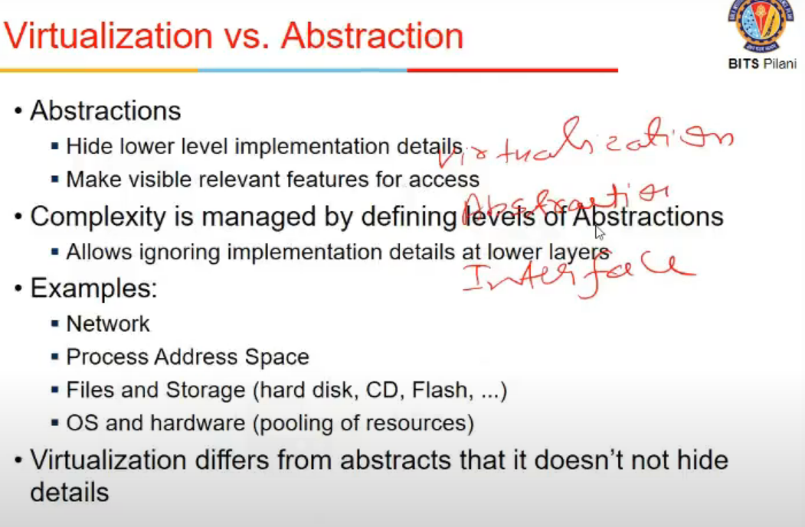

- abstraction examples
  - network layers
  - process address space
    - physical address space maybe discontinuou  but process address space continuous
    - achieeved via page tables etc
  - files and storage
    - hard disk and files
    - files easier to deal with then logical blocks
  - os and h/w
    - pooling of resources
    - os kardeta memory allocation etc
    - scheduling os dekh leta, etc etc potato patato

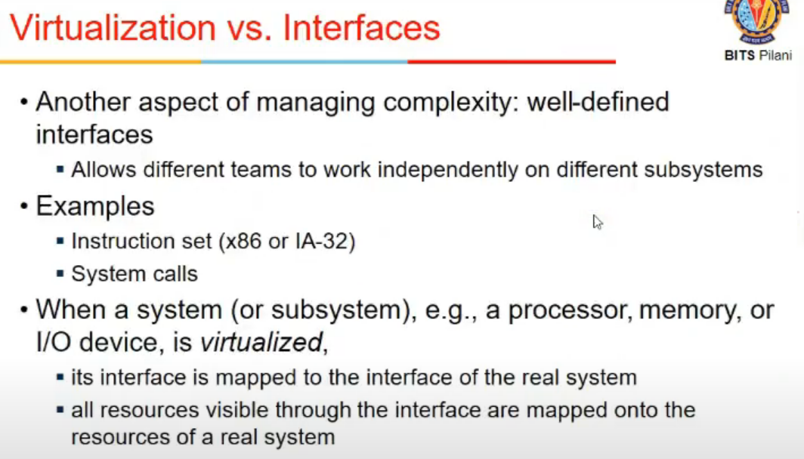

- interface visible to users
- Standardized interface ki wajah se building things simpler
- x86 instructions defined hai, so sab independent kaam kar payegey
- bca they know they will be compatibel due to standardization
- when a system is virtualized, its interface is mapped to interface to real system
  - mapping ke lie ek s/w chahiye (virtualization layer/module)
- all resources visible through interface are mapped onto resources of real system

- say h/w hai (real system), uska ISA = interface
- say actual real system interface is I1 = x86
- and virtualized system ka interface I2 - IA32, that is mapped to I1 using Hypervisor =  Virtual Machine Monitor
- all resources visible through I2 are mapped to I1 using VMM

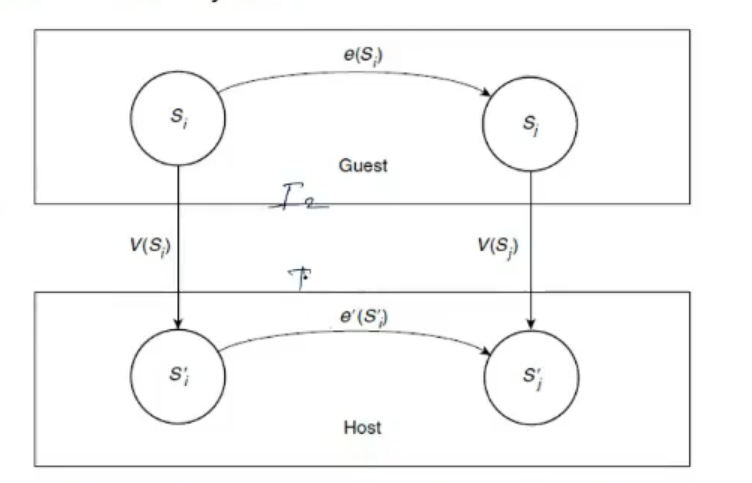

- guest = I2, Host = I1 = real
- V(S) is Virtualization
- any change happening in guest system must also be in real in some way or other

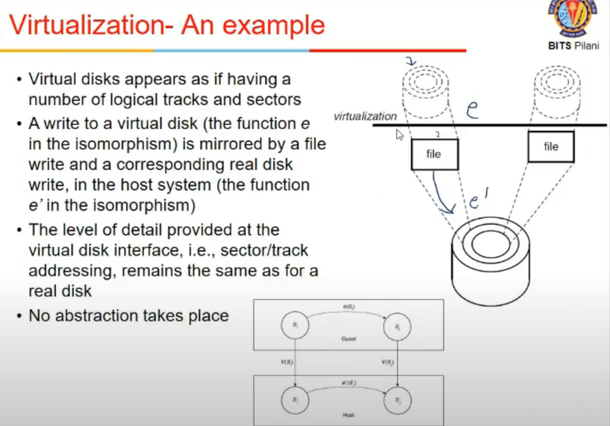

- A write to virtual disk is mirrored by file write and corresponding disk write in host system

## Virtul Machine

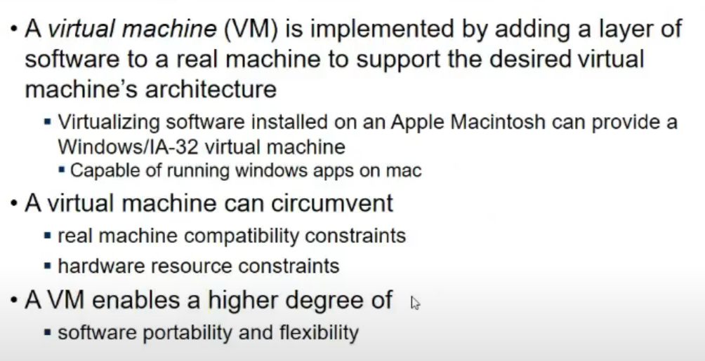

- A virtual machine has apps, library etc

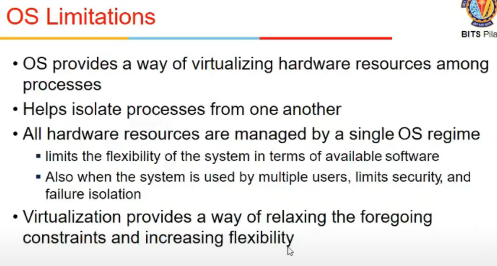

## VM - Applications

- Migrating a process is difficult toh machine ko hi transfer karde, i.e. VM migration is easier

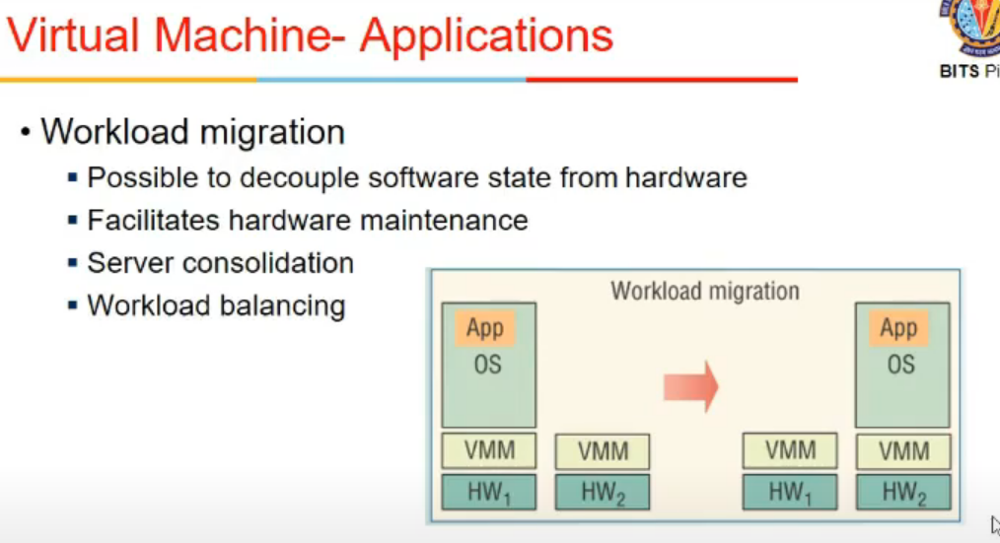

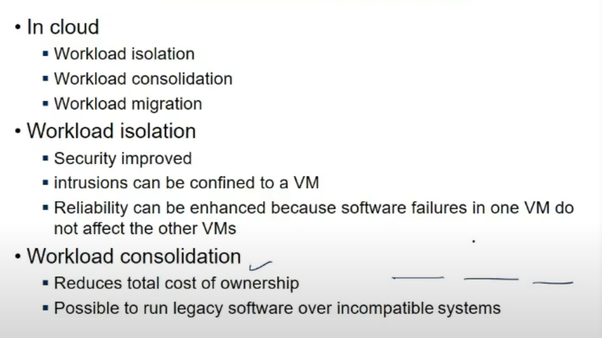

- Consolidation
  - multiple underutilized systems hai
  - 3 VM hai vm1, vm2, vm3
  - combine 3 VMs into 1 to reduce energy consumption etc
- Isolation
  - is data saved? is it being watched?
  - if a VM is attacked, other VMs are protected
  - failure in  one VM, baki chalte rahenge

- Portability hai mtlb can run on any hardware
- Compatability constraints
  - hardware can be emulated using Hypervisor on different ISA
- Hardware resource constraints
  - move it to other which has resources if needed

## Comparisons b/w OS and VMM

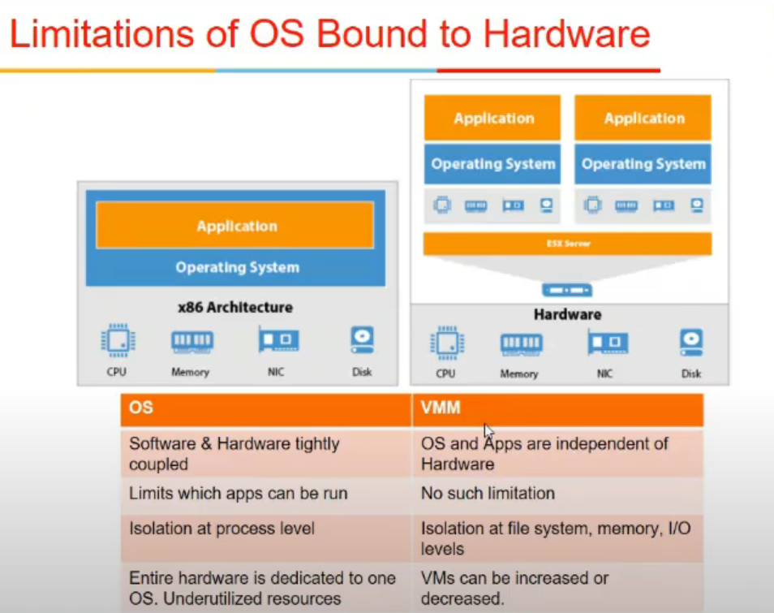

- OS - s/w and h./w are tightly compiled
- s/w compiled for one os might not work on other bcz os bhi accordingly design hota
- vmm me anyth can run on hypervisor bcz it abstracts out that
- OS limits what app can run how easily
  - provides isolation at process level
  - but VMM provides at filesystem, I/O level, memory level

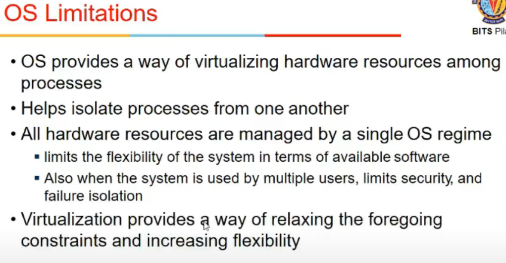
