# Lecture 14

## Computer Architecture

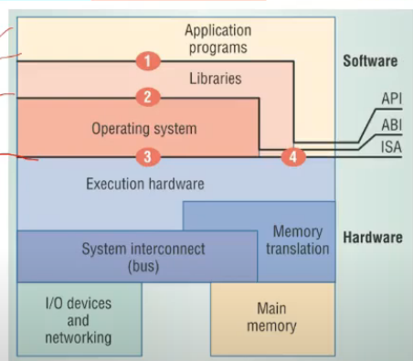

- Given a C program, it will need some resources from OS

```C
    main(){
        int c = 3+2;
        printf("Welcome");
    }
```

- for printf stmt, program needs help of OS, bcz resource chahiye usko
- Interface numbers defined (1,2,3,4) here
  - 1 = API, language offers some libraries
    - C me printf, scanf
    - Java me Scanner, Writer etc etc
  - 2 = System call interface (ABI = Application binary interface)
    - unique to particular os and h/w
    - linux ka alag, windows ka alag
    - languages maintain same API but abi diff hota acc to h/w
    - `fopen()` in (1) converts to `open()` in (2)
  - 3,4 = ISA = Instructions et architecture
    - unoique to given h/w
    - eg intel processors ka x86, x64 ISA, Arm processors ka alag
    - ISA comes in 2 flavors of instructions
      - System Level ISA(3)
      - User Level ISA(4)
      - Difference?
        - dekh user mdoe ya kernel mode hoga CPU ka
        - accordingly user mode me User ISA hi execte kar sakta
        - Kernel mode me I can use both

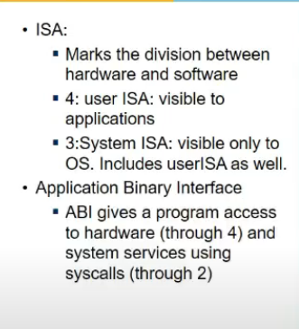

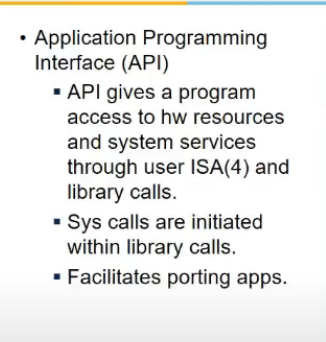

- A process executing expects ABI to remain same everytime it is executed
- so agar ABi maintain karli, toh kabhi bhi, kahi bhi chala payunga,emulate kar payunga
- agar ek process VM can provides Windows ABI using Linux ABI, then karlega woh
- Os expects ISA to remain same everytime, so agar new ISA pe jyaada, then ISA ko emulate karna padega = System VM

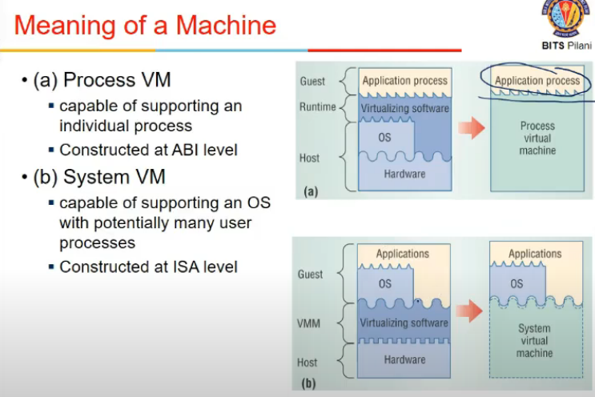

## Process and System VM

- process wali executed one process at a time. So jab 1 process starts vm starts, process exits, vm too
- system vm support entire os, many process running on top of os
  - virtualization is b/w host h/w and guest os
  - isa maybe diff or same
  - if same, h/w resources ko vitualize karna padega
  - mulitple os run kar rahe honge na, so fair chance mile sabko and security issue etc etc potato patato

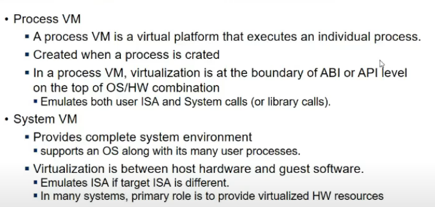

## Process VM - Applicaitons

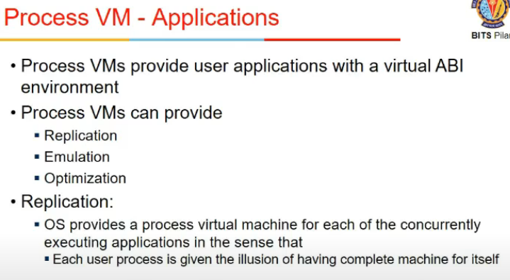

- provides virtual ABI environment
- can provide
  - replication
    - os, har process ke lie logical asddress space deta etc, wohi
  - emulation 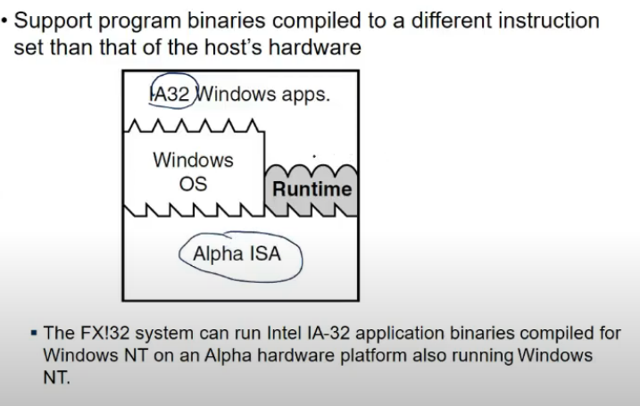
    - compiler for one ISA, and running on diff ISA, translating instructions from one ISA to other(target platform)
    - provided using 2 ways
      - interpretation
        - mapping form one ISA to other may not be 1-1
        - it has subroutine for every opcode
        - so startup is faster interpretation is slow
      - binary translation
        - trnaslae before u execute
        - say kuch instructions hai, ek jump bhi hai usme
        - jump ki wajah se static translation is not possible, it need to be dynamic
        - so static is not always possible
        - here we take one block of code, translate and execute it
          - go to new block, and execute
          - here use branch prediction etc etc
        - startup slow, interpretation faster
        - ***VMMS generally use this***
    - 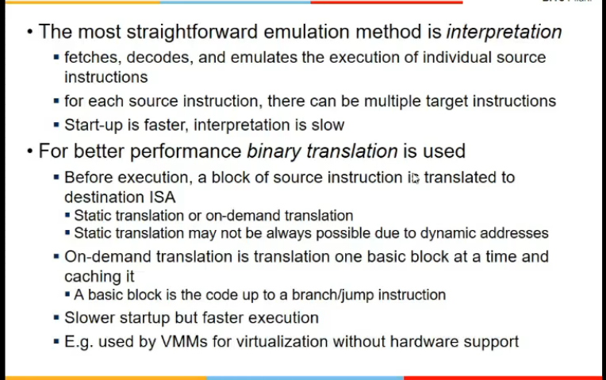
    - 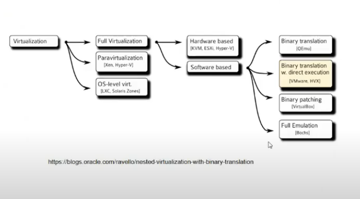
  - optimization
    - code faster execute ho toh compiler karta kuch kuch
    - loop ko dekhke kuch kuch
    - kuch optimizations dynamic bhi hote
    - while executing instructions find btr ways
      - done by process VM
    - 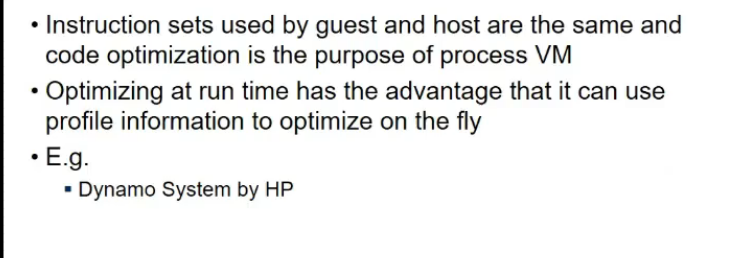

## High Level Virtual Machines

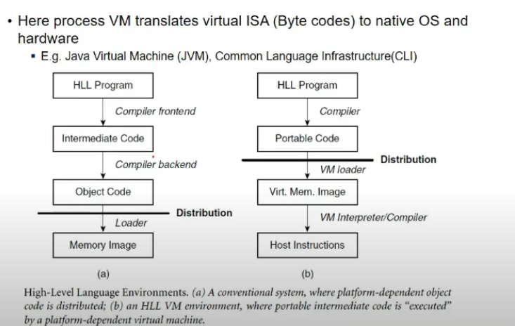

- provide complete system
- JVM, compiles and translates into intermediate code (byte code)
- executes onm JVM, byte code translates into machine code
- it is not a h/w interface
- iti s defined such that java translates code for this VM
- then JVM has to translate it for ABI
- it is a process VM, emulates ABI

## Sytstem VM

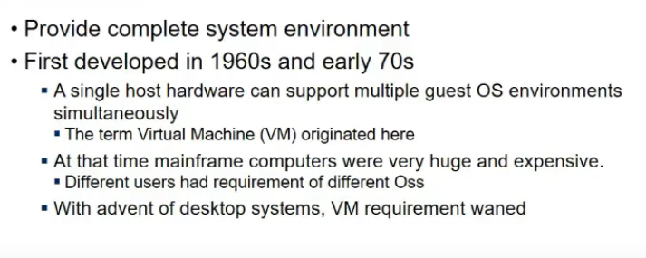

- At ISA level
- running multiple os on single h/w
- mainframe h/w bahut mehnga tha, and us time karte the yeh, multiple os emulate on single h/w
- guest os does not know about VMM sitting in b/w
- VMM should be designe din such a way

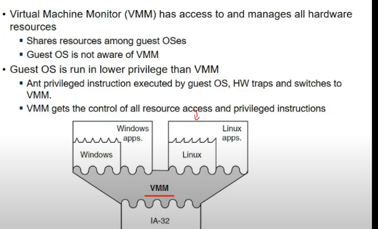

## VM Taxonomy

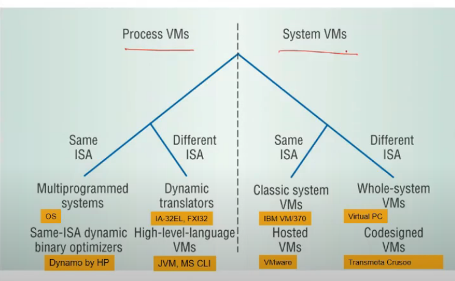

- whole system VMs
  - directly running on h/w
- Hosted VMs
  - run on top of OS and support mltiple instructions