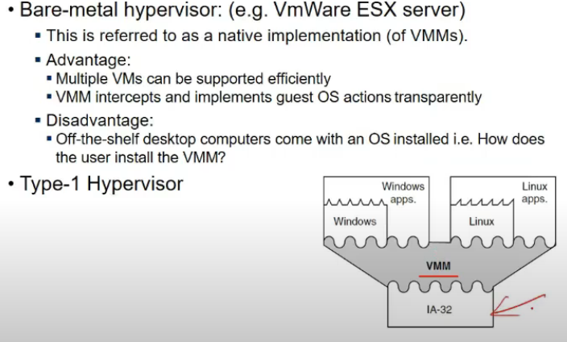

# Lecture 15

- [Lecture 15](#lecture-15)
  - [Video](#video)
  - [User and Kernel Mode](#user-and-kernel-mode)
  - [Virtual MAchine Monitor](#virtual-machine-monitor)
  - [Priviledged instructions](#priviledged-instructions)
  - [Sensitive Instructions](#sensitive-instructions)
    - [Control Sensitive instructions](#control-sensitive-instructions)
    - [Behavior Sensitive instructions](#behavior-sensitive-instructions)
  - [Efficient VVMs : Popek and Gold Theorem 1](#efficient-vvms--popek-and-gold-theorem-1)
  - [IA-32/x86 Critical Instructions](#ia-32x86-critical-instructions)
  - [Efficient VVM](#efficient-vvm)
  - [System VMs](#system-vms)
  - [System VMs - Paravirtuyalization](#system-vms---paravirtuyalization)

## Video

[link](https://drive.google.com/file/d/1AxT_o72eAf2WJ39GKs7tSfHHNuOBQ3P5/view)

## User and Kernel Mode

## Virtual MAchine Monitor

- is also an OS on top of which multiple os are running

## Priviledged instructions

- if executed in user mode will result in trap

## Sensitive Instructions

### Control Sensitive instructions

- that change amount of resources, change processor mode etc etc

### Behavior Sensitive instructions

- disable some interrupts, generally done by os
- loading physical address (user only sees virtual instructions and not physical)

## Efficient VVMs : Popek and Gold Theorem 1

- what is relation b/w sensitive and priveledged instructions?
- if all sensitive instructions is subset of priveledged, then easy for vmmt o be built
- it has to not look into source code of program
- if any program runs ganda instruction trap hoga and it will get to know
- vmms does not have to worry, os kuch bhi execute kare, if kuch sensitive hua, toh usko pata chal jayega
- but if subset nahi hai, Sensitive - Priviledged = critical instructions
  - prob kya hai?
  - sensitive mtlb effecting resource alloation to processes
  - agar priveledged nahi hua, trap nahi hoga agar user program ne run kia
  - say SPT run karra OS1 on top of VMM (set cpu timer)
    - OS1 runs in user mode and VMM in kernel mode
      - yeh priveledged hai toh os isko bata dega and yeh os1 ke lie yeh kam kardega dekhke kisi tarah
    - say popf instructions hai, os execute karta toh thik hai, bcz properly karega
    - if user karta, koi trap nahi generate hota but replaced by a nop
    - aba gar OS1 yeh karta execute, VMM ko pata hi nahi chala aisa kuch
    - sensitive tha but priviledged nahi

## IA-32/x86 Critical Instructions

- these put a load on VVM, it has to look at source code as well
- 18 sensitive, unpriveledged instructions

## Efficient VVM

- due to presence of critical instructions, every thing has to go through VVM, directly h/w pe nahi execute nahi kar sakta
- 2 strategies
  - Binary translation
    - look every instruction, and put trap before critical instructions
  - Paravirtualization
    - guest os source code level
    - modify it to insert interrups/traps there

## System VMs

- bare metal h/w = type 1
  - directly execurting on h/w
  - hypervisor executing on h/w
  - mulitple VM support efficiently
  - guest os gets illuysion of directly running on h/w
- Hosted VM
  - already installed hai ek OS
  - Os provides a virtualization s/w on top of which I execute diff OSs, type 2

## System VMs - Paravirtuyalization

- full virtualization => Guest os directly sees h/w (gets illusion)
- para me => it is aware of VMM is in between
  - so executes system calls on it(hypercall in case of xen)

- modify source code of OS for para
- linux kernel ko modify kardeta so that critical isntructions ke lie scan na karna pade, it inserts hypercall procedures
