# Lecture 16

- [Lecture 16](#lecture-16)
  - [Video](#video)
  - [Efficient VMMs : Popek and Gold Theorem 1](#efficient-vmms--popek-and-gold-theorem-1)
  - [Hardware Support for Virtualization](#hardware-support-for-virtualization)
  - [Intel Virtualization Technology Evolution](#intel-virtualization-technology-evolution)
  - [Emulation](#emulation)
  - [Definitions](#definitions)
  - [Ways to carry out emulation](#ways-to-carry-out-emulation)
  - [Interpreter State](#interpreter-state)
  - [Indirect threaded Interpretation](#indirect-threaded-interpretation)

## Video

[link](https://drive.google.com/file/d/1M1sy8J7ri1XHQnDgszKwP-cfHiK7IURj/view)

## Efficient VMMs : Popek and Gold Theorem 1

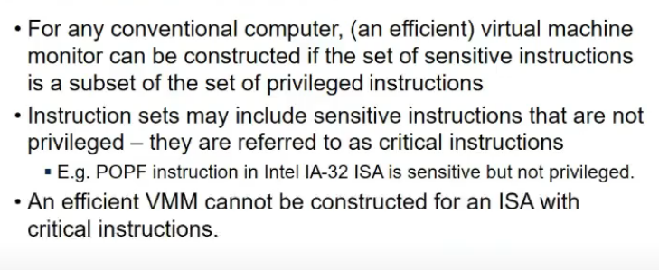

- emulation directly nahi kar sakte bcz off critical instructions
- 2 ways to address
  - binary translation
    - ek ek ko dekho and trap lagado
  - paravirtualization
    - guest os ko hi modify karde
    - and hypercalls
  - both involve a lot of overhead
    - har instruction ko scan karo
    - ya context switches in hypercall

## Hardware Support for Virtualization

- we want guest os level code ko h/w pe execute karna
- so h/w create 2 modes, dekh user and superuser mode the (3 and 0), 2 additional modes hai
  - VMM mode
    - VMM directly executing on h/w
  - non VMM root mode
    - guest os is executing
    - executing in root mode but VMM can program by providing VMCB (Virtual Machine Control Block) ki agar aisa kuch instructions ho, then meko trap bhej dena
    - so agar guest os does those instructions, trap a jata VMM ko and it sees context and all
    - virtualbiox uses this support

## Intel Virtualization Technology Evolution

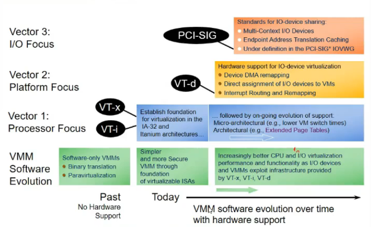

- hardware assistance can be used by 1 hypervisor at a time.

## Emulation

- same interface provide karna kisi tarah (emulate karna diff interface pe)
- putty use karra main
  - it emulates Linux terminal interface on windows

- Simulation?
  - does not respect interfaces
  - tries to create env where some principles are followed
  - eg NS2 and NS3 simulators
    - I cannot run browser or socket programming in those
    - emulation preserves the interfaces

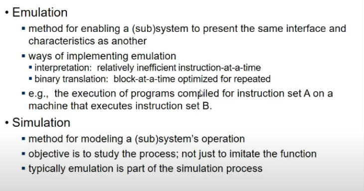

- mininet is an emulator
  - respects interfaces
  - if program works on system, it will on mininet as well

## Definitions

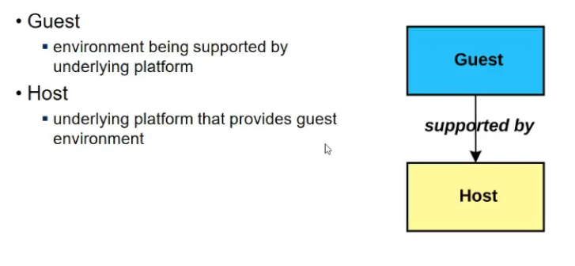

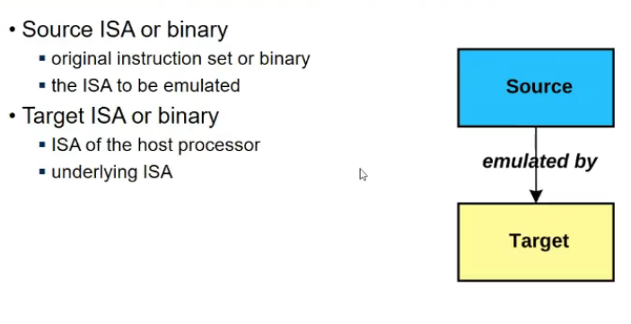

- source ISA is emulated to target ISA

## Ways to carry out emulation

- interpretation and translation
- inter
  - touch source instruction
  - analyze it (ek particular format me hoga  na instruction)
  - perform opern in host
  - all done in s/w
  - looks at individual instruc
- trans
  - look at block of source instructions
  - translate to target block
  - store for future purposes
  - loop me efficient, since translate kar chuka
    - interpret me bar bar translate karunga repititive part ko

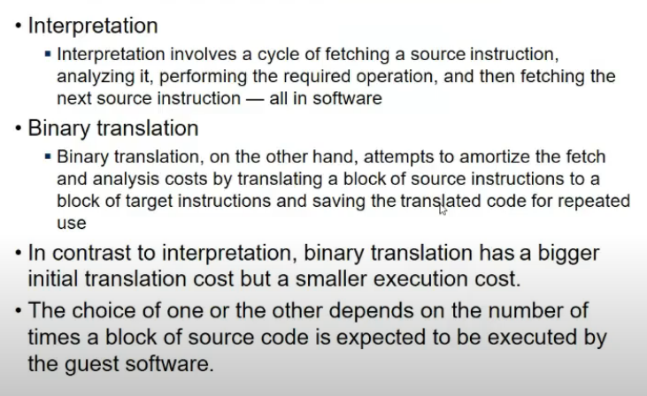

## Interpreter State

- methods of doing interpretation

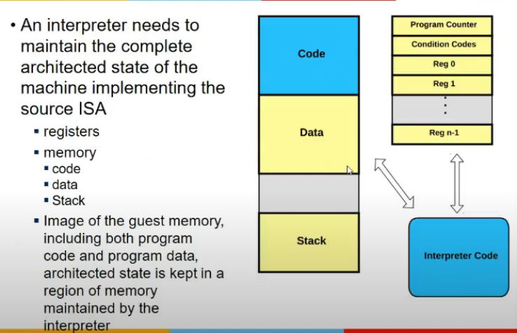

- interpreter
  - read source code
  - emulate on target
  - every instruction tries to modify some reg value etc
  - so program ki state hogi
  - segment and regs ki values etc
  - so it will have to store in its own memory bcz os nahi kareg ana bhai

- Model of interpreter
  - Decode and Dispatch
    - take one instr
    - interpret it = decode it
    - call corresp subroutine for that opcode
    - 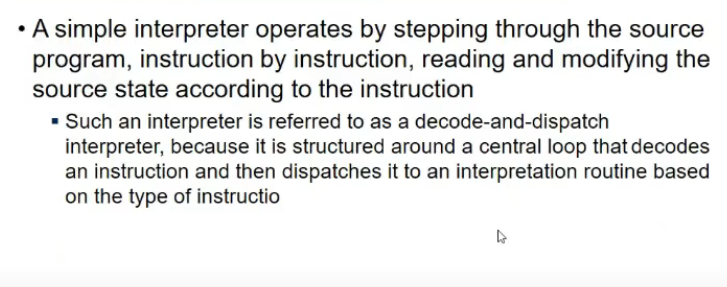
    - 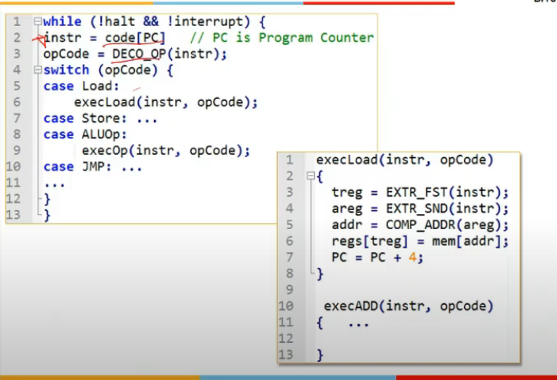
    - execLoad
      - extract first and second operand
      - get address
      - loads memory into the register
      - increment the PC
      - executing on target platform but changes are being done in interpreter state maintained by interpreter

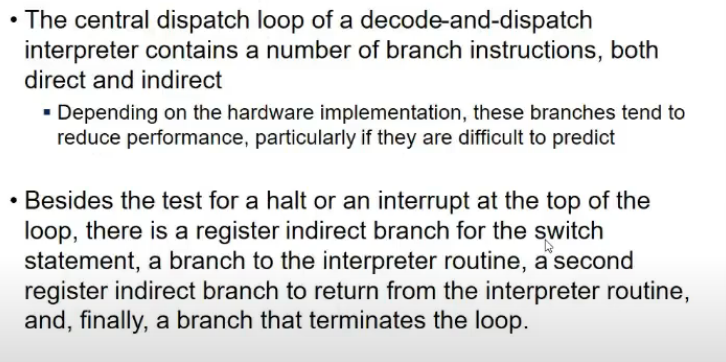

- Branch instructions
  - testing if we get a halt or interrupt generated for process
  - switch case requires indirect branching
  - branch to interpreter code
  - branch that terminates loop iteratin

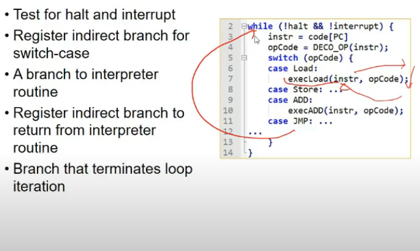

- bahut branches mtlb bt, kuki we don't know kaunsi branch lega
- overcame by following

## Indirect threaded Interpretation

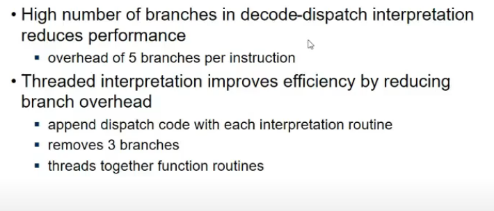

- remove while loop
- jumping to subroutine hai, but going back nahi
- 3 branches removed
  - switch nahi
  - while nahi
  - subroutine se coming back nahi
- inside same subroutine, extract next instruction and ek lookup array hoga which help to know kidhar jump next (subroutine address table)

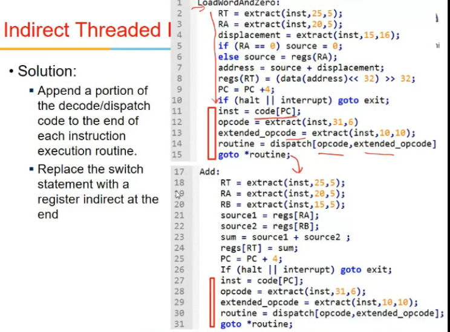

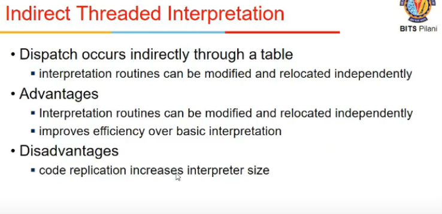

- Advantages?
  - interpretation routines can be modified and relocated independently
    - bcz lookup table hai, not hardcoded anywhere
    - change table to change location
    - improve efficiency bcz eliminates branches

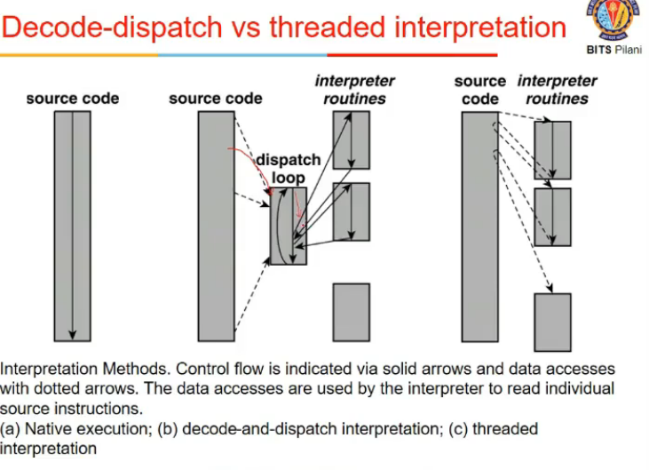
