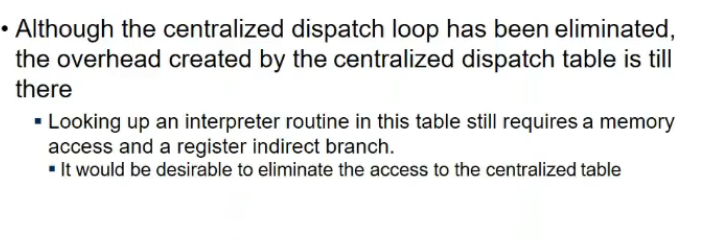
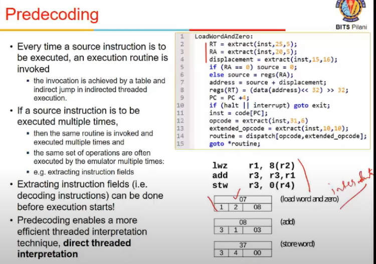
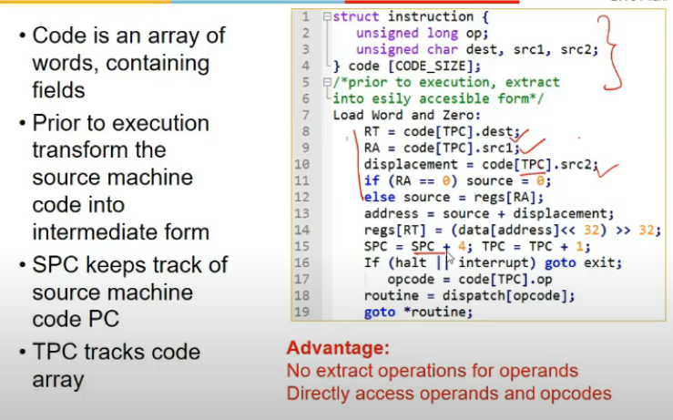
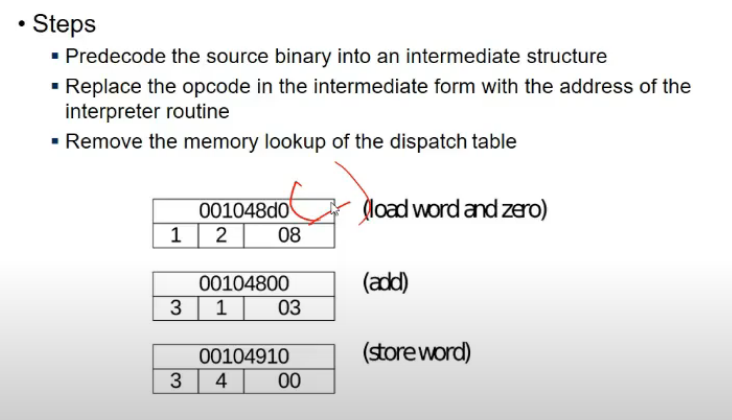
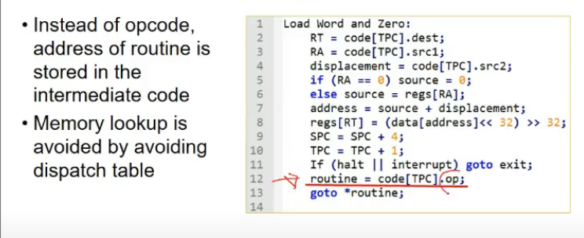
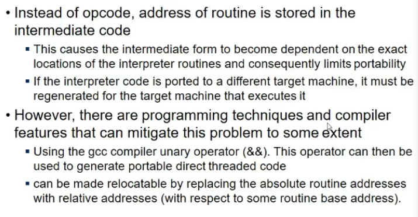
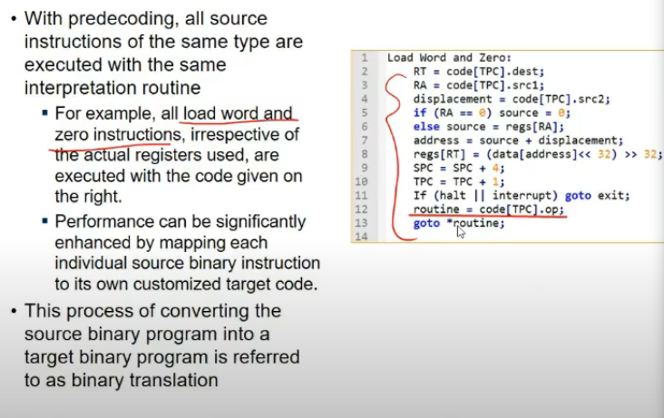
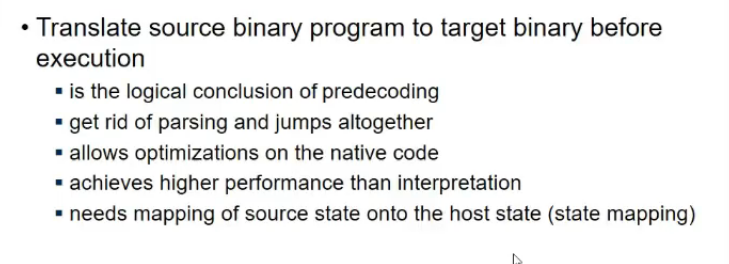
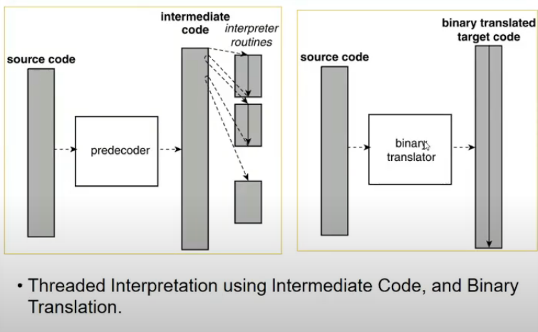
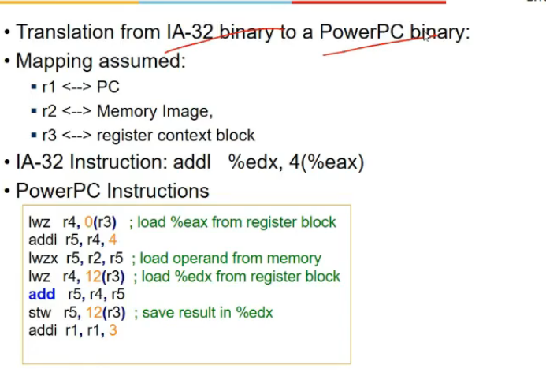

# Lecture 17

## Video

[link](https://drive.google.com/file/d/1YaihgVuSWWANfvMWk3SQY7DP-iZVGNnw/view)

## Further Improvements

- lookuing up central memory table requires one access and branching, eliminate karna woh

- Every subroutine has same code of extracting instruction and decoding it etc. this is repeatedly done
- so isko predecode karle, decoding before executing

- decode before execution starts and store them in a particular format
- extended opcode and opcode ka combination type maybe
- intermediate representation karra kin dof
- direct thrreaded interpretation

- code array contains instruction ka array
- we directly access dest and src from struct, decode nahi karna
- ab 2 cheeejein hai
  - origginal source
  - predecoded form
  - so 2 program counters
    - TPC
      - intermediate code ke lie
    - SPC
      - source machine code ka
      - instructions nahi a rahe yaha se but still we need it to change or keep track of architecture state

## Direct Threaded Interpretation

- predecoded source into intermed form
- instead of storing opcode, store address of subroutine
- ab memory lookup chala gaya and indirect branching bhi fer

- absolute addresses toh depend karenge on runtime..
- so agar dusre system me run karna, toh wapis compile kar
- place offsets instead na wrt base address

- so hamne abhi interpretation dekhlia
  - source code tha, ekek karke dekh rahe instructions
  - inefficient hai

## Binary Translation

- interpretation me hamne regs use nahi kie, ham s/w level pe kar rahe the
- take a grp of instructions and do mapping of reg and memory(if reg not available).
- source state thi but target ki nahi dekhi thi hamne interpretation me

- binary translation is logical conclusion of predecoding
- source instruction kko ek predecoded form me laraha tha na mai, now we put directly at target isa level

- we need to map ffrom source state to target state

- Static translations are not always possible
  - someimtes depemndent upon reg values
  - runtime pe pata user input say, so statically kaise karu
  - way code is stored in file(some compiler might store data with code), discoovering that is too difficult, bcz jab tak execute nahi karunga, idk data kis region me hai
  - so dynamic binary translation
