# Lecture 18

- [Lecture 18](#lecture-18)
  - [Video](#video)
  - [Binary translation](#binary-translation)
  - [Incremental Translation](#incremental-translation)
  - [Resource Virtualization](#resource-virtualization)
  - [ISA Virtualizability](#isa-virtualizability)
  - [VMM Components](#vmm-components)
  - [Recursive Virtualization](#recursive-virtualization)
  - [Hybrid Virtualization](#hybrid-virtualization)

## Video

[link](https://drive.google.com/file/d/1ROeX8rP5ton8V6cuukNRhqkvlj9ULApm/view)

## Binary translation

- state mapping
- target regs state ke lie nahi use kie the interpretation me but here we do

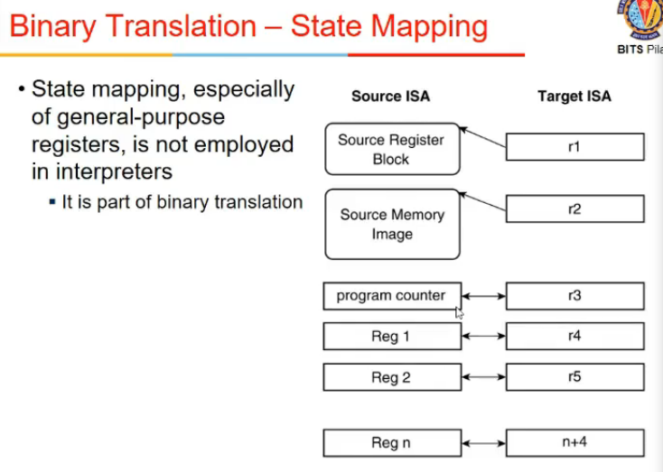

- the static translation might not be always possible

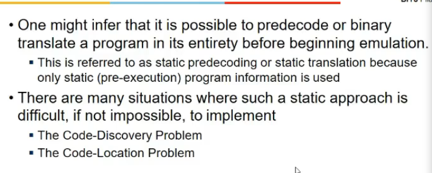

- code discovery
  - differentiate b/w instruction and data might not be possible
  - address is determined at runtime, branch kidhar jayegi idk, etc etc

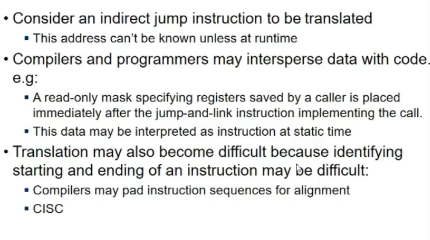

- Within code section, some data might be stored, eg. register mask, so yeh address pe code hai ya instr , idk
- RISC me decoding easy, CISC me nahi bcz risc me fixed length hai na sab

- Code Location Program
  - 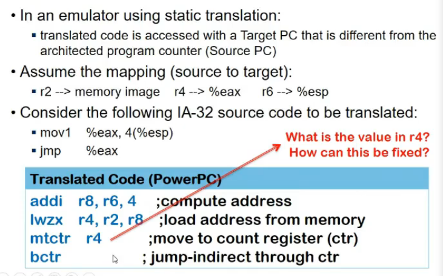
  - dekh do cheejein hai, source and target
  - source me addresses are wrt source
  - branch hai agar, toh branch is wrt source
  - but jab map kia, then instructions change, jump address mtlb should change in source ka address, so address maps to source address
  - so static is tough

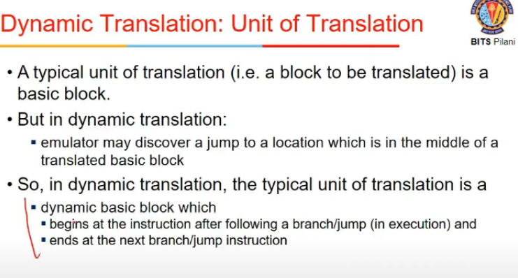

- Dynamic
  - static me block size is depend on branches, dynamic pe alag, bcz tab values pata hongi

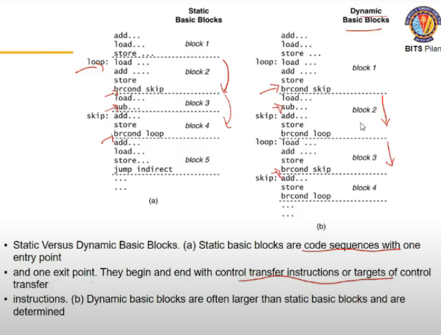

## Incremental Translation

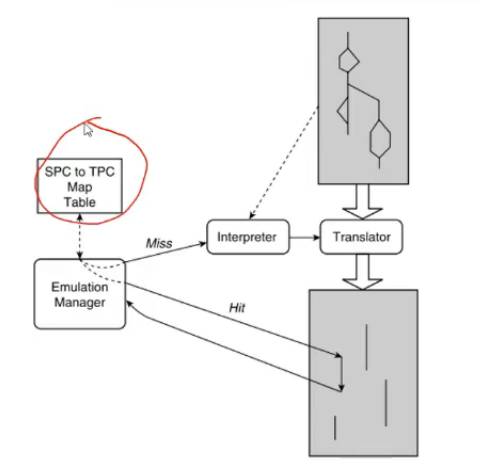

- Source address to target address mapping karde - map table
- we have a cache
- interpretor takes one instr at a time and do it
- translator takes block of code and translates
- interpretor reqd when we don't know what block to execute etc
- say 1 block is translated and executed now to find nextblock, we need to execute next instr, that interpretor does, and check if next instr is already there in cache by checking mapping and then cache check
- first instr interpretor hi karega, then usse pata chalega bllock etc
- SPC to read source memory se instruction

## Resource Virtualization

- We need to virtualize 3 types of resources
  - processor
  - memory
  - I/O

- How to make actual OS aware of it

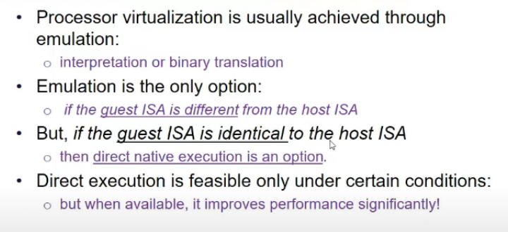

## ISA Virtualizability

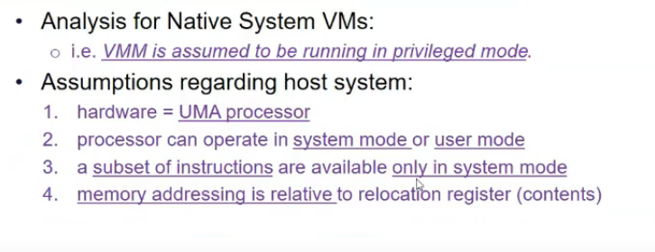

- 3 requirements to enable ISA virtualizable
  - Resource Control Requirement
    - guest s/w should not be able to directly change configuration of system resources available to it
      - eg size of physical memory
  - Equivalance
    - program execting on VM should exhibit behavior identical to its behavior on a native h/w except for slower performance, limited resources or variation in timing
  - Efficiency
    - no critical instructions
    - any sensitive instr must trap and come to VMM dispatcher then.

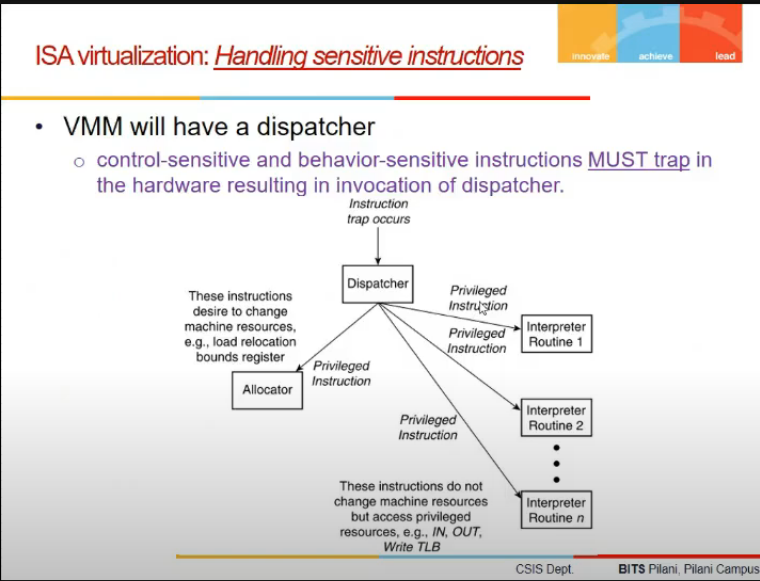

- How it works?
  - if guest os does priveledge instr, cpu wil branch to dispatcher VMM, which will give to emulator and execute

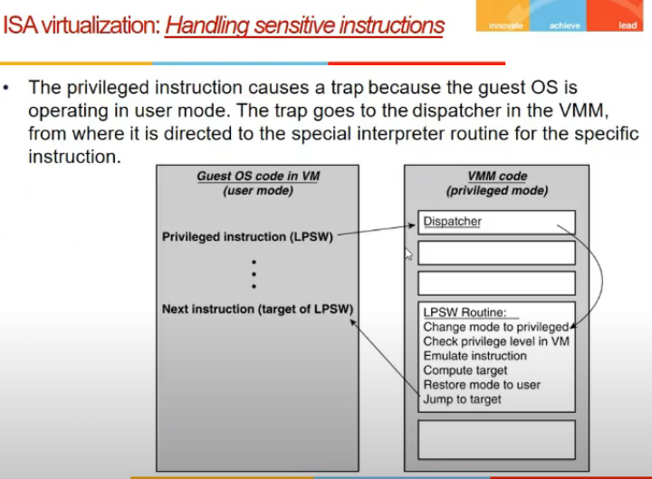

## VMM Components

- Dispatcher
  - finding which subroutine to use for an instruction
- allocator
  - decides how system resources should be provided to VMs running on top of VMM
- interpreters
  - emulation purposes

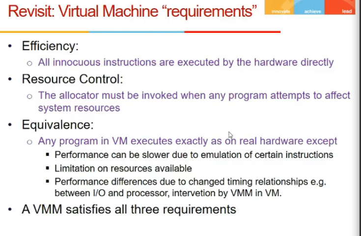

- innocous = not sensitive

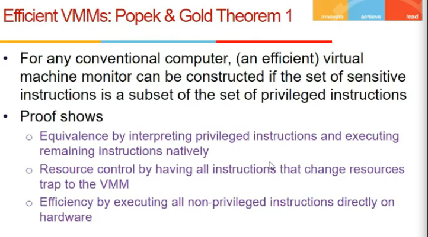

## Recursive Virtualization

- running a VMM on top of a VMM and on top of it another

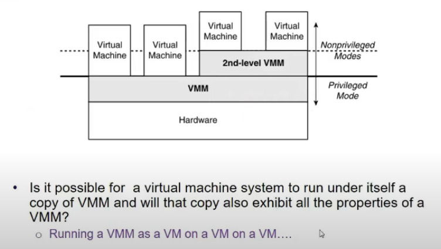

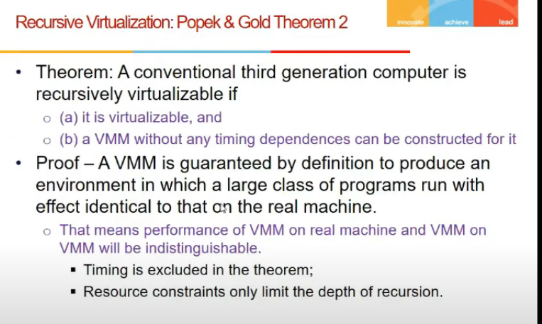

## Hybrid Virtualization

- one that does scanning and patching also
- jisme critical bhi ho

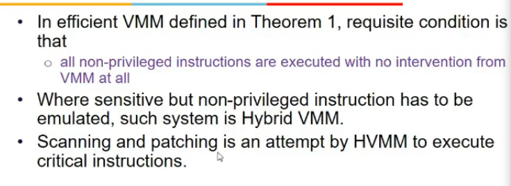

- How handle?
  - inspect code, and discover critical instructions
  - patch: trap laga de
  - 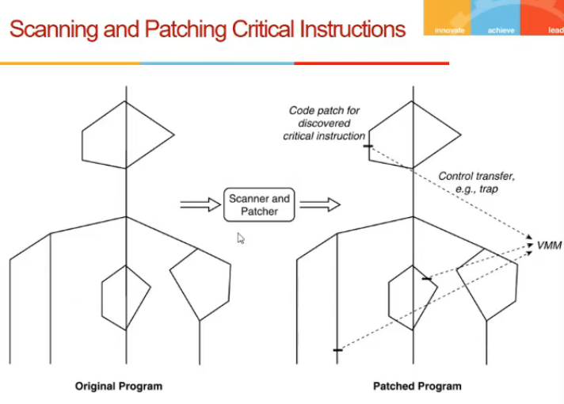
  - 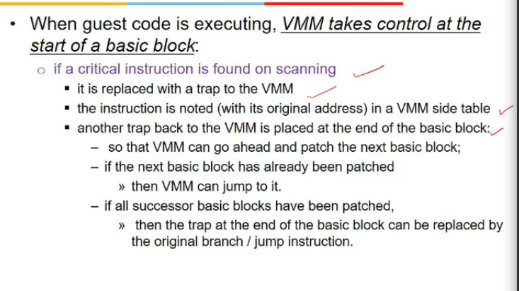
