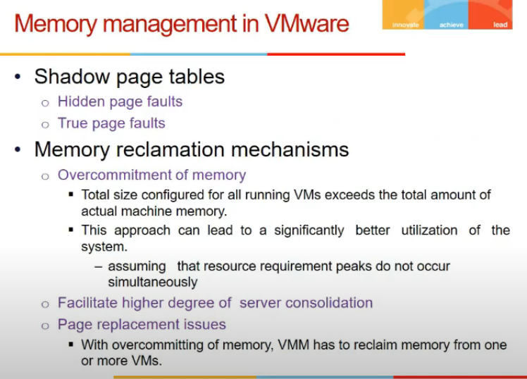

# Lecture 19

- [Lecture 19](#lecture-19)
  - [Video](#video)
  - [Virtualizing Processor State](#virtualizing-processor-state)
  - [Satte Management of VMs in VMM](#satte-management-of-vms-in-vmm)
  - [Resource Control](#resource-control)
  - [Virtualizing Memory](#virtualizing-memory)
  - [Shado wpage table](#shado-wpage-table)
  - [Memory Management in VVMWare](#memory-management-in-vvmware)

## Video

[link](https://drive.google.com/file/d/1SKCtMYQLaA9K2AyGvK43ZhoabyDOv-tV/view)

## Virtualizing Processor State

- state = special purpose registers (PC, Cndition codes etc)

- system registers (clock, timer) not visible to user space, used by os
- these are imp for guest os
- how vmm take care of this?
- 2 approaches

- Guest os has hierarchy of memory: disk, memory, cache etc. Not everything maybe mapped to target
- VMM has to remember the state, VMM is like OS
  - usko guest os state dekhni padegi

## Satte Management of VMs in VMM

- Approaches
  - indirection
    - evryth(state) stored in main memory, refer to main mem
    - inefficient (every time load store karna)
  - copy content to respective posn in memory hierarchy and then do operns

)

## Resource Control

- OS kya karta
- Cpu allocate karta processes ko, context switch karta
- set cput imer instructions e, timer expire ke bad cpu goes in kernel mode, and woh dekhta aage
- vmm is like os abhi, diff guest os are executing, there are processes within vm, and vmm ko har vm ko time dena, and har process within vm ko
- set cpu timer is priveledged instr, so vmm ke pas a jata and woh dekhta

- T = time allocated, Tr = time remaining, checks if current remaining time is less than allocated time etc

## Virtualizing Memory

- Os me bhi virtual address space dete, page table se pohysical address space pe map karte

- valid hai ki nahi page is from valid/invalid bit from page table, bcz kuch page might be in disk abhi
- TLB cache - caches page table address mapping

- TLB is in hardware os is in s/w, so tlb is fast

- VMM Memory thing
  - it has to deal with os and process
    - page table is for each process
    - process change => TLB should be flushed and reloaded
    - guest os assumes control of physical memeory, it adds entries to page tables, deletes, etc.
    - how to achieve such an impression for guest os?
      - we have 3 dumps, generally 2 hote (physical and virtual dump)
        - yaha pe virtual(process level), real (guest level os view of memory), physical (what is in memory)
        - guest maintains mapping b/w virtual to real
        - vmm does b/w real to physical.
        - so real addresses are again virtual only

- TLB translates into physical address, address of main memory
- so page table pointer (h/w) kisko point karega (virtual to real) or (real to physical)
  - 2nd bcz end me physical address chahiye
  - but actual program uses virtual addresses and not real, so we need another page table (shadow page table)

## Shado wpage table

- maintains mapping from virtual to physical (maintained for every page table)

- these addresses are not known to guest os, but vmm only

- when new process changes, vmm points to respective shadow page table
- Page fault
  - when h/w says ki page fault, it comes to vmms, it maybe hidden page fault or true
  - dekh shadow me V->P hai, page fault mtlb page nahi hai memory me
  - guest os me V->R
  - VMM me R->P
  - true means guest me bhi valid bit 0
  - hidden means V->R me hai mapping, but R->P me nahi (guest thought pages hai memory me but VMM has swapped, maybe next guest os ko chahiye tha)
  - so hidden page fault are not conveyed to guest os, true ones are

 

- Problem is semantic gap
  - specific to ESX server(VMM for VMware)
  - guest os and vmm sabki khud ki page replacement policies ho sakti, ek bol ra swap kar, ek bolra le ke aa, and hence multiple page faults ho sakte
  - guest os ki replacement algos public nahi ho sakti maybe
  - so **double paging problems**
    - vmm moves a page form main memory to os, os also says swap it, but swap ke lie it should be in memory, so bulayo memory me and then swap
    - VMWare dows ballooning
      - balloon is process running in guest
      - whenever vmm wants to take away some oages from guest os, balloon inflates, i.e. it will take some pages from guest os, os batayega yeh pages hai, and woh vmm ko bata dunga, vmm will evict those pages, balloon will not use those pages na
      - ab vmm ko agar release karne, then release from balloon

## Memory Management in VVMWare

- overcommits the meory
- guest os ko boldeta ki bhai bahut hai le le
- guest os ne 4gb mangi, aisi 5 vm, total 20 gb chahiye but hai total 16 hi
- assumption is each vm does not peek at same point
- statistical multiplexing

