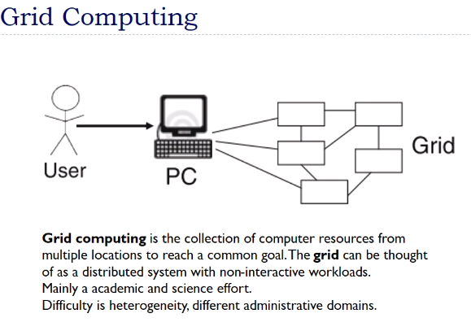

# Lecture 1

## Books

## Course webpage

[link](https://canvas.instructure.com/courses/2263144)

## Intro

- Module 1
  - intro to the course
- A cloud cannot be hosted in a single system, it needs to be spread across various system

## Evals

## What is Cloud

- distributed system
- high availability
- high scalability

- resource can be anything
  - storage
  - computing power

## Computing

- Mainframe
  - very large systems
  - centralized computing
  - monolithic
    - everything is in one place
  - batch processing
  - terminal is usually dumb (like telnet)

- PCs
  - not huge capacity
  - interactive with user
  - user can send cmds, and all

- Computer Networks based systems
  - decentralized
  - connected
  - interactive and remote processing

- Grid Computing
  - resources avail in ur own lab/insti etc
  - give access to other ppl
  - remote
  - non-interactive workload bhi kar sakte
    - submit a job and leave to complete
  - Personal comp ki capacity bahut small
  - so this is cluster and can be connected over n/w and give access to others

- Data Centers
  - pooling the resources
    - grid me bhi yehi tha but usme resources sab ek jagah the and academic purposes mainly
  - yaha huge bandwidth connectivity
  - ppl can purchase/rent it

- Computing on cloud
  - data centers were infrastructure : they provide infra
  - cloud also provide services on top of it
  - infrastr > on top of it platform > on top of it services

## Why Cloud and not own systems

- Cloud provides elasticity
  - u can reduce or increase ur resource requirements as u go, on demand
- Maintenance
  - resource maintenance me I do not have to invest money
  - someone else is taking care of it
  - I have some system lovcally, uske kharaab hone ki prob bahut kam, Cloud pe bahut jyaada systems, so same person will take care of all those resources
  - Cooling, Air conditioning of systems vagairah bhi dekhna hoga
- Scalability is provided
  - Cloud providers replicate data to some geographically diverse places
  - so if there is some disaster in some place, data is saved at other place

## Cloud Services Offering platforms

- Amazon
  - AWS
- Microsoft Azure
- Google Cloud

## Super Clouds

- irrespective of cloud provider, I can have my services running across the cloud
- Moving my services from Amazon (AWS) to Microsoft is not easy
- Super Cloud says it is easier to move from one to other
- all are kinda running at same  place

## Visualizations

- Cost effective hai cloud computing