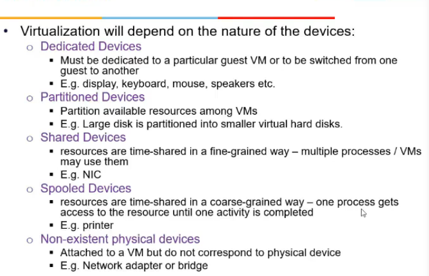
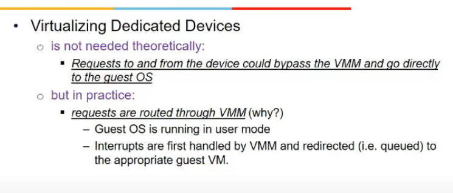
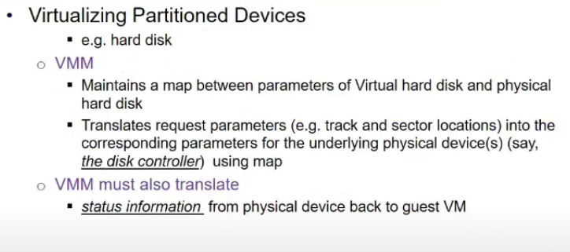
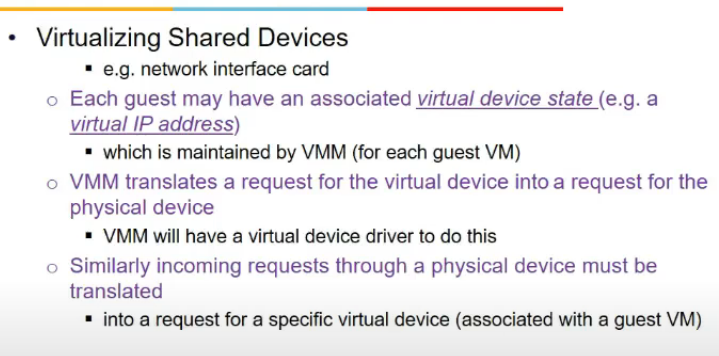
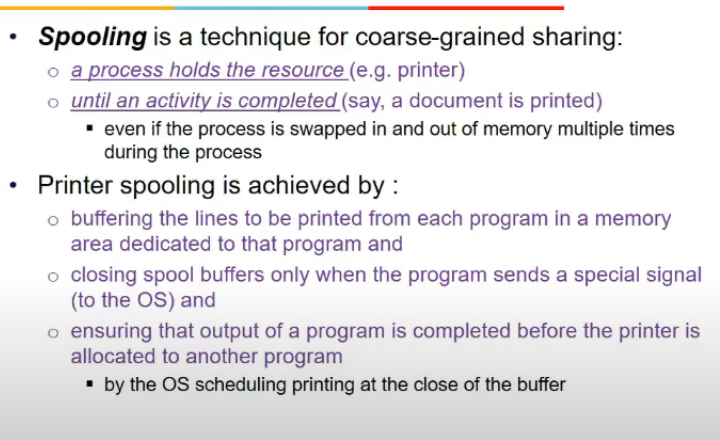
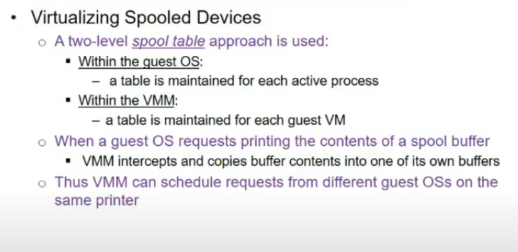
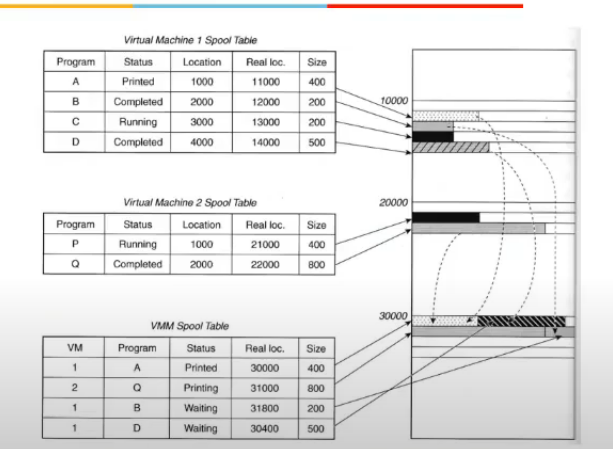
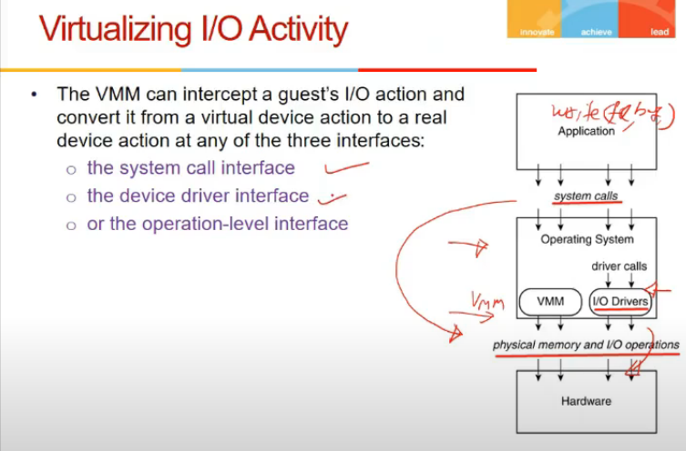
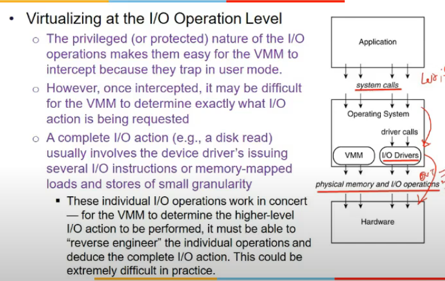
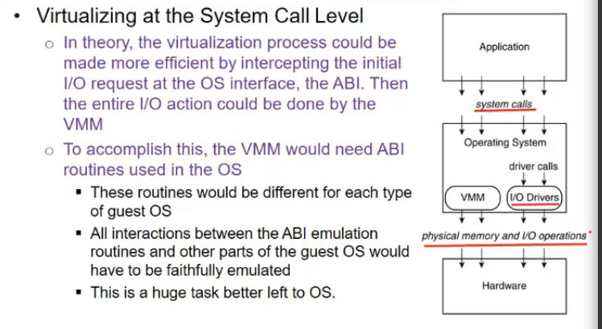

# Lecture 20

- [Lecture 20](#lecture-20)
  - [Video](#video)
  - [Virtualizing I/O](#virtualizing-io)
  - [I/O Devices](#io-devices)
  - [Virtualizing Dedicated devices](#virtualizing-dedicated-devices)
  - [Partitioned Devices](#partitioned-devices)
  - [Shared Devices](#shared-devices)
  - [Spooled Device](#spooled-device)
  - [Virtualizing I/O activity](#virtualizing-io-activity)
    - [I/O Operation level](#io-operation-level)
    - [Device Driver Level](#device-driver-level)
    - [System Call level](#system-call-level)

## Video

[link](https://drive.google.com/file/d/1qSn-9vKmC-zQP-v0FWRxI8nBC1hThy7d/view)

## Virtualizing I/O

- VMM has to interact with so many devices
- guest Oss expect to interact with the devices
- startegy is vitualize device do guest os ko, also jab activity ho, virtualize that activity

## I/O Devices

- dedicated devices
  - cannot be shared
  - keyboard, mouse
  - switched from one guest os to other
- partitioned devices
  - hard disk can be partitioned and presented as virtual hard disk
- shared
  - network interface card
    - cannot be dedicated, asynchronously data aata na bhai
- spooled devices
  - printer
    - hai shared but cannot be fine grained
    - unless one file is completely printed, it cannot be removed
  - sharing is coarse grained way
  - number of pages ke terms hai na ki kitne ms me
- non-existent physical devices
  - device not exist, but attach to vm
  - eg, switch b/w guest OSs, VMM will have a virtual device which does this

## Virtualizing Dedicated devices

- not needed to virtualize
- simple attach device to guest os
- bas req are routed still through vmm

## Partitioned Devices

- partitioned hard disk is actually a file in actual(physical)
- mapping has to be remembered by vmm
- write req aayi, vmm has to translated to sector and tracj in physical device, and status info bhi bhejni hogi to guest vm back

## Shared Devices

- NIC
- has associated virtual nic to each guest vm
- virtual mac/ip address associated hai
- vmm translate requests
- say tcp req aayi, virtual device druiver hota har guest vm me which identify kaha bheju

## Spooled Device

- printer spooling is achieved by
  - buffering data to be printed
  - guest os karega
  - vmm has to do spooling across multiple vms
  - we have 2 tables for these
    - one in every guest os
      - for each process
    - one in vmm
      - for each guest vm

## Virtualizing I/O activity

- device virtualize karlia
- ab activity
- device attach kia, ab activity kabhi bhi ho sakti
- vmm can try to intercept at system call level or at driver call level(priveledged hi hai na)

### I/O Operation level

- vmm traps i/o operns
- diff to know what i/o ho ra, bcz too fine level pe chal rahe honge instructions
- semantic understanding nahi na bhai

### Device Driver Level

- device driver jab isa me convert karra
- vmm intercept call to virtual driver and convert to physical driver
- dekh virtual device driver are provided by vmm only
- priveldged hai woh, so vmm ko pata chal jata

### System Call level

- best handled by guest os
- bcz usko maybe smjh na aayega
- guest os implement karta hai na

