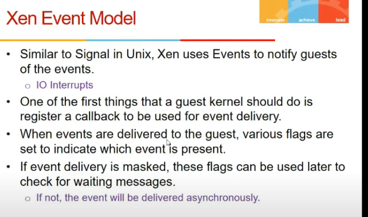

# Lecturee 21

- [Lecturee 21](#lecturee-21)
  - [Video](#video)
  - [X86 Virtualization](#x86-virtualization)
  - [Full Virtualization](#full-virtualization)
  - [Paravirtualization](#paravirtualization)
  - [Xen I/O](#xen-io)
  - [I/O Rings](#io-rings)
  - [Xen Event Model](#xen-event-model)
  - [Communicationg with shared memory](#communicationg-with-shared-memory)
  - [Split Device Driver Model](#split-device-driver-model)
  - [Hardware Virtualization](#hardware-virtualization)
  - [Nested Page Tables](#nested-page-tables)

## Video

[link](https://drive.google.com/file/d/1-pmzFvYBf2tfrLHJ4rNa2utt6_vvdNWG/view)

## X86 Virtualization

- bahut pehle bhi tha vvirtualization (classical)
- architecture used at that time was trap and emulate
- any priveledge instr was to generate trap
- then emulate it
- but x86 me critical instr bhi hote
- so trap and emulare hi nahi chalega
- so binary translate > trap > emulate (scan, patch, trap, emulate)

## Full Virtualization

- OS is nto modified
- it is unaware of virtualization
- it assumes sab kuch hai uske pas

- sometime guest os wants to go according to real time (calendar time)
- to get that, it will be diff bcz u cannot see actual hardware
- natural time lapse hai
- so real and virtual time hai

## Paravirtualization

- modifies guest os itself
- looks at source code, critical instructions ko patch kar dega
- xen comes up with hypercalls
- system calls 80 pe hote, hyper calls int 82 pe

- memory aspect
  - shadow tables dkehi thi
  - R->V, V->P, Shadow thi teen
  - Xen kya karta?
    - jab trap vagairha hota x86 me tlb flushed
    - but tlb hamein visible nahi, so kaise kya kare
    - xen me no shaddow page tables
    - hota mapping R->P hai direct, so diff os ek dusre ki page tables access kar sakte kya?
      - nahi, these are write protected
      - hypercall(trap) hogi, and xen will check location validity and then modify

- xen is allocated some top ki space in page table as linux me kernel hota

- Xen runs in level 0
- guest os in 1
- apps in 2
- apps cannot access guest os
- priveledged and critical instructions are replaced by hypercalls
- improves performance
- hypercall is like system call to vmm
- guest os has to call that, guest os has to be modified, but not possible hamesha (windows ka code nahi na)
- we can batch operations in hypercalls (ek saath kai page table write karle, instead of bar bar)

- Guest app system calls = normal system call
- results in trap, goes to hypervisor, given to kernel, goes to app
- kernel calls hypercall
- accelerated system call
  - cmm ko de ke fer kernel and ferse vmm and then kernel ki bajaye
  - app se kernel

- kernel me handlers de de routines for hypervisor calls

## Xen I/O

- domain 0 guest
  - vm hai
  - special vm
  - priveledged kam karta kuch kuch
  - provides UI to xen (kuch config karni agar teko)
  - provides device drivers (so all I/O ko route through this)
  - has direct access to devices through hypercalls
  - hypercalls has to come through domain 0 only
- domain u
  - cannot issue hypercalls

## I/O Rings

- shmem create kardeta xen
- guest VMs communicate to domain 0 and 0 does to h/w
- place request/data in shared buffer and can be picked by domain 0

## Xen Event Model

- guest os registers some signal handler for event to finish

## Communicationg with shared memory

## Split Device Driver Model

## Hardware Virtualization

- no need to run binary translation, etc, intel ne itne kardia
- vmm root mode and non root mode
  - vmm running in root0

- vmm program h/w ki kab trap bhejna, uske alaawa nahi

## Nested Page Tables

- shadow page table is overhead
- how h/w support this

