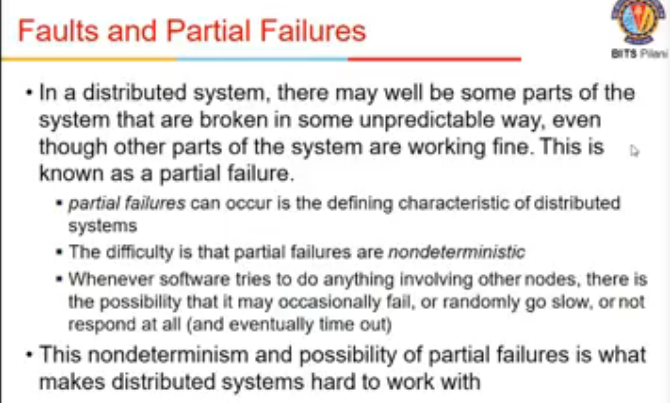
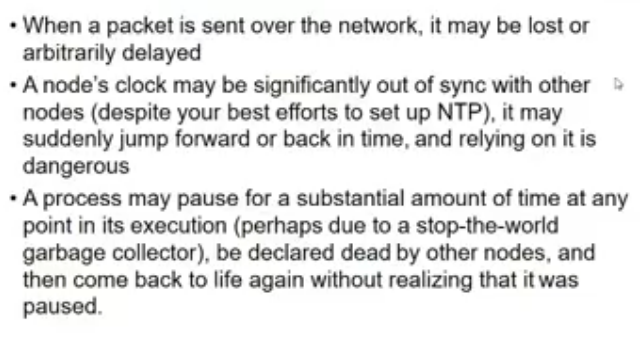
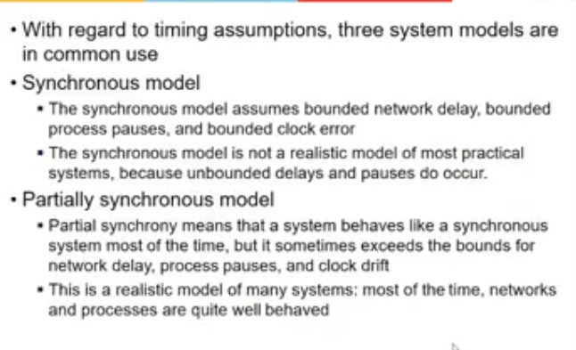
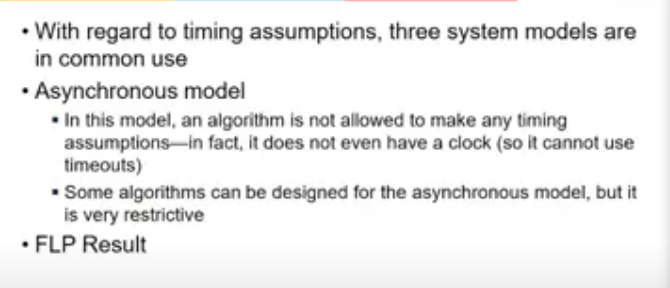
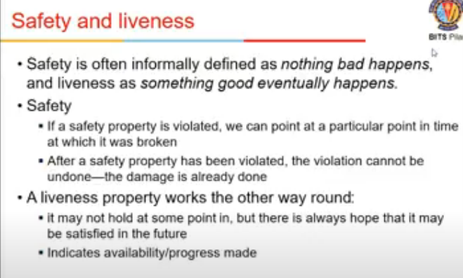
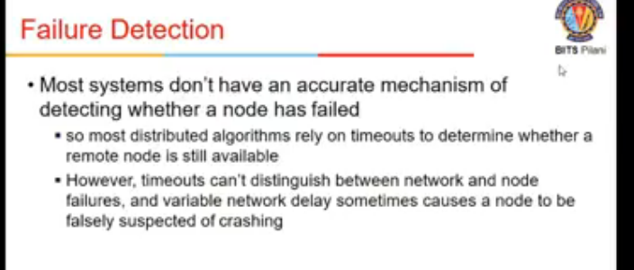
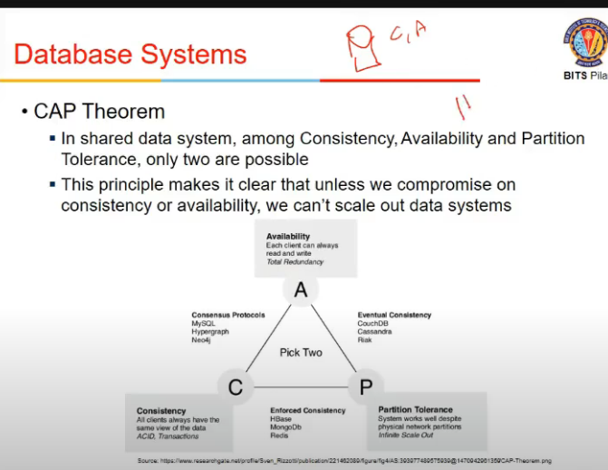
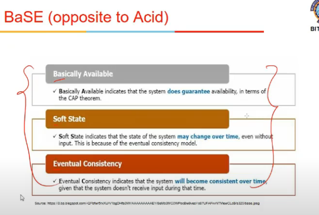

# Lecture 22

- [Lecture 22](#lecture-22)
  - [Video Link](#video-link)
  - [Synchrony](#synchrony)
  - [Failure Models](#failure-models)
  - [Safety and Liveliness](#safety-and-liveliness)
  - [Failure Detectioon](#failure-detectioon)
  - [Fault Tolerance](#fault-tolerance)
  - [CAP](#cap)
  - [BaSE (opposite to acid)](#base-opposite-to-acid)

## Video Link

[link](https://drive.google.com/file/d/1NXk4DX9CtaMx0kA2RiPLOmc3JwDb6itS/view)

- In distributed system, we have nodes connected over a  network
- a program running on single node
- we have some challenges
  - total failure
  - partial failure
- in single node system, program either fails or succeed (reaches expected point or not)
- in distributed system, it may have more than 2 states
  - one process down does not mean system will go down
  - partial failures are diff to detect, since system is not down and seem to be working
  - 
  - 

## Synchrony

- assumption on n/w delays
- three types of models
  - synchronous
    - n/w behavior matches our expectations
    - agar 1s me dena pkt n/w ko, toh utne me hi dega
    - bounds me de raha
    - agar nahi dia => system fail hua hai
    - not realistic model, bcz unbounded delays hote hai
  - partially synch
    - n/w sometimes behaves as synch, sometimes as asynch
    - realistic model
    - most of times, bounds are followed
    - tcp me retransmission timeout value hoti hai, we expect reply to come within those bounds
    - internet is generally partially of this type
  - asynch
    - no assumptions can be made
    - delays are unbounded
    - **imp result (FLP Result)**
      - if there is a system in asynch setting, it is impossible to achieve on a consensus (agree upon ho)
    - 

## Failure Models

- when node fails, 3 common system models for nodes
- crash-stop faults
  - node was working, at some point it fails, after that it is not part of system., it is done
- crash-recovery faults
  - node failed at time t1, it might come back later at t2, tho t2-t2 time diff is not known
  - challenges if node comes back, state uipdate ho chuki hai
- Byzantine (arbitrary) faults
  - node might to anything, including trying to trick and deceive other nodes
- algos should take care of which failure they are modeling, and take care

## Safety and Liveliness

- any execution happening on distributed system should follow these
- safety
  - nothing bad happens
  - every state within node is consistent with state other nodes have
- liveness
  - something does happens
  - algo should come to a conclusion
  - deadlock type ki state na aa jaye

## Failure Detectioon

- timeouts is one of mechanism to detect failure
- agar set timeout me nahi reply aaya => smth went wrong
- but node ya n/w kya fail hua, no one knows

## Fault Tolerance

- hadoop me dekha tha
- distributed systems are generally through msg passing
- this is shared-nothing system [not shared-message]
- faults are common in distributed systems
- when node fails, system should be robust to tolerate that failkues
- failure may mean multiple aspects node fall down
- n/w is divided into 2 parts (n/w partitioning)
- multiple nodes failed at same time

## CAP

- Consistency, Availability , and Partition tolerance
- single user agar hai db me, no worry about concurrency issues
- multiple users => concurrency control needed
- db systems ensure these ACID properties
  - atomicity
    - txn may have multiple read/writes
    - prop states that either txn happens completely or nothing happens
  - Consistency
    - data b4 txn and after txn are consistent
  - Isolation
    - temporary state of a txn (inconsistency) is not visible to others
  - Durability
    - whatever change is done should be durable even if system is crashed, it must remain
- to ensure these properties
  - single node db me koi bt nahi, sab kuch ek jagah hai
  - but if data is partitioned across multiple systems, it might delay (overhead int erms of time and availability)
- CAP thm says that out of consistency, availability, and partition tolerance, only 2 can be provided at a time

- single node me partitioning hi nahi hogi toh C,A dono mil gaye
- agar atleast 2 node hai
  - partitioning possible
  - so along with partitioning, I can only get consistency or availability

- Consistency?
  - changes should be consistent
  - if db is replicated, change in one must reflect in others as well
  - even if it is partitioned (darta partitioned into disjoint subsets and distributed)
    - constraints vagairah ensure karna, tough
    - availability affect hogi (mtlb timely nahi milega bande ko reply)
    - so tradeoff b/w consistency and availability

- Availability + Consistency
  - either single system or some protocol in place
- Availability + Partition tolerance
  - eventual consistency
  - system maybe inconsistent at some pt of time, but eventually it will get corrected
  - user may read inconsistent at some time
  - dynamoDB is one eg
  - there are mechanism where we can know if it is consistent or not
- Consistency + Partition tolerance
  - any copy of data picked will be consistent

- MongoDB vagairah
  - partition database in other systems, so that any txn requires data only for a particular system
  - so agla involve hi nahi toh koi bt nahi consistency ki
  - sharding karta na mongodb

## BaSE (opposite to acid)

- basically available
  - system does guarantee availkability
- soft state
  - whatever state we see at one pt of time may change at any pt of time without any external input
    - normal db me w/o input it fdoes not change
    - router me hoti hai soft state => has some time after which it changes, hard state => which remains constant
- eventual consistency
  - system will become consistent over time

