# Lecture 23

- [Lecture 23](#lecture-23)
  - [Data Replication](#data-replication)
  - [Leaderless replication](#leaderless-replication)
  - [Read and Write in Dynamo-Style DBs](#read-and-write-in-dynamo-style-dbs)
  - [Read Repair and Anti-entropy](#read-repair-and-anti-entropy)
  - [Quorums for Reading and Writing](#quorums-for-reading-and-writing)
  - [Sloppy Quorums and Hintend Handoff](#sloppy-quorums-and-hintend-handoff)
  - [Limitations of Quorum reads and writes](#limitations-of-quorum-reads-and-writes)
  - [Detecting Concurrent Writes](#detecting-concurrent-writes)
  - [Version Vectors](#version-vectors)
  - [Capturing the Happens-before == Causal relationship](#capturing-the-happens-before--causal-relationship)
  - [Merging Concurrently written values](#merging-concurrently-written-values)

## Data Replication

- have copy of data at multiple places
- advantages
  - increase availability = fault tolerance
  - distributes load among multiple nodes
  - decreases latency, ppl send request to node close to their system
- Challenges
  - any change in one replica , must be refglected in others else inconsistent states, this s **synchronous replication**
  - this affects latency
- **Asynchronous replication**
  - keval ek me kar abhi, baaki ka asynchronously hota rahega

- 3 kind of replication strategies
  - single leader
  - multiple leader
  - leaderless

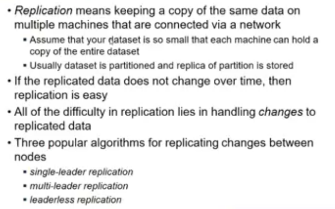

## Leaderless replication

- there is no ordering of requests
- when leader is there , one replica is primary and others are secondary
- secondary do not accept request for update, only for reads
  - for any update to be done, they send to primary or client sends to primry
  - primary applies writes in some order and also tells to secondary ki is order me lagayo, so all of them see same state
- here, no leader
- client can talk to any replica for r/w

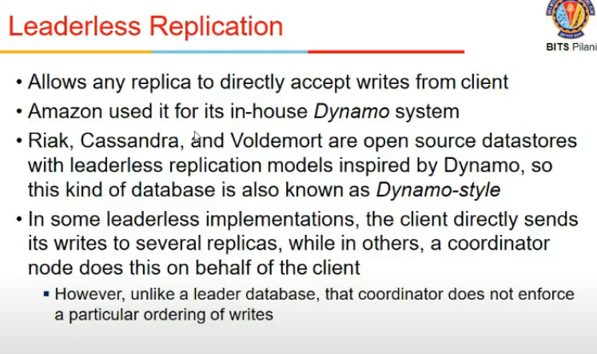

- DynamoDB is based on this
- S3 is built on top of Dynamo
- dynamo is very much scalable

## Read and Write in Dynamo-Style DBs

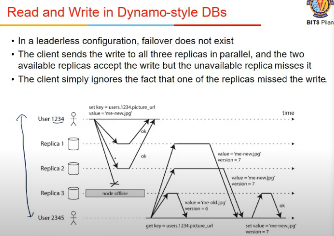

- 3 replicas and 2 users
- user 1234 is updating, updating in all 3 replicas
  - 1 replica is offline
  - so bas 2 me changes hue
- user 2345 asks for image url
  - 2 nodes give same info, 3rd node gives diff
  - he sees ki 2 node me new version so tells last node to correct it
- so, read requests must be sent to all the replicas and update stale values

## Read Repair and Anti-entropy

- when u read, read from all and update if needed
- it may not give update to db easily, bcz reads may not be frequent
- so anti-entropy process
  - bg me chalta and checks if some older version remains etc

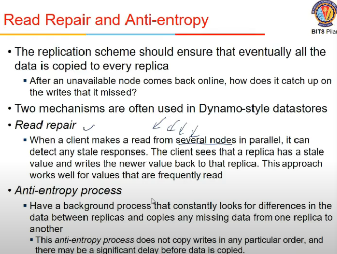

## Quorums for Reading and Writing

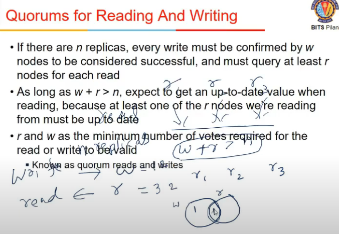

- Does read have to be from everyone?
- nah, follow quorum principle
- when we write, say there are n replicas
- we write to w nodes, and read from r nodes, such that w + r > n
- the idea is the nodes in which we write and from where we read must overlap (atleast one node must be part of overlapping region)
- so atleast one ndoe will have value of most recent write
- r and w can be chosen, n is fixed

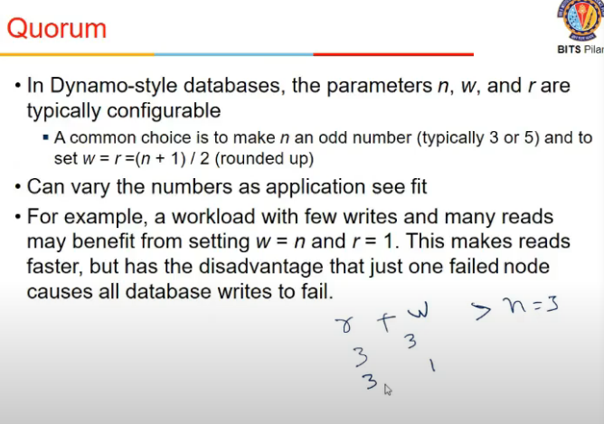

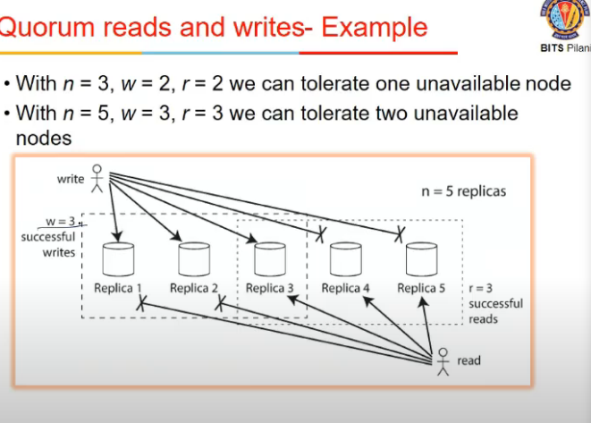

## Sloppy Quorums and Hintend Handoff

- specific to dynamo
- sloppy quorum
  - say write quorum is 2, but u can write only to 1, so it makes an intermediate node and write there, and sayas all is ok
  - tho it has not written to actual node
  - when node comes online, value is copied to the node which is back
  - when u read, are proxy/temporary used?, don't know. they might not, so inconsistency might be therw
  - tradeoff with performance

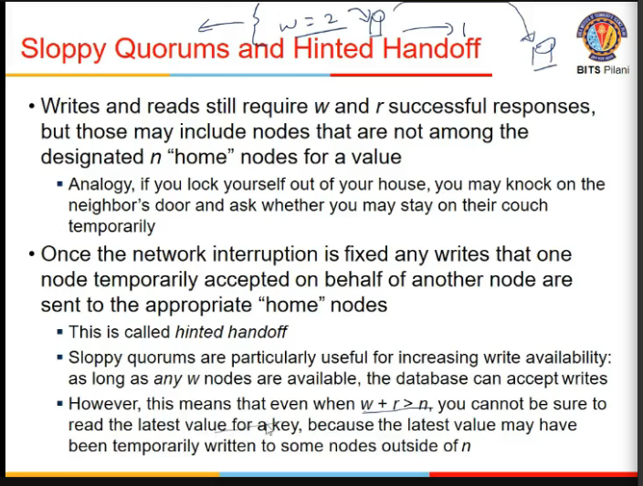

## Limitations of Quorum reads and writes

- is it sufficient to follow quorum to ensure everything is ok?

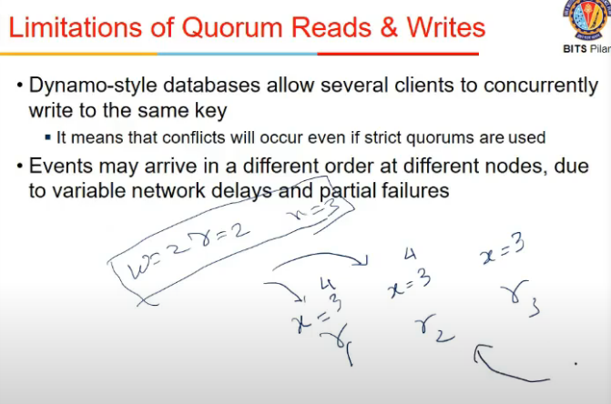

## Detecting Concurrent Writes

- a data item being written by 2 diff client in 2 diff replicas

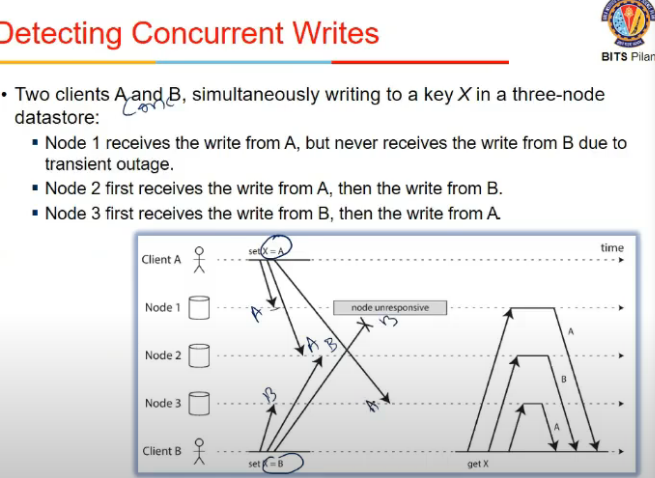

- version number diff nahi, ambiguous hai version number
- detect using version vectors

## Version Vectors

- for each data item, keep a version vector along all nodes
- position in vector correspond to node number
- all elems in one vector < second vector then ok,
- 100 < 200, 100 < 110
- but if some value is smaller, some are larger => concurrent writes ho rahe
  - 100 and 011

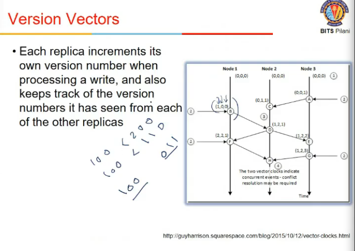

- if conflict hua, what is considered as most recent
- Last Write Wins
  - timestamp for every write, latest timestamp wala le le, baki ko reject
  - achieves eventual convergence, but durability ke cost pe

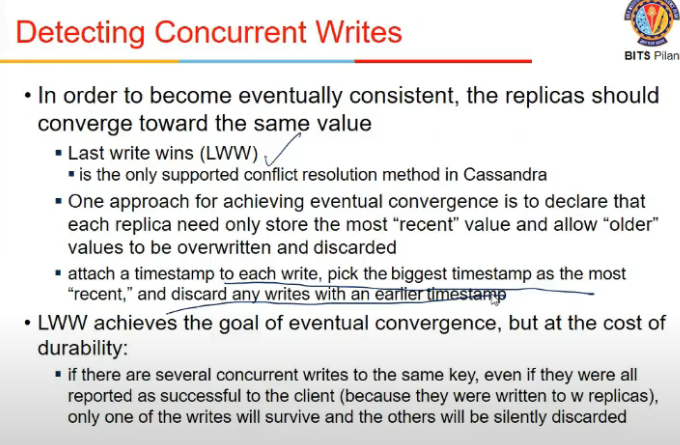

## Capturing the Happens-before == Causal relationship

- which one comes first, which one comes second etc
- server can determine if 2 operns are concurrent by looking at version numbers
- maintains version number for each data item
- value written to key => increase version number
- when client reads a data item, server returns all versions
- b4 writing client must read all values
- so write is not successful unless we read all values
- when client writes a key, it must include version number from previous ones
- overwrite all versions less than what client has told. higher waale rakhe rteh as at is

## Merging Concurrently written values

- requires application semantics
  - union for a shopping cart
    - 2 alag entries aayi, merge kardia unko
  - last write wins

- what number of minimium and max nodes can fail (how robustly I handle it) depends upon quorum values
