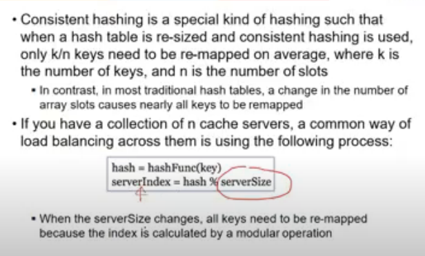
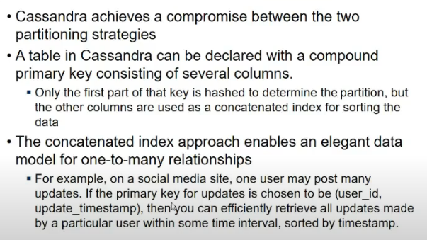

# Lecture 24

- [Lecture 24](#lecture-24)
  - [Data Partitioning](#data-partitioning)
  - [Approaches to partitioning](#approaches-to-partitioning)
    - [Consistent Hashing](#consistent-hashing)
  - [Hybrid](#hybrid)
  - [Skewed Workloads and Relieving Hot spots](#skewed-workloads-and-relieving-hot-spots)
  - [Secondary Indexes](#secondary-indexes)
  - [Rebalancing Partitions](#rebalancing-partitions)
    - [How to do](#how-to-do)
  - [Request routing](#request-routing)

## Data Partitioning

- duplication of data nahi hai
- one big data stored at multiple places splitting it

- this concepot is sharding
  - known as shard in MangoDB, Region in Hbase, etc etc
- data partitioning and replication could happen simultaneously

- each piece of data (row) belongs to exactly one partition (horizontally partition hai), fields are not split
- instance of fields store at diff

- diff b/w HDFS and partitioning?
  - hadoop is file wise while others are wrt rows and columns
  - hadoop me bhi partitioning hai but file ke terms me
  - db me rows/documents ke terms me hai
  - hadoop me we have replication as well along with partitioning

- Purpose?
  - load balancing
  - so that hotspot na ban jaye ek node

- How to partition data
  - sorting
  - hashing
  - randomly distribute the keys
    - retrieval is difficult
    - query should be efficient

- Two types of query (in gen 2 types)
  - Equality
    - `select * from table where column = value`
  - Range query
    - `select * from table where column > value`

## Approaches to partitioning

- Key range partitioning
  - we have range
  - sort data by key
  - b/w value a and b, go to node 1
  - b/w value b and c , go to node 2 and so on
  - range queries efficient since sorted order hai
  - there can be hotspots, key accesses more frequently might be in closer range

- Hash partitioning
  - appl hash function to key, it gives a node # where to go
  - range queries are diff

- How to repartition when there is imbalance? new node added, removed etc

### Consistent Hashing

- we have a set of nodes and key space(0..2^4-1)
- node joins the n/w, it is hashed using hash fn
- when key is hashed, it also lies somewhere in that range

- I take key and hash it, it gives me some number
- key ke hash maan 16 pe aaya and waha koi node hi nahi, so usko next node pe laga de
- next server in clockwise dirn wala utha leta hai
- advantage?

- new server (green wala) is added
- initially key 0 was mapped to gray node
- now keys b/w yellow and green jo thi, woh pehle grey pe mapped the, ab green pe ho gaye
- so only some keys need to be remapped

- if a server is removed(fails down), key mapped to next server

- load imbalance ki prob a sakti
- key space b/w 2 servers is non-uniform
- so how to work it out
  - add a virtual node
  - node actually does not exist
  - same physical server is added virtually as multiple physical servers

- sorting and hashing dekh li
  - hashing me equal queries efficient

## Hybrid

- Cassandra uses this approach
- sorting + hashing
- key is based on multiple columns
- first part is hashed
- others are sorted
- within partition how to search out, is using sorting
- one-to-many relationship hai agar, student id is repeated in every part na, so usko hash karke partiion nikal and then within partition it is sorted and hence searching easier

## Skewed Workloads and Relieving Hot spots

- even though equally distributed hai data, hotspots still can occur

- one of way is while writing, same key add smth more to it
- to divert read and writes for a givem key using a random number
- if a key is hotspot, add some random integer , it will become new key , and it goes to diff partiion now.

## Secondary Indexes

- not unique but still mnight help in search

- 2 approaches to maintain 2ary indexes(everything is not in one partition na bcz partiioning isbased on primary key)
  - document based partitioning
    - within partiion, create a 2ary index
    - execute query across all partitions and combine results
  - term-based partiioning
    - or, create a global index
    - multiple partiions me query nahi karna
    - jaha jaha pe data hai, wahi pe query kar

## Rebalancing Partitions

- kind of load balancing
- queries ko proper response time mile
- moving data in cluster from one node to other

### How to do

- Fixed number of partitions
  - say 1000 partitions the
  - every time node added, partition moved to node
  - #partitions remains ame, size may vary

- Dynamic partitioning
  - key range partitioning
  - sorting of keys se ja raha
  - fixing number of partitions is diff
  - idk how many values will be there within a range

- indynamic, number of partitions are proportional to data size
- in orher approach, har node ko fixed number of partions de de
- when partition size increases split it

## Request routing

- end user does not know kaha data lies

- diff approaches
  - first
    - dns based thing
    - allow client to communicate to any node
    - if node contains partition, it answers query else send to respective partition
  - second
    - send all request to router and it will handle where to send

- dotted are devices whiuch need to know where data is there

- third approach me client ko hi pata kaha pe bhejni
- how component making router decision comes to know about changes made in partiion node mapping
- many distrbuted systems depend on service like zookeeper
  - allows multiple nodes to write
  - and ensures consistency bani rahe
  - notifications bhej dega subscriber ko
  - stores all mappings

