# Lec 22

- [Lec 22](#lec-22)
  - [Consistency and Consensus](#consistency-and-consensus)
  - [Strict Consistency](#strict-consistency)
  - [Linearizability](#linearizability)
  - [Sequential consistency](#sequential-consistency)
  - [Causal Consistency](#causal-consistency)
  - [Linearizability vs Causal](#linearizability-vs-causal)
  - [Ordering Messages](#ordering-messages)
  - [Noncausal seq num generators](#noncausal-seq-num-generators)
  - [Lamport timestamps - Example](#lamport-timestamps---example)
  - [Total Order Broadcast](#total-order-broadcast)
  - [Consensus](#consensus)

## Consistency and Consensus

- consistency means txn executing on consistent db leaves it in consistent state, i.e. all constraints are satisfied
- in distributed diff meaning
- many models
- eventually consistent dekha leaderless me
  - maybe in inconsistent at some point
  - but eventually will come to consistent

## Strict Consistency

- any write to any data in any node is immediately visible to all other nodes

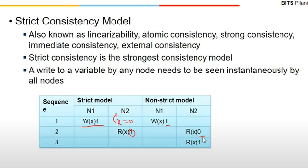

- aka atomic/strong/immediate/external consistency or linearizability

## Linearizability

- about a single opern across various nodes
- when system is lineaz, any write is seen as single data write even though theremight be multiple copies
- one copy of data abstraction it provides
- any changes are visible to subsequent operations
- treats all replicas as single data
- it is a recency gyuarantee

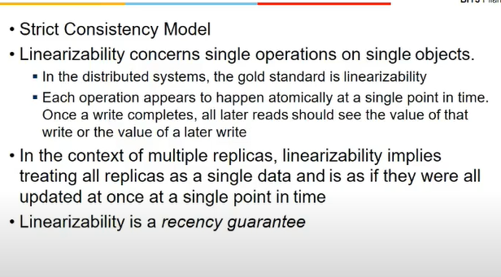

- example
- refree adding scores
- 3 instances - leader, 2 followers
- not linearizable bcz all replicas not updating in single point of time

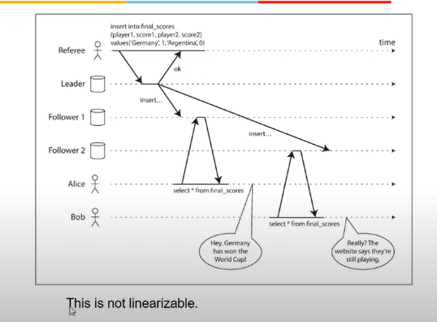

- Compare and Set operations
  - when u read a value from replica, assuming u r making change, someone else might have also
  - so while making change, u should also give a condition, ki agar value yeh ho, tb yeh kardo
  - else, overwrite and lineariz nahi hoga

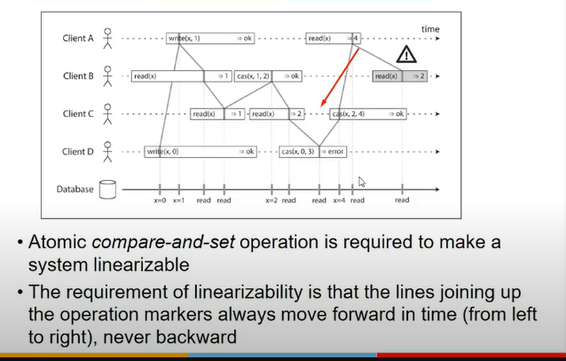

- client  B gets incorrect val;ue and hence not lineariz

## Sequential consistency

- all operns from a given node must take place in the same order in other nodes
- diff from strict consistency
- eg tweets from a user would be seen by others in same order in which he tweeted

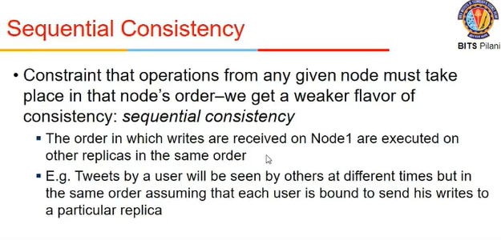

- it is concerned about all operns (agar koi photo change karra woh bhi, faltu me)

## Causal Consistency

- only causally related operns must occur in order, others ka idc
- eg, blog me reply comes after comment only. kaunsa comment pehle aya does not matter. so reply is related to comment

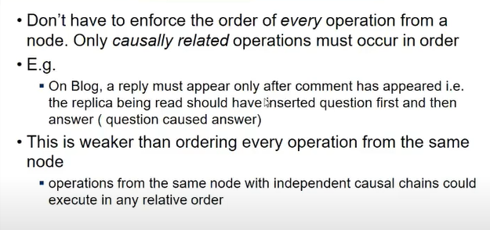

- diff from sequent consis bcz operns from same node with independent causal order can occur in any order
- order is only applicable to independent changes

## Linearizability vs Causal

- lineariz me total order hai, any opern performed in one node is also in other nodes
- there is no concurrent write in lineaz
- one copy of data hai, no 2 ppl can write to same data, so no concurrent writes
- in causal, order is partial
- independent change pe hi order applicable hai, among causal chains, no order
- lineariz => causal but not vice versa
- lineariz me availability might be harmed, bcz user ko inform karne se pehle we change all replicas
- causal does not affect availability provided u can make data in such a way that one causal change can be made in one node in same order, in other nodes it should when they come in contact

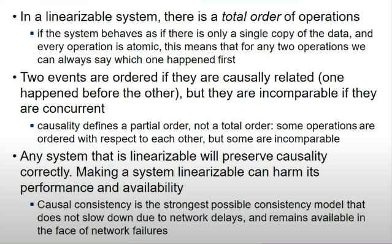

## Ordering Messages

- keeping track of causal dependencies can be impractical
- any change I will need to rtrack, ki kaunsa change kis ki wajh se hua etc etc
- appln level pe hai caual relnships, txn lvl pe karna hard

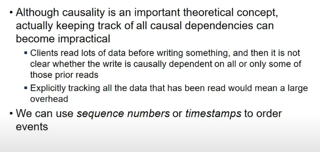

- can be done using sequence number
- har opern ko ek seq numb de de, and value se pata chal jayega ki kaun pehle aya
- the seq nums should be globally allocated since kisi bhi node pe ho sakta write opern
- single leader replication (all writes go to one leader only) me it makes an order of all operns, same order is in which other applies to their dataet

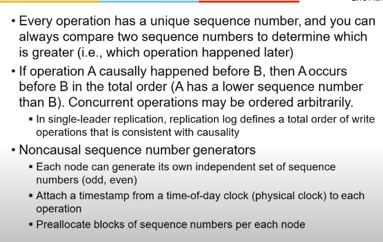

- total ordering hai bcz global level pe hai, all ndoes level

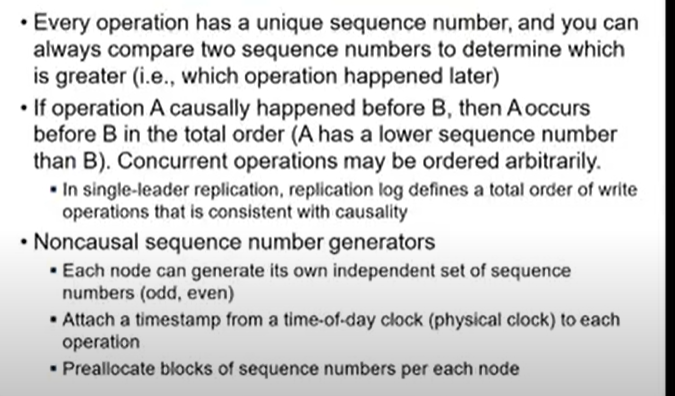

- non causal seq num generators
  - odd and even
  - ecery node can generate
  - pehle globally generate tha
  - does not guarantee total order

## Noncausal seq num generators

- even-odd, etc do not guarantee causal consistency
- bcz seq num are specific to indiv nodes
- operns cannot be compared across nodes so , no causality
- lamport timestanmps = counter specific to ndoe but node id is attached to counter
  - provides total order
  - since node counters can be compared
  - causally consistent, how?
    - any node which sees seq num higher than itself will make it 1

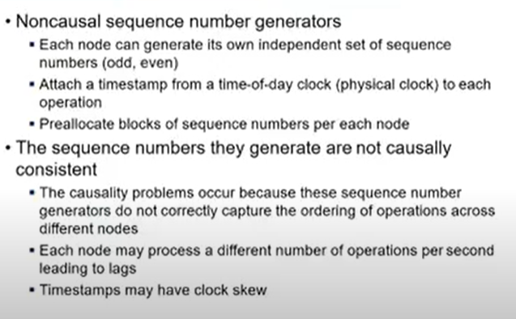

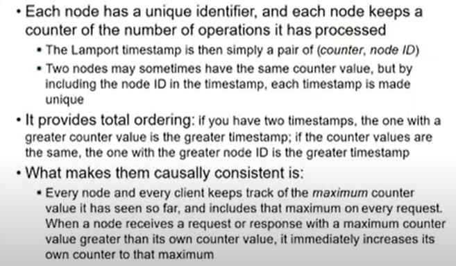

## Lamport timestamps - Example

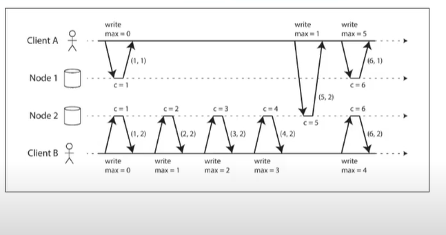

- here counter is being increased
- in node 1, it is 1
- node 2 me it does writes, count increases
- node 1 does a read, gets 5,2 and this counter value (5) is greater than its value (1), so it makes its value as 5
- ensures total order and causality

- what if client A contacts node 1 after client b writes 3 in node 2
- so here count will start increasing, from 1->2->3...
- the total order is fine but emerges only after all operns are done.

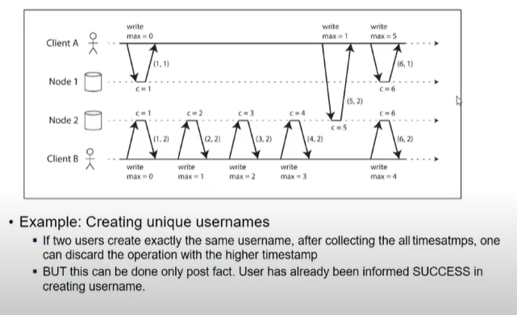

- user contacted node 1, u1 nahi tha, usne boldia karle
- user b contacted node 2, u1 still nahi tha, usne bola karle
- so bt ho gayi, bcz nodes ko baad me chalega yeh
- but client ko toh ha hi bol chuka
- total ordering hai but immediate responses nahi mile

## Total Order Broadcast

- decide order first
- every node should be aware of it.
- lamport me they were not aware
- eg opern to create username
- only when u r sure koi other node ke paas nahi hai username tabhi aage badh
- can we know ki other clients what they r doing

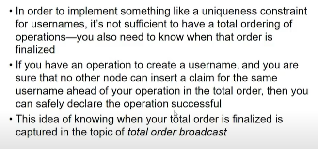

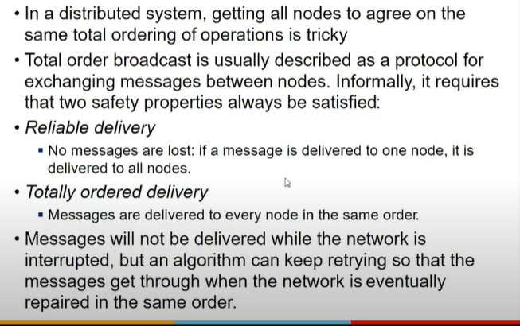

- 2 assumptions
  - reliable delivery
    - nothing lost
  - totally ordered delivery
    - delivered to everybody in same order

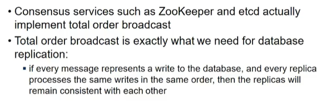

- in tob, when msgs are originated froma node, order is fixed, others can add to it, but not change it
- tob is exactly what we need for db replication
- zookeeper me implement hota yeh
- tob is same as linearizability

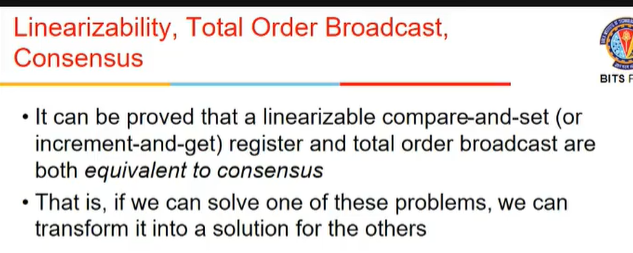

- line me every write should appear to others, in tob, we r getting others to agree on an order, consensus = majiority should agree

## Consensus

- getting others to agree on smth
- one of appln is leader election, hapens automatically
- atomic commit = some nodes may fail, so sabko us samay rollback karna hoga

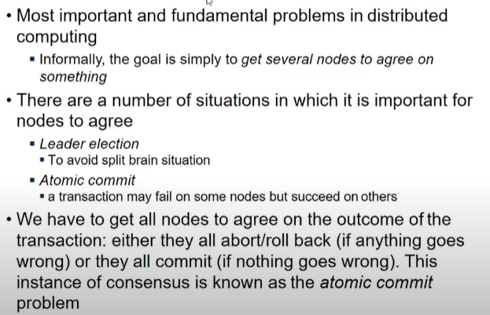

- 2 phase commit hota
- we have coordinator and participant
- coord sends req (can u commit?) to every p, they say yes or no, if they all agree
- if all say yes, then commit bhejta coordinator sabko, else rollback

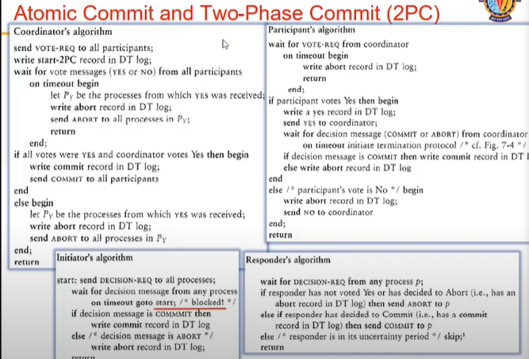

- what happens in terms of failure?
- say coordinators rcvd yes or no from nodes and when coord sends in second phase abort or commit, and some node is not able to hear it, then node blocks. It cannot abort or commit itself.
- so what happens is, after some timeout, it starts sending messages to neighbouring nodes (jinko yeh janta), and if anyone says commit, it commits.
- if it is not able to connect with any other node,  it blocks then
- if coordinator is crashed in second phase, then no body knows and are waiting.
- but if rcvd by some, not by some, then prob. bcz if nodes do not know about each other, then bt
- so it can end up blocking indefinitely

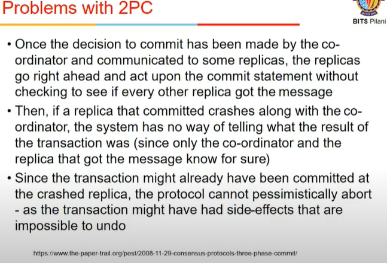