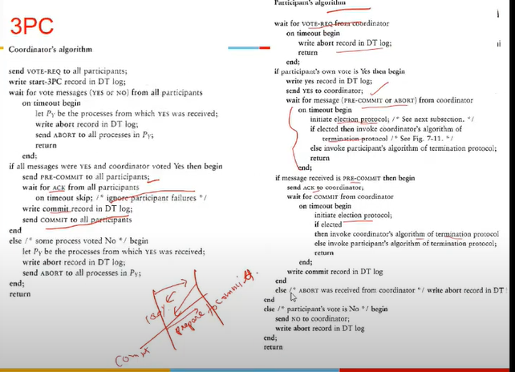
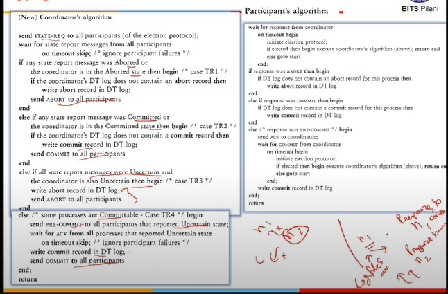
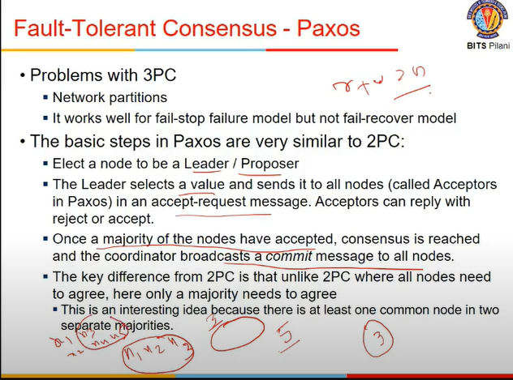
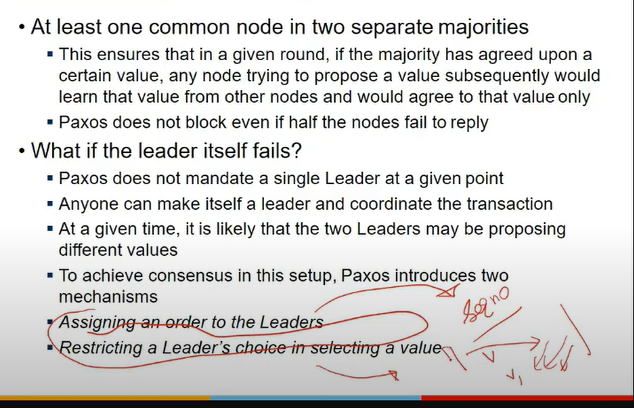
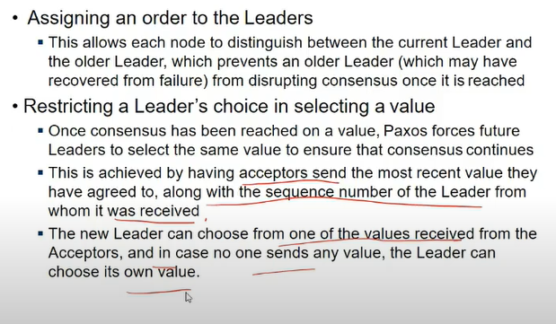
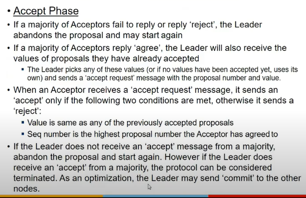
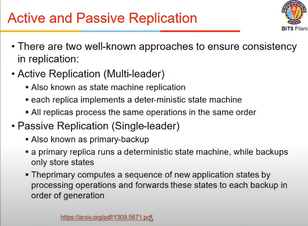
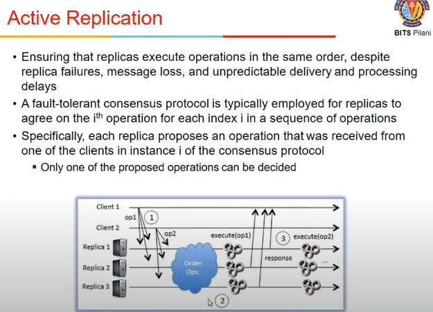
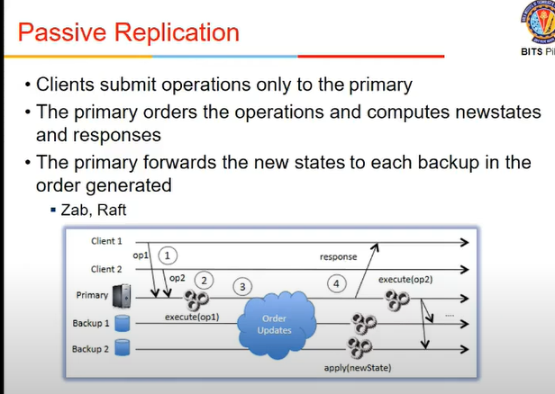
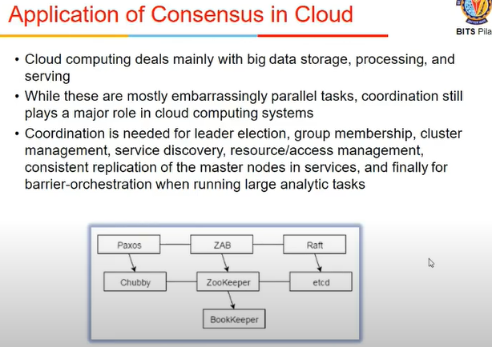

# Lecture 25

- [Lecture 25](#lecture-25)
  - [3PC](#3pc)
  - [Paxos Protocol](#paxos-protocol)
  - [Paxos Failure Handling](#paxos-failure-handling)
  - [Active and PAssive Replication](#active-and-passive-replication)
  - [Application of Consensus in Cloud](#application-of-consensus-in-cloud)

## 3PC

- resolving 2pc condition by indicating nodes that this is decision taken but don't do anyth until i tell u
- so commit phase is splitted into 2
- coord sent req
- got 100% yes
- now it will prepare to commit msg
  - nodes do not do any changes which are not reversible
  - if some participant fails to ack it, coords abort it
- what if prepare to commit is not rcvd? same as commit phase in 2pc?
  - no node has commited it atleast, if some one says no, then aborted again
  - p2c is telling a decision taken but not allowing some1 to do changes
- when waiting for p2c msg or abort msg, if timeout ho gaya ,mtlb coord crashed, initiate election protocol

- on coordinator election, it gets status request, what is statsu of this txn from all participants
- if any report is abported or coord is in aborted state, then it writes abort and sends to all partcip
- if any is in commited styate or coord is in commited, then sends commit
- if all are unsettled and corod is also unsettled, then send abort to all

- new coord now does not waits for 100% yes
- 2 or more partitions can happen in terms of n/w failure
- so 2 alag alag coords ban jayenge
- both see their groups
  - ab ek group me it might commit properly
  - ek group me it remains unsettled and hence abort
  - so block n ahi hua kuch but safety issues a gaye
  - ek variable ki value changed in some partitions but not in other

## Paxos Protocol

- 3pc is not safe when n/w partitions
- works in fail stop fail model but not in fail recover model me it does not work
- on recovery, particip must contact coord and get logs etc and check logs but official 3pc me aisa nahi hai
- when multiple ppl trying to be coordinators, no sequencung of requests and hence bt ho sakti

- paxos take care of all this
- has 2 main things
  - each node can be leader or proposer
  - it selects a value (proposes this is txn to be done), opthers havve to accept oir reject
  - if majority have accepted, commit bhej de
  - 2pc, 3pc me 100% quorrum, tha , idhar majority
  - jaise peeche dekha tha r + w > n ho toh wala

- it will not allow old values to be allowed to commit, only newer versions bcz latest will be avail with one of nodes in majority
- what if leader fails?
  - how to get status of txn
  - 2 things
    - assigning an order to leaders
      - each leader must have some seq num or smth
    - restrict choice of leader in selecting a value
      - when leader proposes a value, if there is a value proposed by a higher leader, then older one must accept it.

- assigning an order mean
  - seq num denge leaders ko
  - isse pata chalega ki which leader is currently active
- restricting choices
  - acceptors send most recent value they have agreed to, along with seq num of lader from whom it was rcvd
  - the new leader can choose from one of values rcvd from acceptors and in case no one sends any value, leader chooses its own value
  - leader might be old bruh and 3pc me it proposes by that value, yaha he has to accept new values sent by acceptors

- we have 2 phases
  - prepare
    - node chooses to become leader and selects a seq num and value v
    - creayes proposal P(x,v)
    - sends this to all acceptors and waits for response
    - acceptor does foll
      - if it is first proposal, it accepts thisand promises ki aage koi x' aya < x then it will reject those
      - if there are already proposals agreed, then compare x to highest seq numb proposals say P2(y, v2), if x < y, reply reject along with y. else reply agree with P2(y, v2)
  - commit

- leader what does
  - if majority says reject, aborts
  - if majjority says agree, takes value of proposals sent, and send sacdept req msg with porposal seq num and value

- accept phase - acceptor gets msg in second phase
  - accepts only if 2 condns met
  - value used same as any of prev accepted proposal
  - and, seq num is highest porposal num it has agreed to
  - this means leader is not deviating form what ppl have done already, continue kar
  - and acceptor is also not allowing old values to written into it

## Paxos Failure Handling

- failure skahi ho sakte
- paxos kehta ki if upto majority -1 failed, then also protocol will work
- agar partition hue n/w me
- 2 leader honge but since majority chahiye, so they will nvr succeeds
- so not progress but not compromise on safety

## Active and PAssive Replication

- multi leader = active
- single = passive
- multi me
  - req can come to any machine/node
  - aka state machine replcn
  - each replica implements a deterministic state machine and all replicas process same opern in same order
  - paxos is a multi-leader protocol
    - as long as data item is diff, they will all succed
    - but if 2 working on same, one fails
- passive repln
  - all req goes to one leade ronly
  - it runs a single state machine
  - it computes order in which the operns are applied and is forwarded to replicas and they follow it
  - hdfs me bhi dekha tha, priumary tells secondary what to do

- in active rpeln
  - should ensure that replicas execute opern in same order despite ndoe failures etc may be there

- elect a leader
- followe duntil it crashes
- primary orders operns
- forwarded to others

- active me client sending to multiple replicas and they have to order it = consensus protocol run

## Application of Consensus in Cloud

- coordination is diff to implement
