# Lecture 27

- [Lecture 27](#lecture-27)
  - [Similarities among paxos protocols](#similarities-among-paxos-protocols)
  - [Raft](#raft)
  - [Interface provided by zookeeper, chubby, etcd](#interface-provided-by-zookeeper-chubby-etcd)
  - [Differences](#differences)
  - [Proper use criteria for paxos systems](#proper-use-criteria-for-paxos-systems)
  - [Zookeeper](#zookeeper)

- consistency, consensus dekha tha distributed system me. ab cloud systems me.
- cloud bhi distributed hota but diff abstarctions
- we saw 2pc, 3pc, etc
- active, passive replication dekha
  - active = every replica can propose and change values = multi-leader replication
    - paxos is a active one
  - passive = 1 leader at a time. others follow what he says
- zookeeper = coordination as a service, built over ZAB
- coordination reqd for leader election, grtoup membership, service discovery etc

## Similarities among paxos protocols

- original paxos was multi-leader/active
- vartiation = multi-paxos
  - simplified
  - once leader is selected, it continues to handle all req until it goes down.
- zookeeper atomic broadcast (ZAB) based on paxos
  - has single leader
  - similar to multi-paxos
- atomic broadcast is same as total order broadcast

## Raft

- single leader replication
- one leader at a time
- phases involved in zab and raft
  - epoch starts with leader election, synchronize with followers and normal opern(broadcasting = whatevr req it gets, f/w to others, if majority yes replies, then commit and tlel others to do so as well)
  - epoch lasts until leader fails, and again second epoch starts
- in case of raft, this synchronization phase is not present
  - synch phase = ensuring ki whatever leader has is also foll by followers.
  - raft me it is done on txn to txn basis so particular synch phase is not reqd
- in zab, leader election is done by who has highest epoch
  - epoch is a number, along with epoch #, there is also an index number
  - when prev leader fails, leader with highest epoch is elected
- in zab and raft, one leader at a time, until it fails, then next is sleected
- a node can only be elected if it has higher epoch or if epoch is same as highest commited txn id
  - i.e. it is aware of latest changes

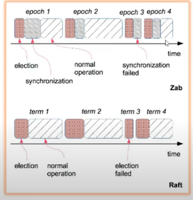

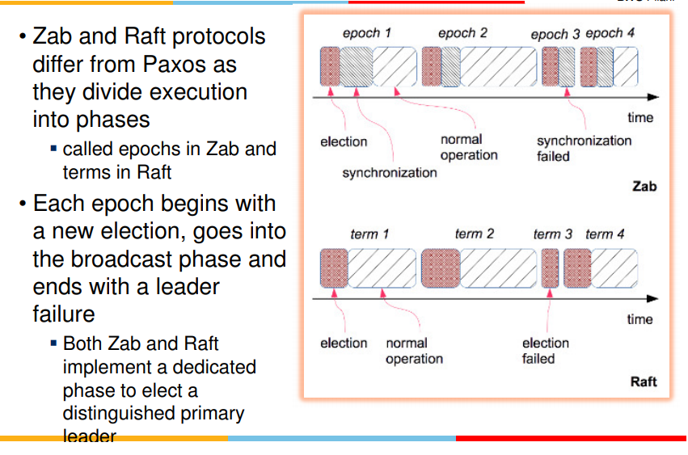

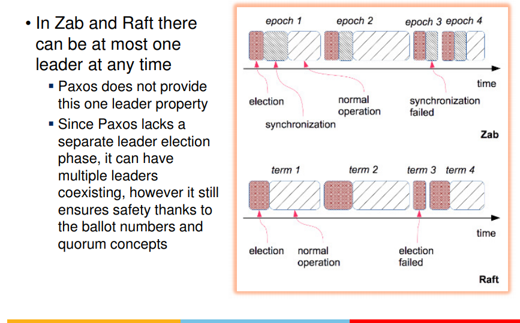

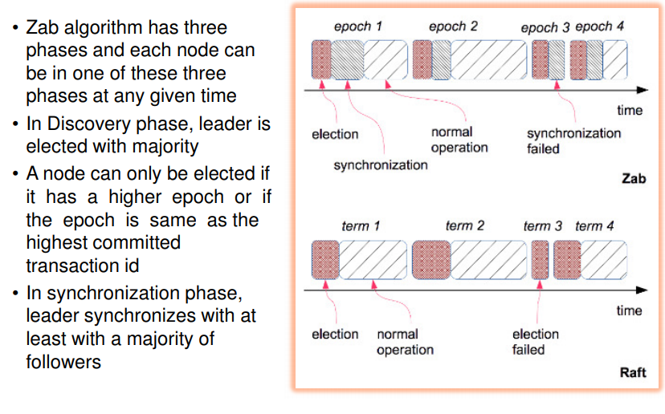

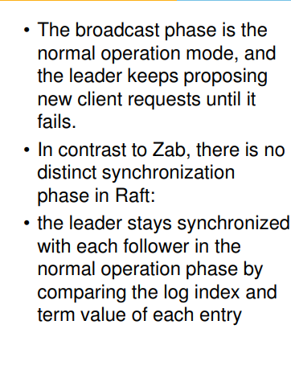

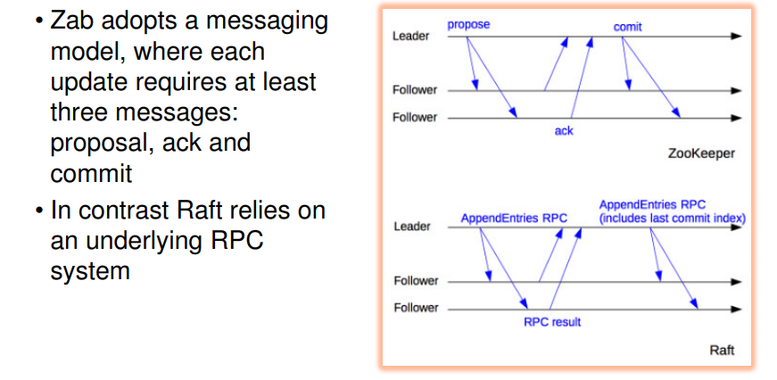

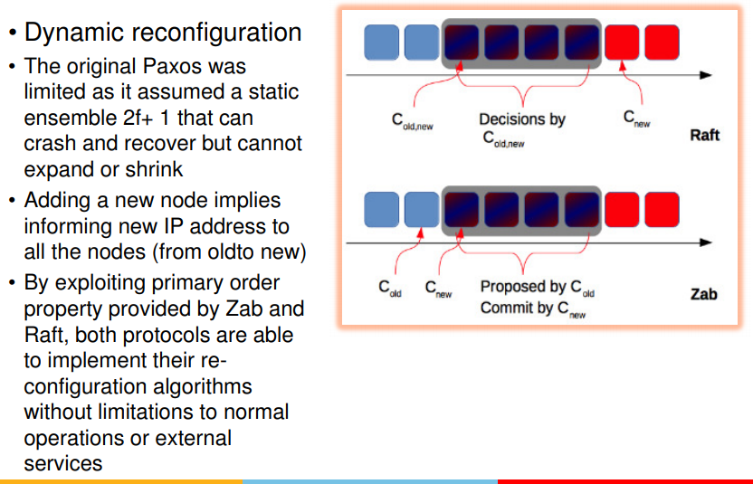

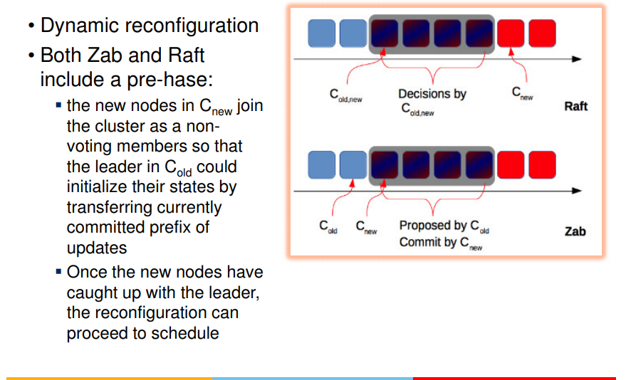

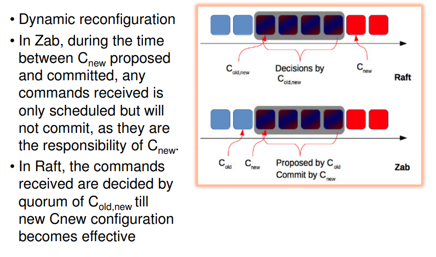

- only half of nodes can crash at a time or #nodes joining can be < majority only.
  - this ensures that changes are not lost when nodes go awatyy from system
- this is common property among raft and zab
- that is majority of nodes should not be new, should be part of current configuration

## Interface provided by zookeeper, chubby, etcd

- filesystem like api
- hierarchial structure
- directory or file
- ensuring that file is uniquely created at a time is difficult
- maintaining file system in distributed systems is not easy
- ability to set watches
  - if there is a change in some file or smth, then a notification is sent to others
- ability to set auto increment key
  - distributed systems me tough
  - zookeeper deta
- auto-incremented keys
  - ensures FIFO order
  - adding items to file, should be retrieved in same order
  - zookeeper adds key along with data item
  - as data item added, key incremented, using key retrieve in fifo order
- observer server - used only for read-only purpose
  - not participating in quorum purposes
  - read values
  - do not write
  - helps in achieveing scalibuility

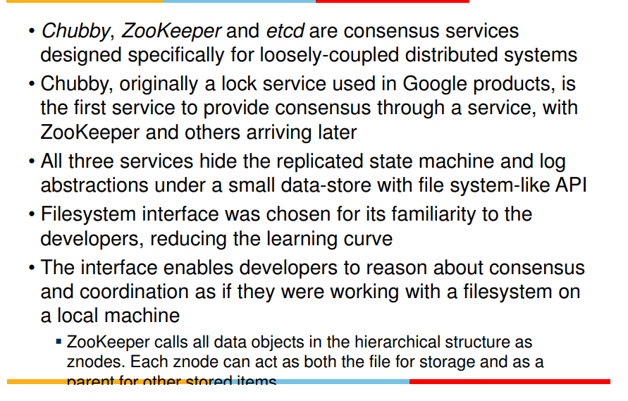

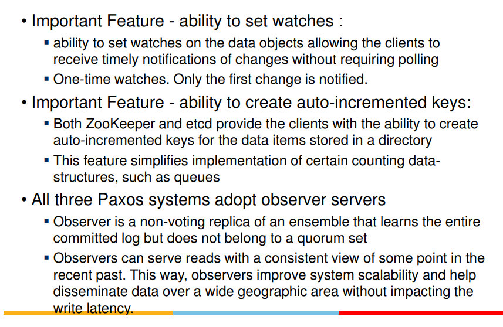

- ephemeral storage
  - when node joins, creates a file
  - when no more traceable, zookepper or node can remove it
  - helkps us in infrastructure config
  - counting #nodes
    - count # files in directories

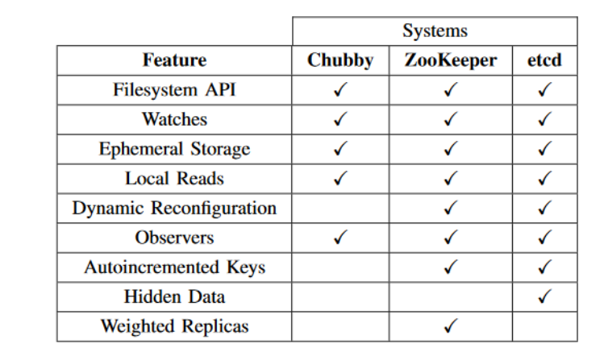

- local reads
  - u can store and read values from zookeeper
- dynamic config
  - u keep adding and removing things
- hidden data **feature specific to etcd**
  - some data is only for particular node and not for others
  - client can write items but when listed others cannot access
- weighted replicas
  - when they vote, each vote has equal weightage
  - here, it means, vote can have weight
  - it means vote has some value given to it
  - reqd when we don't have defined #nodes
  - single node can be presented as multiple nodes in cluster by increasing its weight
  - generally what happens is when i have majority, I need 5/3/7 nodes, and i don't have odd #nodes, so increase weights of each replica, so that majority gets followed even though we do not have actually majority nodes

- Linearizability is a part of all three
  - lineaz is single node abstraction
  - any change is visible to all others as well
  - partition and repolicas hai though

- zookeeper also provides FIFO order of client requests
  - rpelica when receives some req, updates in zookeeper, it provides auto incremented key

## Differences

- zookeeper, and chubby are stateful
  - rememebr what u have doine
- etcd is stateless
  - client has to send in request what it has done
- similar to http and rest api
  - one req not related to other req
- zookeeper is not used for frequent operations
- say watch rakhni ek
  - notificn from zookeeper, etcd etc
  - etcd is stateless
  - so client has to do some arrangement, it has to take responsibiliy

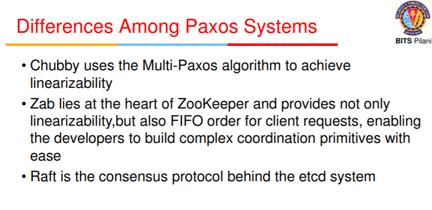

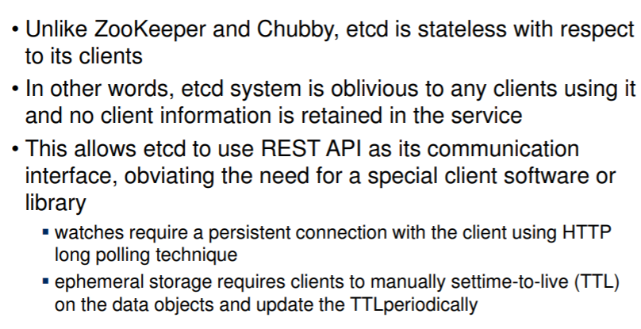

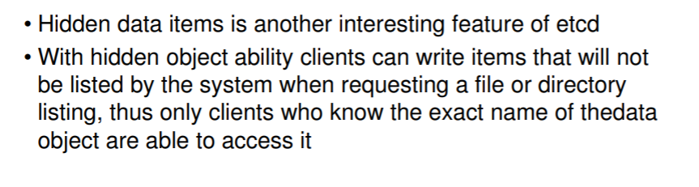

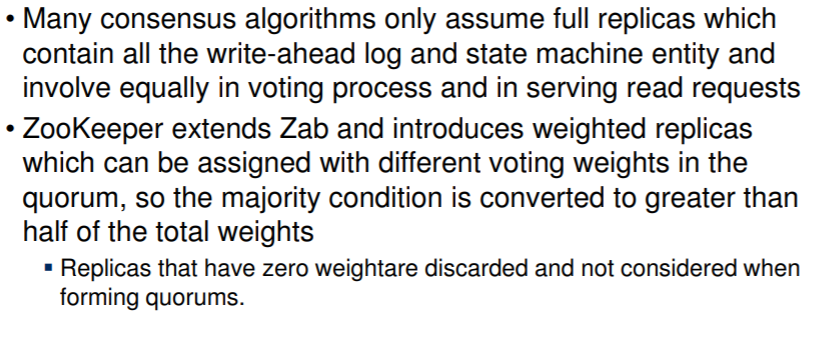

## Proper use criteria for paxos systems

- consensus is expensive task since multiple msgs reqd to be communicated to replics
- so frequency of writes should be small
- and amount of data in system also should be less
- one thing is to be known initially ki is linearizability is reqd or not, if yes, tabhi inpe jao
- zookeeper is mainly stored to store meta information, like what version of s/w etc
- for routine info, paxos should not be preferred
- paxos should not be used over WAN, increases latency

- Server Replication
  - multiple servers dealing with same data item

- Log Replication
  - kafka = publish/subscriber system
  - has partition across multiple nodes
  - subscriber queries, it should be ddeliber to users
  - log replication = duplicate data across multiple nodes

- Synchroniz service
  - locking
  - until i do this, no body should update it
  - serializ is reqd
  - use sycnhroniz service or coordination service

- Configuration mgmt
  - reqs, which nodes are part of cluster
  - leader election
  - group membership

- msg queues
  - when u write to msg q, buffer me store ho gaye
  - nodes process at their own time
  - requires coordination
    - overwrites na ho
    - who is accessing at one time
  - msg q may be itslef stored in multiple ndoes for scalability

- barrier orchestration
  - wait for everyone to complete a step
  - when everyone completes, then move ahead
  - can be implemented using watches of zookeeper

- whether to use paxos?
  - not for server and log replication
    - implement paxos ourselves
    - those servers can themselves implement a protocol instead of using any third party or other system for it.

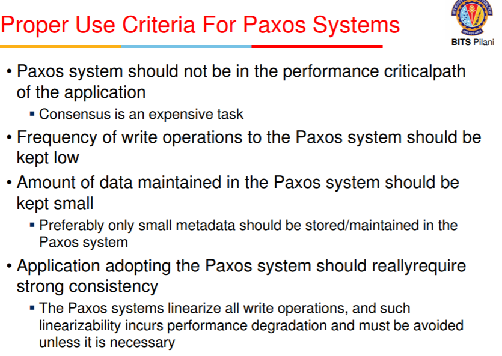

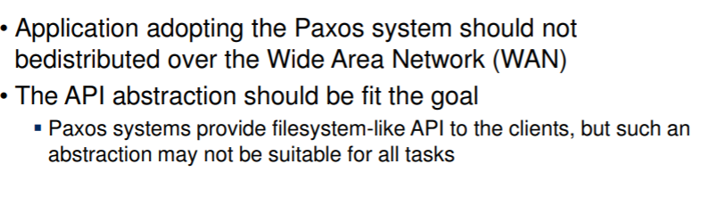

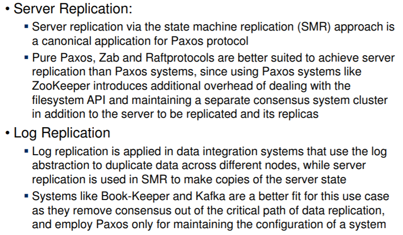

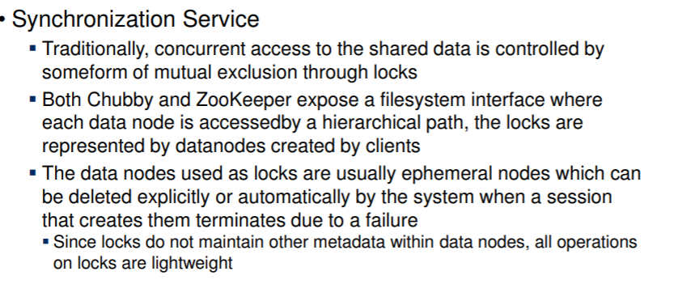

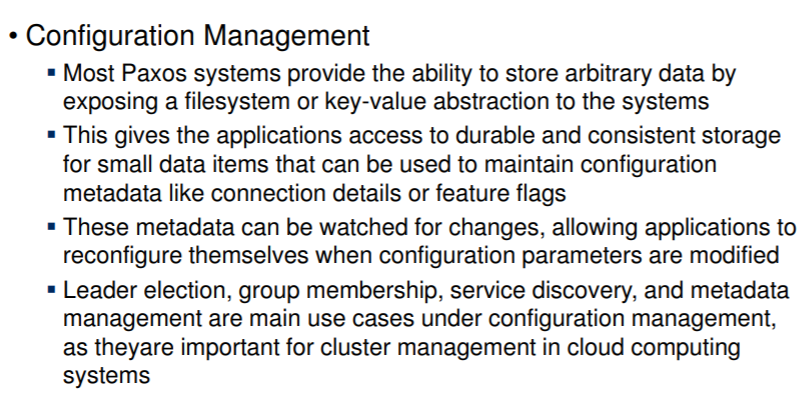

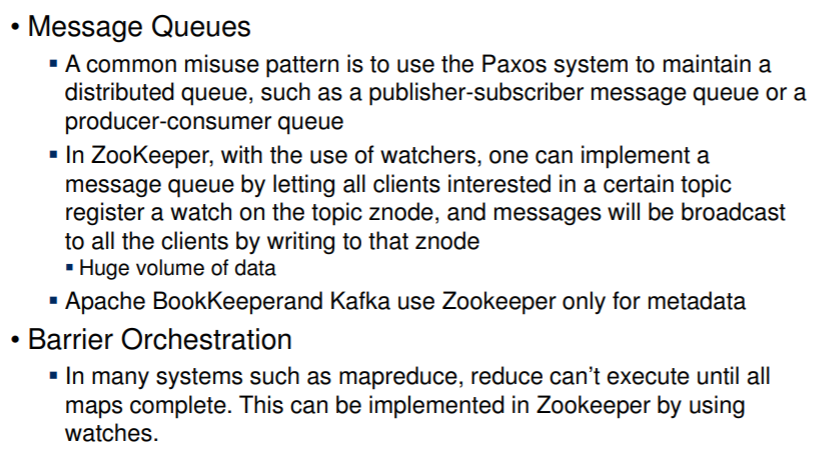

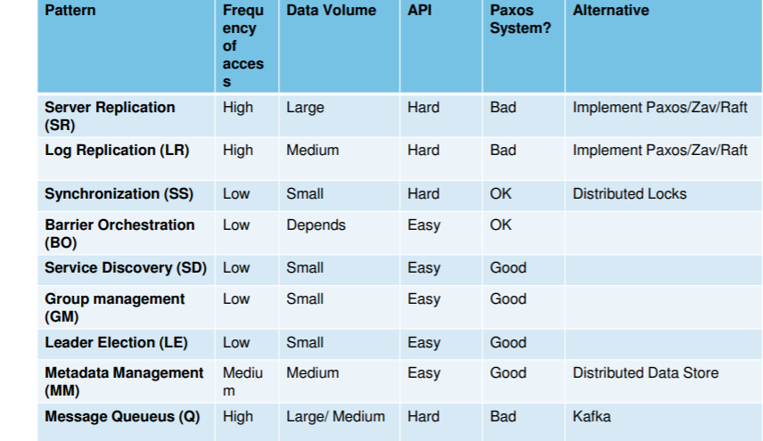

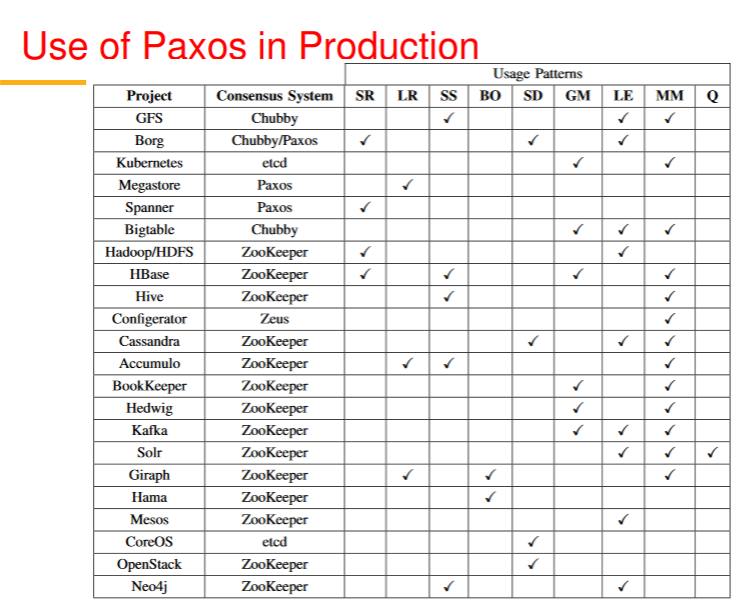

## Zookeeper

- highly available, scalable, distributed, configuration, consensus, group memebership, leader election, naming, coord service
- provides strong consistency, ordering
- fb uses it as controller for sharding

- provides file system like api
- core of zk ds is znode
- nodes arranged hierarchially into tree structures as well as hold data
- max 1mb can store since data nahi store nahi karte, metadata
- no partial writes (when u write, previous is overwritten)
- API
  - create
  - delete
  - setData

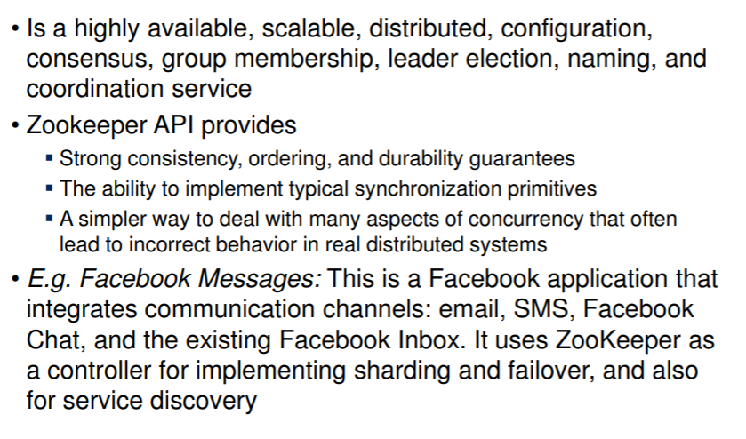

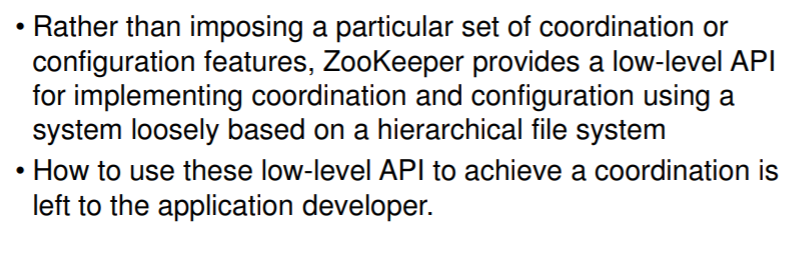

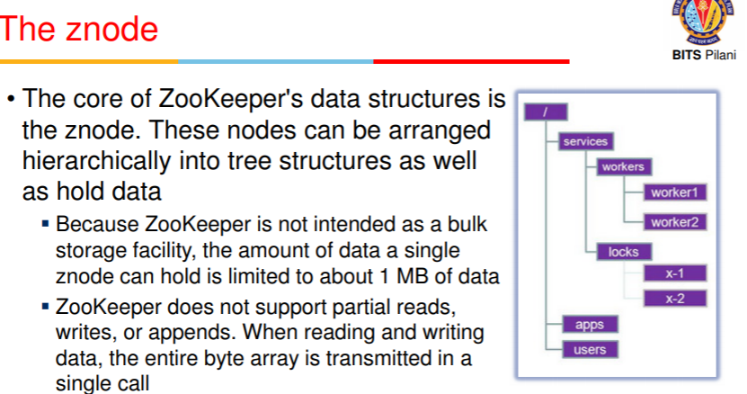

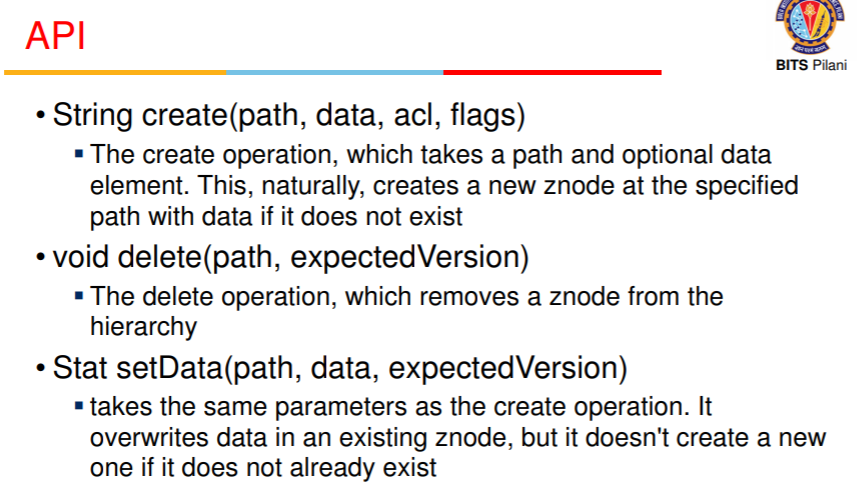

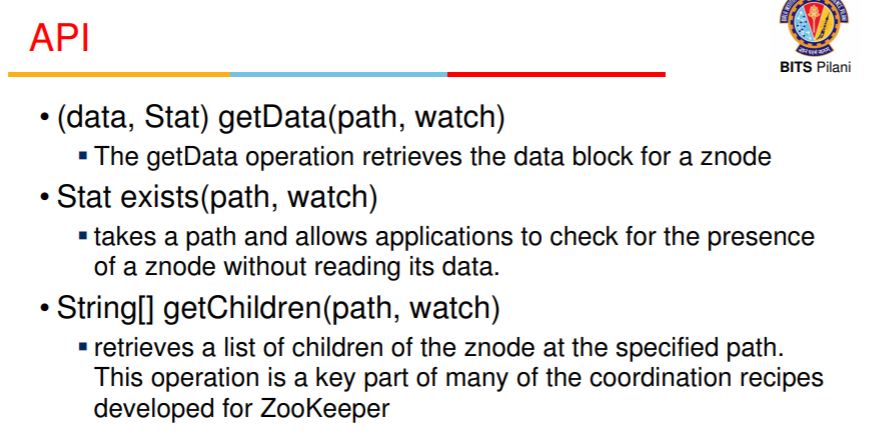

- z node can be persistent or ephemeral
- in ephemeral case, when client session is no more live, ephemeral nodes, deleted from system
  - they cannot contain children since can be deleted any node
- znode can also be declared as sequential, i.e. int number de dia ek sabko
- unique increasing nodes banane agar maanle

- watches
  - when data associated with a node or children changes, notification (async) reaches nodes who set watches
  - one time operation hai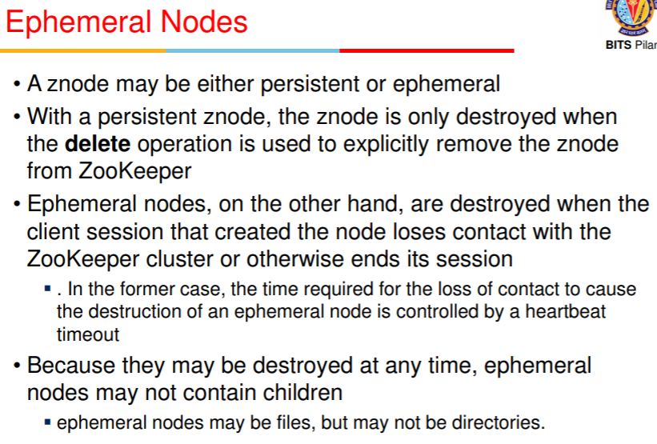

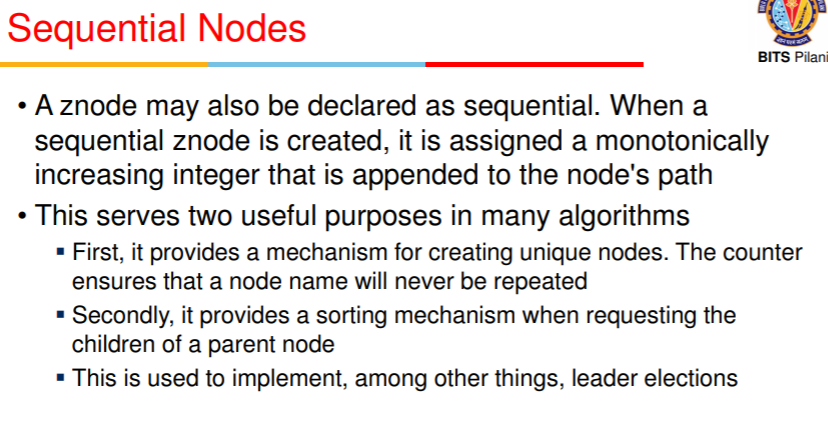

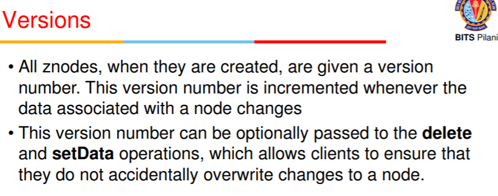

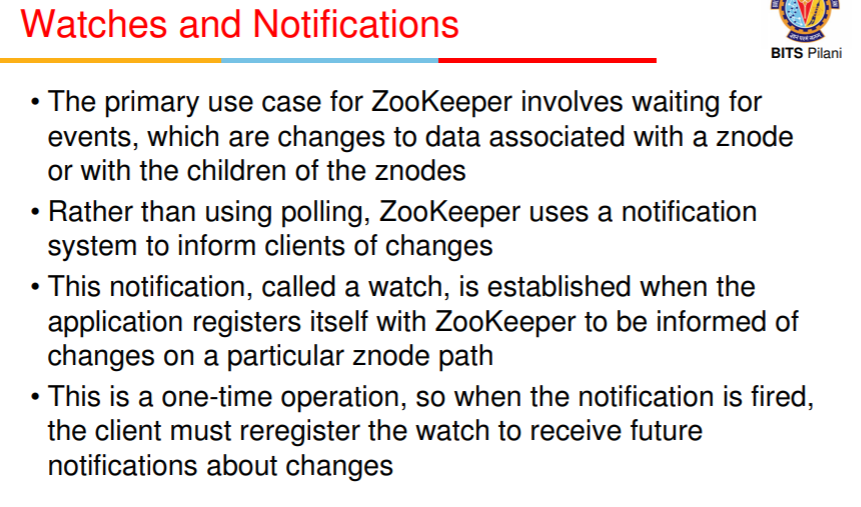
