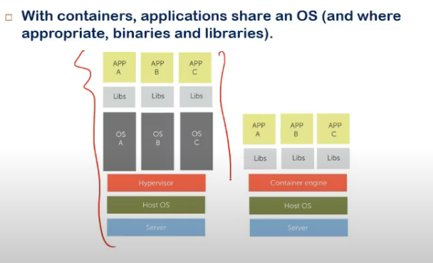

# Lecture 28

- [Lecture 28](#lecture-28)
  - [Slides](#slides)
  - [Containers](#containers)
  - [Namespaces in linux](#namespaces-in-linux)
  - [Linux Control Groups](#linux-control-groups)
  - [Container Checkpointing](#container-checkpointing)
  - [Main Implementations](#main-implementations)
  - [LXC](#lxc)
  - [Resource Management](#resource-management)
  - [Objectives of Resource Management](#objectives-of-resource-management)
  - [Resource Types](#resource-types)
  - [Steps in resource mgmt](#steps-in-resource-mgmt)

## Slides

[link1](https://drive.google.com/file/d/155C-12NKfTWimg0PbUzRXqnWrXHDkVJu/view?usp=sharing)

[link2](https://drive.google.com/file/d/1FqxPQC-EkBrLUxpnEjjMDcbAf6H8BEYO/view?usp=sharing)

## Containers

- vm discuss kia tha
- container also provide virtualization, but at a diff layer
- earlier to container, diff ways the
  - chroot
    - system call hai
    - user ke lie ek dir becomes root dir
    - anything reqd by proces /bin, /lib, etc becomes available in this only
  - solaris zones
  - bsd jails
- linux ne new supports die
  - namespaces
    - define namespace for a process/set of processes
    - namespace used by a process is diff from other process
    - same class existing in diff namespaces does not collide
    - os me resources shared hote
      - memory
      - network
    - process should be able to run indepent of other processes
    - ek sql server chaalu hai, naya chalaana, issues
      - etc/conf file jo hoti, cannot be used by multiple simultaneously
      - iske lie abhi ham naya vm laga sakte har new version/instance ke lie?
      - overhead hai bahut
      - bas ek app ke lie pura new os?
    - so create a new namespace
      - whatever is reqd by server, is present there
      - create new namespace for new server
      - virtual port numbers, virtual environment de dia
      - usko khud ka os dikh ra kinda
      - this is **container**
      - **virtualization** hi toh hai yeh
    - VM me **ABI level** pe virtualization
      - system call + ISA
      - virtualized interface milta unko so that things not provided by native os kar sake
    - here
      - ISA same, system calls same
  - cgroups
    - control groups
    - group certain processes
    - and put a limits on kitna cpu, memory etc use kar sakte woh

- vm me os pura packaged hai, os + libs+ api
- container me os same, app + lib are packaged together and can be run w/o any dependencies

- Isolation
  - resources allocated to u is same as u r directly running on h/w
  - multiple levels
    - reosurce isolation, performance isoln,etc
- resource isoln
  - how much it can take
- hypervisor level pe we saw resouce control
  - memory mgmt, cpu allocation
  - processes ke lie os dekhta
- group of processes ke lie os nahi dekhta
  - uske lie we need resource control = resource limits for groups
- container confined to a namespace
- processes runnign inside the container appear to be running on system dedicated to them

## Namespaces in linux

- lxi - linux smth

- fork for child process
- linux uses clone system call
- this can assign new process to a container using flags
- namespaces
  - file system, pid, host name
  - file system
    - fs u r expecting will be limited
    - ur visibility of directories will be diff from others
  - pid
    - every system starts with pid = 1 in linux
    - pid ns means this pid should starts with pid = 1 for every container

- how this all helps in process migration?
  - difficulties hai na migration me
  - some process part might running in os
  - some in cpu
  - some doing ipc
  - etc etc
  - when u migrate, u  have to migrate everything
  - with containers, u cannot access anyth outside container
  - so ipc within container hoga
  - so when u move, move whole container itself
  - same pids could be assigned to new os as well
  - bcz container me hai na sab

- n/w namespace
  - I can have my own ip address and port numbers
  - mininet uses containers for switches
  - n/w namespace karta na woh

- user namespace
  - users defined for system and container will be diff

- IPC
  - own msg queues semaphores, etc define kar sakte

- host name namespace
  - khud ka host name  bhi kar sakta

## Linux Control Groups

- combine processes into groups and limits resource usage
- os me process level limits hoti hai
- yeh allow to apply limits on groups
- process running in container can see all memory and all cpus

## Container Checkpointing

- checkpointing
  - current state of process store in file system
  - and when u move it, then restore
  - process crashed => restore last checkpoint
- complete container state can be saved in a file
  - running processes
  - opened files
  - n/w connections, buffers, backlogs, etc
  - memory segments

## Main Implementations

- LXC
  - linux container
  - written in c
- Docker
  - written in go
  - stable and mature codebase
- lxc does not have container mgmt feature, docker has
- openvz
  - written in C

## LXC

- installation
  - `sudo apt-get install lxc`
- create container
- contianer info
- start new container
- stop container
- destroy container
- clone container
- execute a temporary container

- creating C groups
- memory, cpu limits set

## Resource Management

- cloud provider's ke lie imp

## Objectives of Resource Management

- SLO (service level objectives) should be satisfied
- balancing load
  - utilizn balanced across all nodes
- fault tolerance
  - redundancy rakh
- energy use minimization

## Resource Types

- compute resources
  - collection of physical machines
  - vms
- networking resources
  - high bandwidth n/w connection
- storage resources
- power resources
  - major cost part
  - one way to reduce power usage
    - dynamic voltage scaling
      - clock speed of processor reduce when not needed
      - can be configured using ACPI (advanced configuration and power interface)

- Static resource mgmt
  - pre allocated resources
  - user came with subscription

- Dynamic resource mgmt
  - shift vms and containers etc

- dynamic voltage scaling
  - shutdown cores not reqd maybe

## Steps in resource mgmt

- vm sizing
  - assign a vm applicable to user requirements
  - user might not be using vm, bas allocate karwa lie
  - so minimum and maximum rakh, ki min de de, and expand maybe, kinda dynamic memory allocation?
- vm provisioning
  - vm scheduling on physical machine
- resource monitoring
  - SLOs
  - service requirements jo user ne mangi thi, r those being guaranteed
  - collecting stats and profiling
- dynamic resource mgmt
  - dynamically resource adjust
  - move vms from one system to other
  - increase available memory to one vm, etc etc
  - 2 types
    - local
      - within system, multiple vms running
      - hypervisor decides which vm needs more resources etc
    - global
