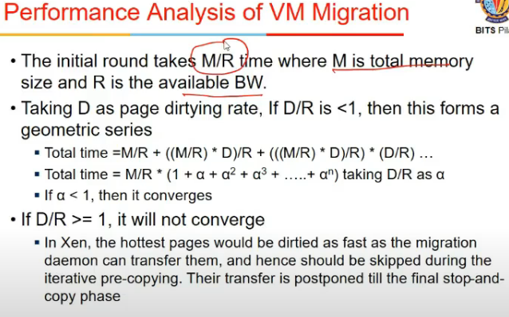
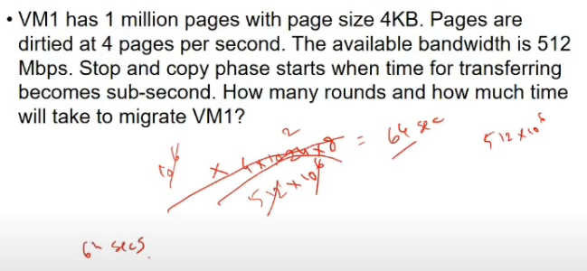

# Lecture 29

- [Lecture 29](#lecture-29)
  - [Slides](#slides)
  - [VM Migration](#vm-migration)
    - [Need](#need)
  - [VM Migration types](#vm-migration-types)
  - [Downtime and total migraito time](#downtime-and-total-migraito-time)
  - [Memory Migration Options](#memory-migration-options)
  - [Pre-copy migration](#pre-copy-migration)
  - [Performance analysis of vm migration](#performance-analysis-of-vm-migration)
  - [File Migration](#file-migration)
  - [N/w migration](#nw-migration)
  - [Migration on WAN](#migration-on-wan)

## Slides

[link](https://drive.google.com/file/d/1PCDLSCFpYPmhBiBFLDpv1TJHLs7FqaKR/view?usp=sharing)

## VM Migration

- dynamic resource mgmt in cloud
- dynamic assignment nahi kia toh nuksaan, cloud lene ka fayda nahi
- users use differently
- dynamic monitoring system is reqd, user ko chahiye ya nahi
- when it is identified, then usko do to fulfill SLO, agar us system pe resource na ho, toh shift the vm

### Need

- load balancing
  - move vms to less busy host
  - make use of newly added capacity
  - vm consolidation
- maintenance
  - move vms off a host b4 it is shut down
- recovery from hsot failure
  - restart vm on diff host
- challenges are involved
  - when u r moving, service might be running, so end user ko allow to use service while migrating
  - say, migration ke middle me tha, host a se b pe le ja raha
  - a cannot clear up resources until transfer is complete
  - challenges with n/wing
    - ip addresses etc would change when move vm
    - tcp connection break

## VM Migration types

- cold migration
  - completely shutdown on first system
  - restart on host 2
- warm
  - suspend vm on host 1
  - pause kia, shutdown nahi
  - copy ram and cpu registers associated with this vm on system and paste in other
- live
  - vm is not stopped
  - bahut chote time ms me ke lie it is
  - copy across ram while vm continues to run
  - keep transfering pages
  - when u suspend vm, what is not transferred is very less

## Downtime and total migraito time

- downtime
  - suspension start time, service nahi available
  - perceived by end user
  - period during which service is unavialbale due to no running instance of vm
- total migration time
  - migration init operation se resource cleanup on host 1 time
- minimize both

- wrt downtime **reln b/w cold, warm, live migration**, and wrt **total migration time**
  - downtime
    - L < W < C
  - total
    - L > W > C
    - cold me minimum, bcz shutdown kardia, resources not held
    - warm me resources are held
    - live me bahut n/w calls

## Memory Migration Options

- warm and live me, memory is to be copied
- live me vm is running while I am copying
- so copied page might become dirty
- 3 phases
  - push phase
    - source vm push pages to destn, pages dirty sent again
  - stop and copy
    - source is stopped, pages copied to destn
    - downtime and migration proportional to memory size
  - pull
    - new vm executes and if it needs a page, takes from source vm
  - pure demand migration
  - shorrt downtime but longer migration time
- alternative
  - pre-copy migrn
  - used in xen and all

## Pre-copy migration

- iterative push phase
  - send pages from host 1 to host 2
  - iterative manner me
  - 1st round me kuch bheje
  - 2nd me wohi  bhej jo first me dirty ho gaye
  - expectation #pages in further rounds are less
  - load distributed, vm downtime bhi nahi

## Performance analysis of vm migration

- m is total memory
- r is available bandwidth

- 1st round me m/r time lega
- we can compute page dirtying rate (#pages dirtty per second)
- d/r < 1 => converge kar jayega
- else, won't, time will keep increasing
- if d/r >= 1
  - hot pages dekh (stack local variables wale etc)
    - those keep changing very frequently
  - do not transfer those
  - keep those for last round

- problem

- pages transfer karne me time = 64s
- #pages dirtied = 64\*4 pages = ((64\*4)\*4\*1024\*8)/(512\*10^6)
- next iteration me aur bhi less, so total ~ 64.016s

- **Significance of page getting dirty?**
- estimation hi hai
- on avg 4 pages per s get dirty
- not dirty => don't transfer it
- if D is high, D/R >1, time increases everyt ime and diverges

## File Migration

- idea is to use SAN or NAS = storage networks
- taki vm jab transfer kare toh easy rahe maamla
- copying everything on n/w mi8 take lot of time
- storage n/w
  - common to all vms
  - do not move files

## N/w migration

- subnet hote n/w me
- prefix common to all in subnet
- system moves from one subnet to other, it has to be added to vm or configured somewhere
- VLANs the
  - physical locn does not define subnet
  - configurations define subnet
- this config has to be enabled agar diff n/w me ja ra
- agar same n/w me ja ra, toh koi bt nahi, prefix same hai
- same ip chahiye toh config me dalna hoga

## Migration on WAN

- migrating storage
  - wan = closed nahi
  - vm moves like sun movement around earth
  - india me sun => vm close to datacenter in india
  - this is wan migration
  - here, shared storage is not possible, latency and all
    - lans me easy
  - storage rpelication karle
    - move storage ahead of vm
  - or, on demand fetch
    - copy file when needed

- n/w reconfiguration
  - layer 3, layer 2 Virtual private Networks use karle
  - ip address change on movement
  - so, kuch proxy ya reconfiguration is required
  - so that new connections come to this machine only but existing are forwarded here from prev one

- Use cases
  - compute infra around the world
  - maintenance and upgrades of a site
  - collaborative projects
  - cloud burst scenarios
