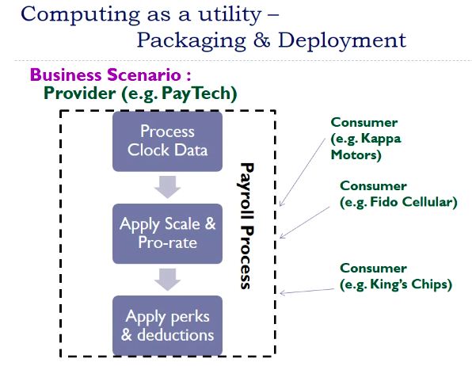

# Lecture 2

## Summary from last class

## Computing as a utility

- paytech has service - payroll processing
- takes some input and gives output
- companies upload their employees data and paytech service processes and sends report regarding benefits and all
- the payroll process are different for each company
- the steps are similar, but actual details are different
- If I make a generic service interface, every company can use same service provided it is encapsulated as well

- modules can be changed later but interface remains same

## Publishing and all for services

- a shop who advertises more has more customers than one who does not
- *Yellow pages* pe company apni contact info and description deti
- aisi hi kuch, I require for s/w also
- ***Service LAyer***
  - should have functionality of lookup and discovery, service description
  - could be a manual effort or program should also be able to search and all
  - XML/JSON format me specify karde ki service ko contact kaise kare, what will be input, what will be output

- I do not have to know where service is located.
- No physical binding is required = *Reduces Coupling - Deployment Dependencies*
  - I do not have to connect sockets and all

- Due to service layer, infrastructure is not needed to be limited to a particular location, Paytech will not worry about it
- So, paytech will move its payroll service to some data center/cloud

## Services on the cloud

- core buisness of paytech is now separated from infrastructure part
- it could just focus on payroll service
- *Consumer* is consumer of *applicaiton provider*
- *Cloud provider* is one which provides infrastructure to *application provider*
- there could be several service providers in cloud
- and client can use one according to their comfort
- So, cloud is all about services now a days
  - service could be **platform, infrastructure, database, software, etc**

## What is a service

- product is present in front of us, but service is not
- doctors offer services, medicine is product
- provider is providing some features

- in product, u know what outcome it is
- process me, u should quantify somehow

- I need to have some expectations from service and they should be verified

- so we have some contracts, terms defined that should be met from provider and consumer side

## SOA - service Oriented Architecture

- there is a diff b/w using fn in a program, and serviceo ver web

- What is the difference between calling a function in a program, calling a service over web
- service oriented arch is tied closely to object-oriented architecture
  - If I send some data to network, I want it to remember it, I do not want to send again and again

- object oriented me, state nahi pass karni

- either we know already interface details, or we lookup

- now, we do not need to know the interface either, we pass parameters
- XML form me pass karde
- no language specific bindings is required
- I might have service in C, and calling it in python

- state, execution, interface, location all are hidden

## IaaS

- offering the processing power, network, storage
- consumer has control on os, storage, deployed apps
- but which machine, vm etc is not under control

## PaaS

- libraries, tools are provided by cloud provider, using those u write ur own apps

## SaaS

- everyth is under control of cloud provider
- eg, Gmail, google docs, CRM from Salesforce.com
- I just use these
