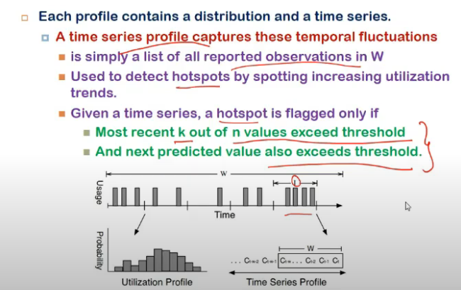

# Lecture 30

- [Lecture 30](#lecture-30)
  - [Resource Monitoring](#resource-monitoring)
  - [Black box monitoring](#black-box-monitoring)
  - [Grey box monitoring](#grey-box-monitoring)
  - [Profile Generation](#profile-generation)
  - [Capturing multi-dimensional loads](#capturing-multi-dimensional-loads)
  - [Greedy heuristic](#greedy-heuristic)
  - [Other questions](#other-questions)
  - [When to migrate](#when-to-migrate)
  - [Which VM to migrate](#which-vm-to-migrate)
  - [Where to migrate](#where-to-migrate)

## Resource Monitoring

- what to monitor?
  - SLOs jo sign-in kie honge
  - some parameters change with time, those I will have to monitor

## Black box monitoring

- no access to what happening inside OS of guest VM
- only hypervisor point of view I see
- parameters
  - cpu usage
    - time given to vm dekhle
    - done by domain-0 in xen
      - also is guest OS but has certain priveleges
  - n/w and disk I/O
    - translated to machine level instructions so  hypervisor ko pata
    - each guest interface is mapped to a virtual interface in domain 0
  - page faults
    - can't monitor memory as such but page faults I can
    - page fauylt = perf going down
  - memory monitoring
    - memory utilizn only known to os
    - hypervisor ne allocate toh kardi, ab use kaise hotr, it doesn't know
    - certain activity I can monitor
      - swap operns
      - increase hue toh mtlb page faults jyaada

## Grey box monitoring

- kuch service install within guest os
- and those services monitor it
- request rate, request drops, and service times specific to app

- focus is on service level stats
- SLOs wahi pe sign-in hote na
- need to monitor log files as well
- process logs to get request rate, drops, service times

- BB relies on resource utilizn = SLAs
- GB on appln level stats

## Profile Generation

- stats mil gaye, but ek set of stats se I cannot predict everything
- so window ke across nikal
- and then avg vagairah karle
- i.e. profiling of resource utilizn karle
- 3 back-box profiles per vm
  - cpu utilizn
    - over a period of time
  - n/w b/w utilizn
    - over a period of time
  - swap rate(page fault rate)
- for grey-box, 4 profiles
  - memory utilizn
  - service time
  - req drop rate
  - incoming req rate
- done over sliding window
- similarly physical machine ki bhi profiling bhi kar sakta

- Each profile contains a distribution and a time series
- histogram = utilizn profile
  - how many times a utilizn is occuring

- time series profile = wrt time, predict what could be next resource usage value
- list all reported observations in Window
- used to detect hotspots by spotting increasing utilizn trends
- given a time series, a hotspot is flagged only if
  - most recent k out of n values exceed threshold
  - and next predicted value also exceeds threshold

- Interpreting these 2 graphs?
- estimating peak cpu and n/w b/w needs
  - vm may g et higher share of resources than guaranteed allocn
  - if distribution profile is a tail, it tells peak demand
  - tail ka end denote, ki tab tak resources the allocated
    - if all vms are not using their full resources, peak referes to actual peak need
    - if all vm are using their allocated share, scheduler will allocate only that it guaranteed
      - so peak will not represent actual needs
      - prob with **black-box monitoring**
      - so **peak+data** is added
- SLOs = appln level metrics nahi dekhe hamne black box me

- estimating peak memory needs
  - xen allows fixed amount of physical memory to be assigned to each vm
    - it is hard upper bound that cannot be exceeded regardless of memory demand and usage
  - vmware me, variable, that cna be adjusted, sabkoi utna min de de, and if some1 needs more, de de free pool me se

## Capturing multi-dimensional loads

- multi dimension = cpu + n/w + memory
- what is cpu n/w memory load of a bm
- cpu,net and mem can be get by black box, which will be approximations
- grey me actual values

- vol represents
  - if resource utilizn is high, vol will be greater
- formula used to decide can this vm be moved to some other physical machine
- can current machine guarantee resources

## Greedy heuristic

- move load from most overloaded servers to least overloaded
- determining which VMs to migrate?
- find volume of each vm, then volume to size ratio
  - size = kitna data transfer karna
- we want less size, high volume, so pick greatest value
- i.e. order by this ratio, and pick highest one to migrate

## Other questions

- when to migrate
- which vms to migrate
- set of destn machines for migration

- 3 goals in resource mgmt
  - server consolidation
    - bring #machines underutilized
  - load balancing
  - hotspot migration

## When to migrate

- periodically?
  - sun ke according migrate
- due to hotspot
- excess spare capacity
- load imbalance
- addition or removal of vm/pm

## Which VM to migrate

- volume to size ratio dekh le
- but what if a gp of vms ek saath cluster bana ke kaam karre the? commmunication cost badh jayega, so that also take into account
- affinity based
  - communicn costs among VMs
  - memory sharing b/w VMs
    - gan scheduling

## Where to migrate

- resource availability is not only criteria
- min spare capacity must be there in destn pm after migration
- bin-packing or vector packing techniques
