# Lecture 31

## Resource Management in VMM

## Shares vs Working sets

- OS me working set model hota, kya pages abhi being used
- in cloud, we have to also see Vm level promises we make
  - importance, ownership, amount of money paid to service provider for executing the vm
  - penalize less imp bm, even if it would derive largest perf benefit from additional memory

## Share based allocation

- give resources acc to shares that is held by vm
- share is regulated parameter
- client consumes resources proportional to its share
- guarantted min resource fraction equal to fraction of its total shares in system

- algorithms for proportional share
  - dynamic min-funding revocation algo
  - revoke memory from client that owns fewest shares per allocated page
  - take memory away from those payingh lower price to those willing to pay higher price

## VMWare ESX - Share based allocation

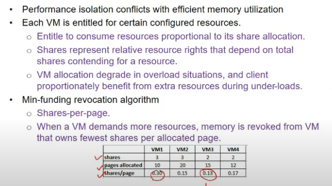

- always not feasible
- might be ki higher ratio wala having larger #pages, ab woh use karra ki nahi idk
- idle memory tax

- prob with pure proportional share allocn
  - idle VMs with many shares can hoard memory unproductively
  - active vms with few shares suffer under memory pressure

- resolve this by introducing **idle memory tax**
  - fraction of pages being utilized and idle nikal le
  - f = fraction of number of pages which r active (say 10 me se 5 hi active => 0.5)
  - cost is k = (1/(1-t)), t = tax
  - if t = 0, same as min-funding algo = S/P
  - t defaults to 0.75
    - cost we r imposing on system with idle pages
  - penalizing not utilized pages

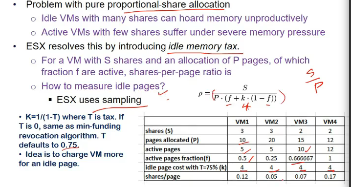

- jiske pas extra tha usse le lia, and jiske pas nahi tha, usko de dia

## Resouce allocation policies

- 3 parameters
  - min
    - min this should be avaialnle so it can run
  - max
    - amount of physical memory configured for use by guest os
  - shares
    - entitle vm to fraction of physical memory based on proportional share allocation policy

- Admission control
  - a vm is admitted if min+overhead(for page tables, shadow page tables + grpahics grame buffer) is available
  - max-min swap space honi chahiye
  - tabhi take this vm into ur system

- ESX dynamically computes memory allocations and reclaims memory when below threshold
  - 4 memory thresholds
    - high
      - no reclamation
      - agar free memory available is only 6%, then lio
    - soft
      - use ballooning to reclaim
      - free% = 4% pe
    - hard
      - forcible paging
      - 2%
    - low
      - stop execution of vms reclaim pages
      - 1%

## Sharing MEmory across VMs

- if 2 processes using same code, say vi editor, os only creates one copy and maps to the process executing
- esx bhi aisa kuch karta
- say 3 vms hai, 2 runnign windows, 1 running linux
- if 2 vms use same pages.. how does it know?
  - hashing technique use karle
  - and idea laga ki agar same pages acces kar rahe 2 machine
  - if changes kie kisi ne, then copy karde(**copy on write policy**)

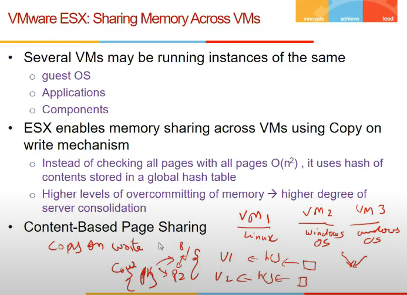

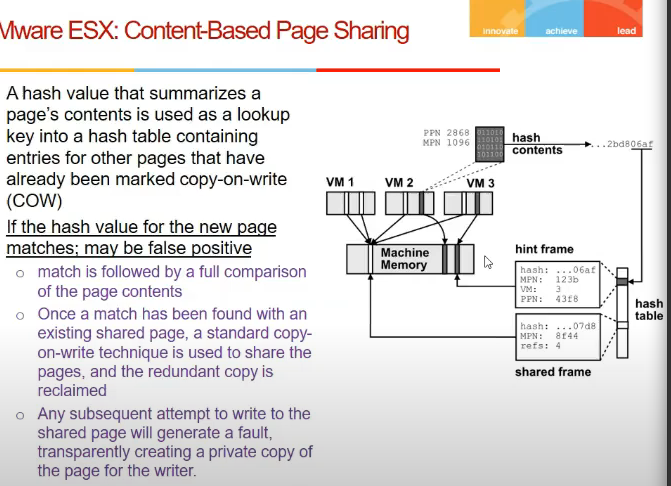

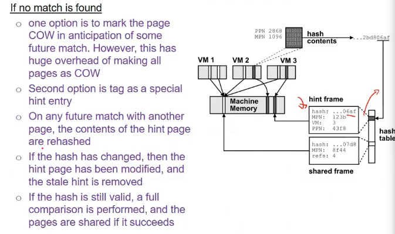

## Resource mgmt - local vs global

- optimizing reosource mmgmt at vmm level(locally)
- but it might not globally lead to optimal resource mgmt
- cloud me globally chahiye bhai
- 2 parameters that paly role in dynamic resource mgmt
  - perf
    - energy efficiency
  - vm migration

- why imp to look globally?
  - even if har vm khud se acha karri, it might be underloaded, vms might be able to consolidated

## Borg system

- cluster manager used by google for admitting, scheduling, starting, restarting and monitoring jobs

### Architecture

- borg cell
  - set of machines
  - a borgmaster
    - logically centralized controller
  - an agent process = borglet
    - runs on each machine
    - gives info to server

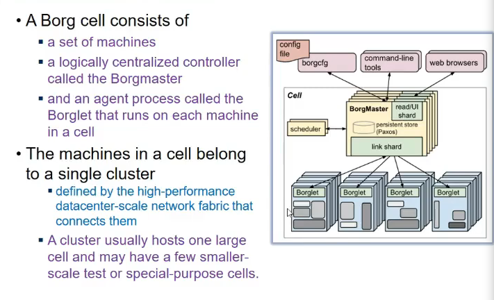

- machines in a cell belong to single cluster
  - cluster usually hosts one large cell and may have smaller scale test or special purpose cells

### Borgmaster

- schedules jobs submitted to it
- logically a single process but is actually replicaated 5 times
- uses paxos to manage shared state

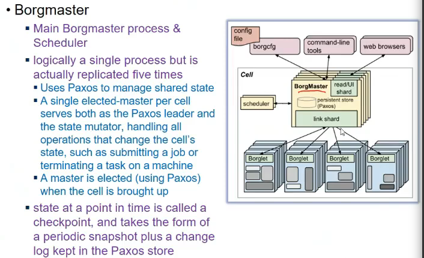

### Borglet

- software running on each machine
- starts and stops a job

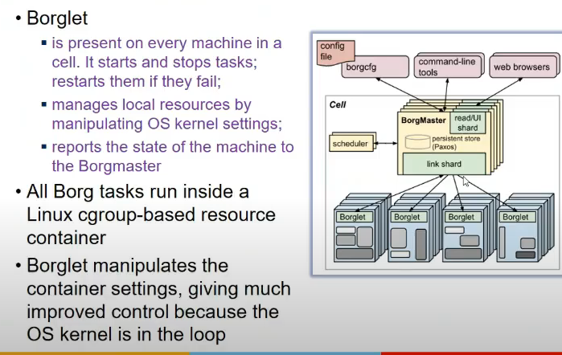

### Workload Characteristics

- long running services
  - should nvr go down
  - very less latency
- batch jobs

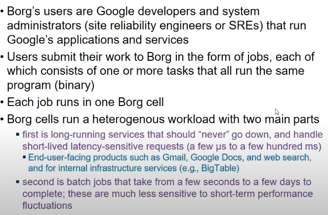

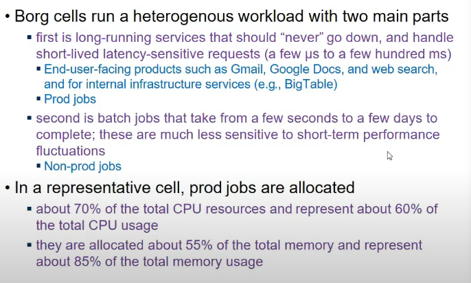

- production and batch jobs
  - production = latency sensitive
  - batch = lower priority

### Clusters and cells

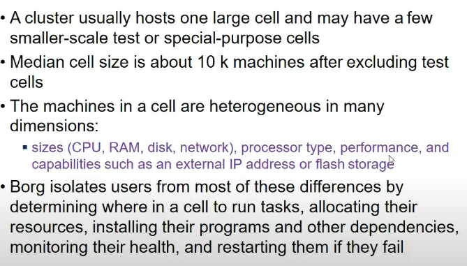

- user submits jobs to borg mgr
- baki borg master dekhta
- kaha run karu
- kitne resources du
- kya dependencies hai, install kar usko
- monitor machines if fail, etc

### Jobs and Tasks

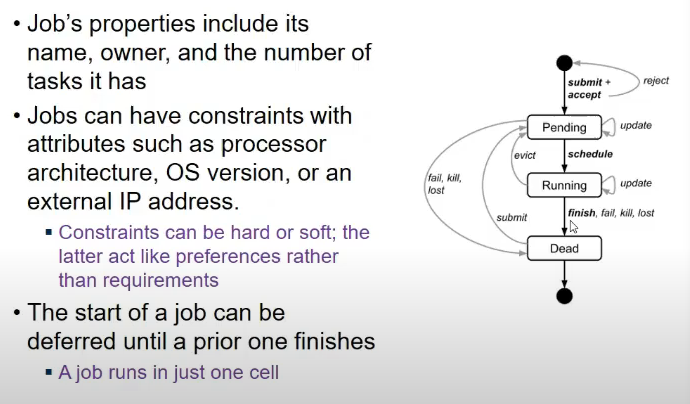

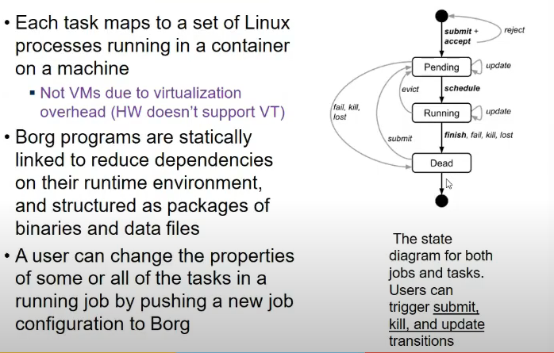

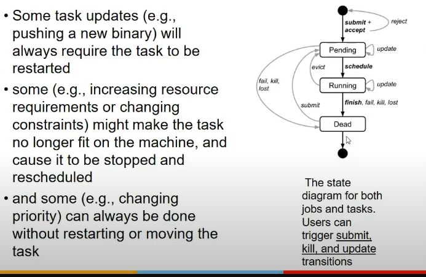

### Priority, quota and admission control

- every job has a priority
- high priority can preempt lower priority for resources
- preemption cascades ho sakte
  - solution: same band wale nahi preempt kar sakte
- ands
  - monitoring>production>batch>best effort(aka testing/free)

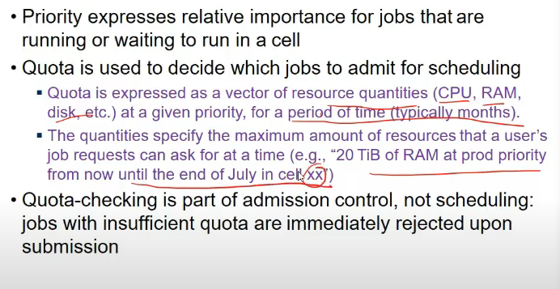

## Naming and Monitoring

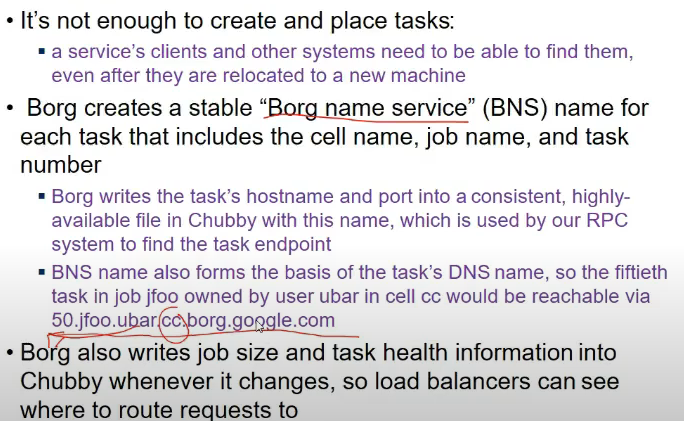

## Scheduling

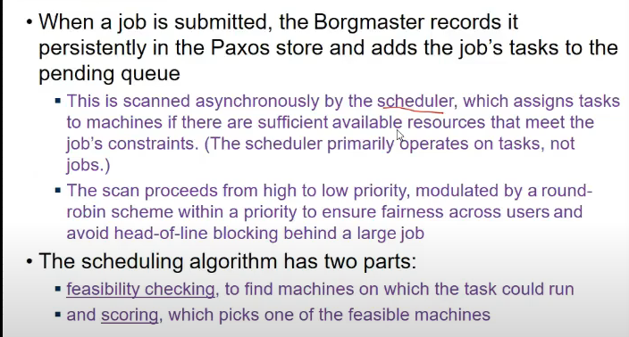

