# Lecture 3

- [Lecture 3](#lecture-3)
  - [Video](#video)
  - [What is Cloud computing](#what-is-cloud-computing)
  - [Economics of Cloud users](#economics-of-cloud-users)
    - [Costs involved](#costs-involved)
      - [Consumer point of view](#consumer-point-of-view)
      - [Provider point of view](#provider-point-of-view)
  - [Definition of Cloud computing](#definition-of-cloud-computing)
  - [Attributes of cloud computing](#attributes-of-cloud-computing)
  - [Cloud Computing](#cloud-computing)
  - [Programming models in cloud](#programming-models-in-cloud)
    - [Outline](#outline)
  - [Cloud applications](#cloud-applications)
  - [Data streams](#data-streams)
  - [Data flow mgmt in streaming algos](#data-flow-mgmt-in-streaming-algos)
    - [Distributed data flows](#distributed-data-flows)

## Video

[link](https://drive.google.com/file/d/12SLz4rmXo0GXa1dgAQwQr_I_EessW_K0/view)

## What is Cloud computing

- before cloud computing existed, Software as a service was still existing
- what makes cloud computing - 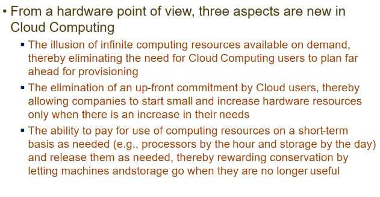
  - provides illusion of infinite resources
    - as and when necessary, I will take more servers/resources
    - I do not have to predict max demand already
  - Commitment required by cloud users (who use the services)
  - ability to pay for use of resources on short term basis as needed
    - abhi liye, and thodi der me returned

- eg 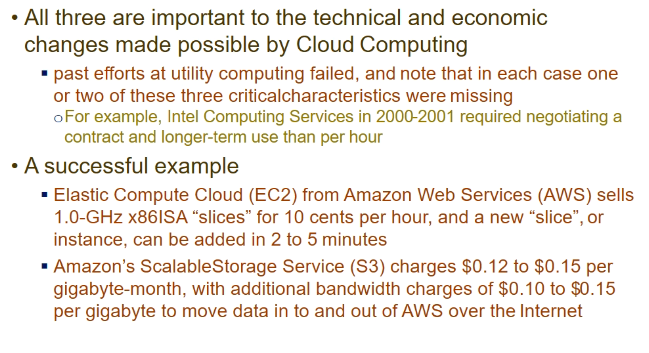
- pehle wale failed bcz I need to negotiate and sign contract and all
- but successful wale
  - billing is per hour basis or less
  - scalable storage service (S3)
  - no contract and all
  - bandwidth charges are very less as well

- How these services are offered so cheaply
- when u do at big scale, u can do at cheap rate - economies of scale
- u can make multiple instances into single box
  - put multiple instances as virtual boxes/containers into single box - **statistical multiplexing**
- **bulkpurchasing**
  - discount jyada when u order things in bulk - eg 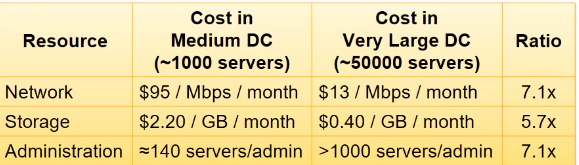
- is it possible for small scale company to provide cloud services
  - Amazon toh kar sakta
    - they have s/w stack to manage huge setup
    - and infrastructure as well
    - they extended it to public
    - utilized off-peak capacity
      - rented things they were not using
  - Microsoft
    - had lot of consumer base who used office suite and .NET products
    - it just moved them to cloud
  - Google
    - had large setup and s/w stack
    - used that to offer cloud services

## Economics of Cloud users

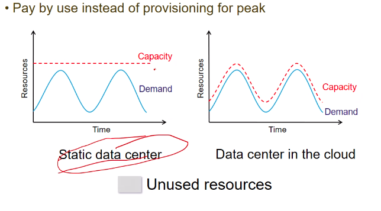

- u cannot give up capacity in static data center tho demand is varying
  - increases cost
- Cloud side - resources are changing according to demand

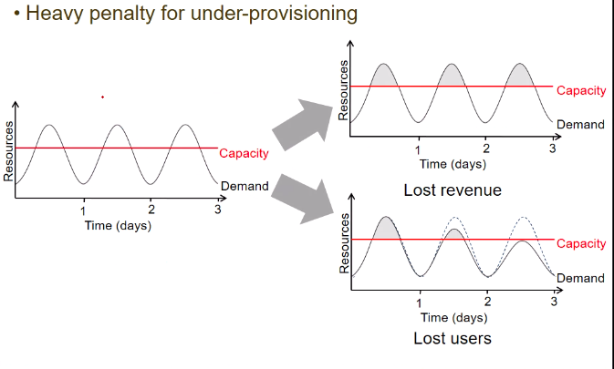

- when I have undercapacity, I will be dropping requests which exceed the capacity
  - so I will lose confidence of users, demand will decrease (see 2nd graph)
- so ppl prefer **cloud computing** as a platform

### Costs involved

#### Consumer point of view

- cap-ex = capital investment
  - traditional
    - one time investment
    - acquiring space, firewalls, network equipments, air conditioning
  - cloud
    - not applicable
    - I am not purchasing anyth 1-time, I am renting
- op-ex
  - traditional
    - operational expenses
      - electricity
      - infrastructure wear and tear
  - cloud
    - rental

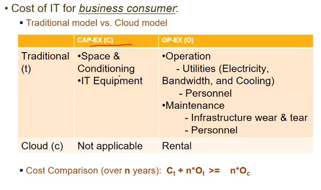

#### Provider point of view

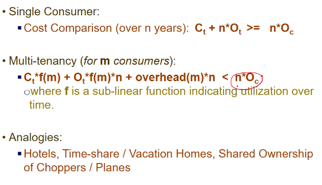

- multi-tenancy
  - m consumers will be using ur system simult maybe
  - m se multiple nahi kia but function of m
  - function will be sublinear
- I am multiplexing
- I will have some metadata corresponding to each customer
- summing up costs , it should be less than total paisa consumers pay, tbhi profit hoga na bhai

- Analogies
  - hotels
    - multiple ppl check-in/check-out
    - one room shared by multiple ppl
  - time-share/vacation homes

## Definition of Cloud computing

- [paper](https://nvlpubs.nist.gov/nistpubs/Legacy/SP/nistspecialpublication800-145.pdf)

## Attributes of cloud computing

- 5 attributes

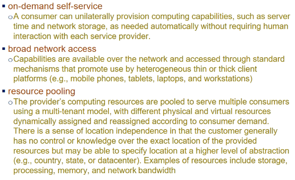

- resource pooling
  - multiple consumers can access the resources
  - provider's resources are pooled
  - location of resource is not reqd to be known by consumer

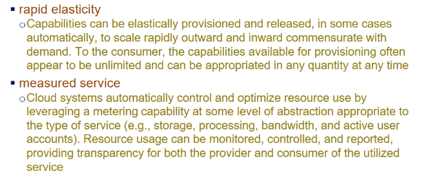

## Cloud Computing

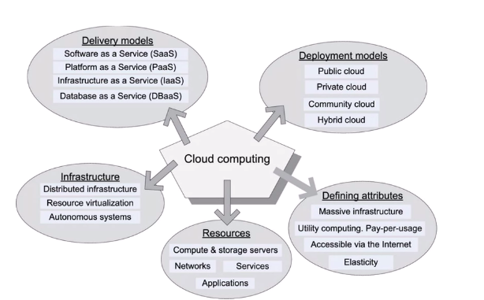

- deployment models
  - community cloud
    - gp of companies together using a cloud
  - hybrid
    - combn of public and private
- Delivery models
  - SaaS - software
  - PaaS - platform
  - IaaS - infrastructure
  - DaaS - database

## Programming models in cloud

### Outline

- Cloud applications
- Parallel Programming paradigms
  - pleasingly synchronous model
  - bulk synchronous model
    - hadoop

## Cloud applications

- pipelined exec
- batch processing apps
  - offline data
- real time processing apps
  - streaming data
- web apps

## Data streams

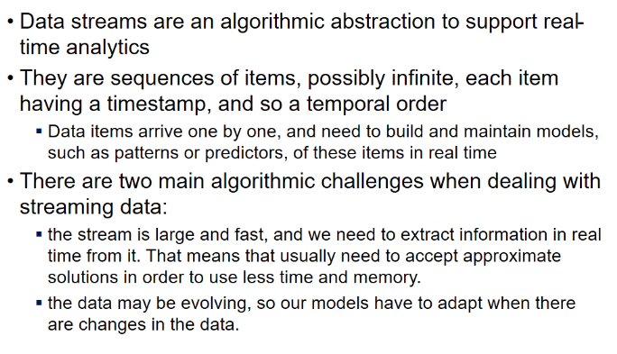

- streams = continuous generation of data
- items come 1 by one, and are timestamped
- 2 challenges
  - very fast
    - processing of one item must finish before other arrives
      - then only we can do without loosing buffer and all
  - and very large
    - it's unlimited stream
- we need to extract info realtime
  - cannot store everything at one place and then apply algos
- also, data might be evolving
  - so models which I build, should adapt to change in data

## Data flow mgmt in streaming algos

### Distributed data flows

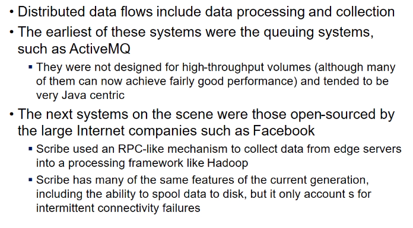

- ActiveMQ
  - a queuing system
  - generator can put stream into queue and reach destn
  - scaling up is prob

- Scribe
  - open-sourced by FB
  - pools data and stores into disk

- Flume and Kafka
  - recent open source systems
  - meant for distributed collection of data
  - follow publish/subscribe model

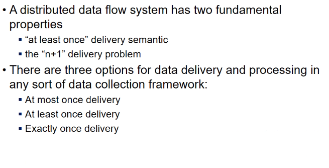