# Lecture 4

- [Lecture 4](#lecture-4)
  - [Video](#video)
  - [Slides](#slides)
  - [Hadoop](#hadoop)
    - [Scale Out vs Scale-up](#scale-out-vs-scale-up)
    - [HDFS](#hdfs)
    - [Job Tracker](#job-tracker)
  - [MapReduce Paradigm](#mapreduce-paradigm)
    - [scheduling](#scheduling)
    - [Shuffle n sort](#shuffle-n-sort)
    - [Multiple reduce](#multiple-reduce)
    - [Compressor](#compressor)
    - [WordCount example](#wordcount-example)
  - [Homework problem](#homework-problem)

## Video

[link](https://drive.google.com/file/d/1UVHSKC9YpGHZZFX47Oiskmg2HQp3KMyb/view)

## Slides

[link](https://drive.google.com/file/d/1Hp0HyzvWjMNUpumtlK4LMgO7XfCdagZC/view?usp=sharing)

## Hadoop

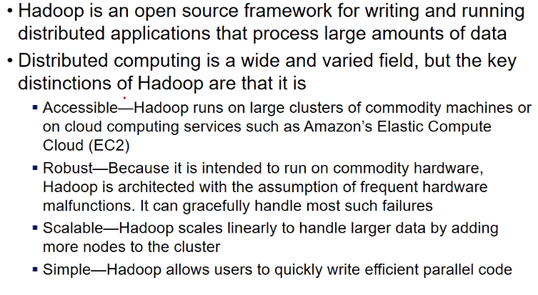

### Scale Out vs Scale-up

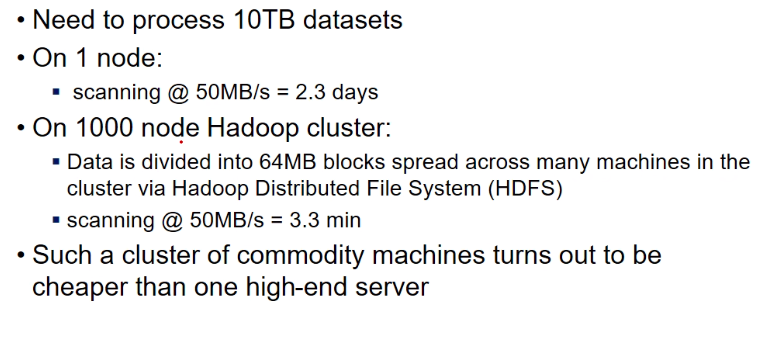

- scale-out = horizontally expanding capacity
  - I add more servers
  - it should increase storage and server capacity

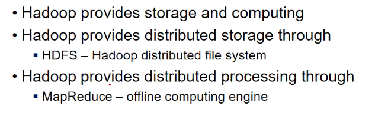

### HDFS

- there is a name node = kind of central server
  - responsible to maintain file system hierarchy
  - metadata related to files
- then, there are data nodes
  - datanode1,.. datanode n
  - each node stores some data
- there is a conterol communication b/w namenode and datanode
- there is also a HDFS client
  - say he has a 1gb file
  - it says to name node ki yeh file hai
  - name node adds it and tells client ki yeh nodes hai jaha pe file hai teri (set of servers deta, ip addresses, which are datanodes)
  - abhi it has just added metadata, not actual file nodes
  - once file is added, client
- first client asks to add file
  - server rpelies ok
  - then client says add chunks request for each of the chunk
  - namenode stores metadata ki kaunsa chunk kaha hai
  - **namenode is only responsible for control operations**
    - adding
      - not adding data
      - but entry in hierarchy (metadata)
    - moving
    - copying
    - deleting
    - listing
- load on namenode is not much bcz data is not passing through it
- but still Single Point Of Failure problem
- all operations pass through namenode
- so there is a concept of secondary name node
  - which remains passive unless needed
- another factor is scalibility
  - say each datanode is 1TB, I add 10 datanodes, space increases by 10TB
  - so, scalable easily
  - no effect on namenode na
- Efficient read write
  - reading can be done in parallel
  - read each chunk from each datanode in parallel
  - it is efficient, only if reads are long, u are reading long stream of data
  - but for transactions, it might not be efficient

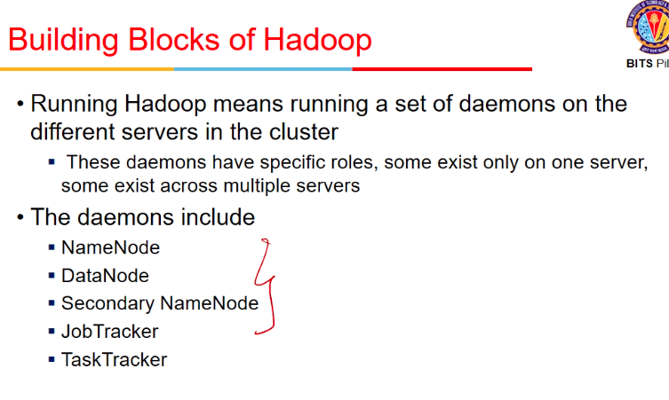

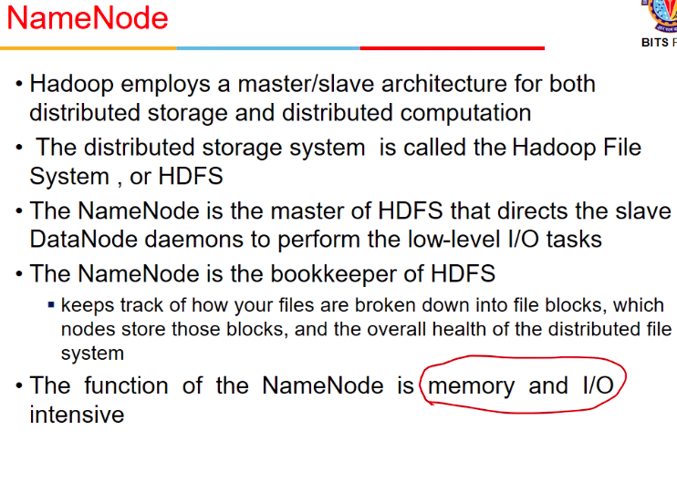

- memory and I/O intensive bcz logs likhne and disks metadata likhna

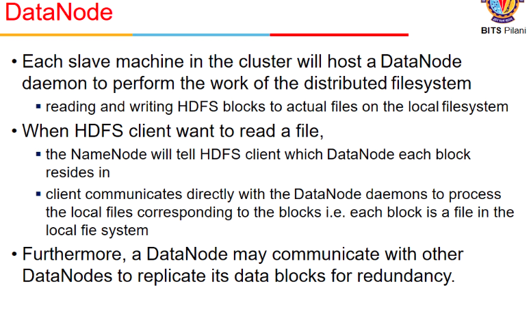

- namenode example 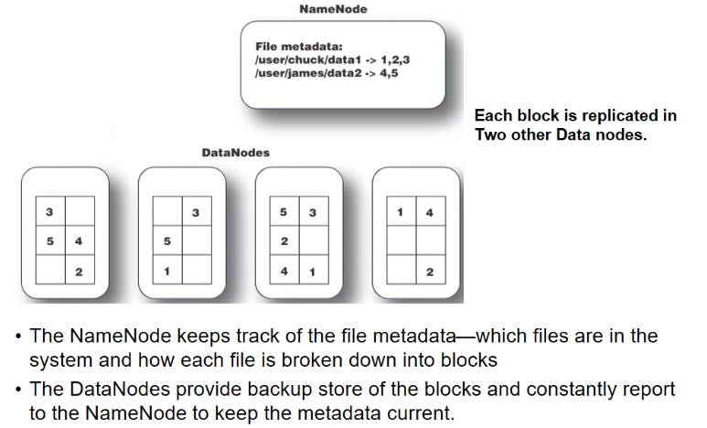
- each block is replicate din 2 other data nodes

- communication between dtaa and name ndoe 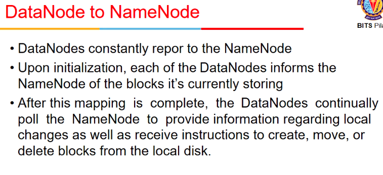

### Job Tracker

- we have data and processing
- 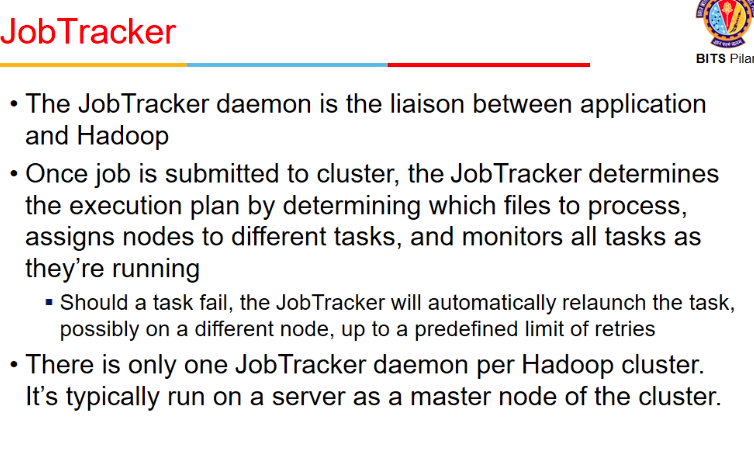

## MapReduce Paradigm

- example
  - say we have some records of form <IDno, Hostel>
  - I have to count number of students in each hostel (Hostel-wise count)
  - the file is very big (say 1 million records)
  - For hadoop, assume
    - I cannot do in one system, say I have 3 systems
    - some data in 1 system, some in 2nd and some in 3rd
    - I want someone to process data in each nodes
      - if processing happens within those system itself, greattt
      - and return some output from each node
      - output is in format <key, value>
    - now these key,values are combined together (*shuffle sort*)
      - sorts on basis of keys
      - one key goes to only one reducer
    - then we have reducers (say 3 hostels the toh 3 output a jayenge)
      - all nodes with hostel1 as key h1 me chale jayenge
      - and so on
      - so ek list of values mil jayegi h1,h2,h3 ko
      - if number of hostels > number of reducers then h4 bhi 1st reducer me

- we had 2 phases
  - map
    - input = at one time it gets one record
    - it decides what it should write
  - reduce

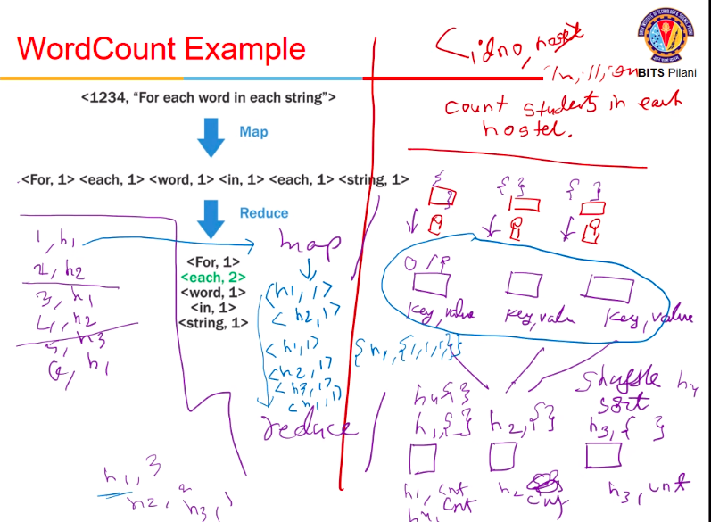

- we might have multiple map-reduce blocks (in an iterative fashion)

### scheduling

- split = chunk of data in datanode

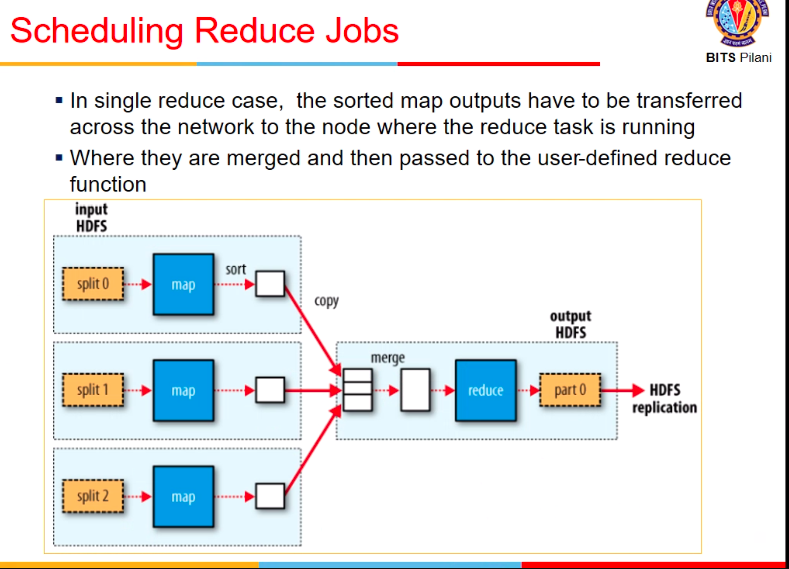

### Shuffle n sort

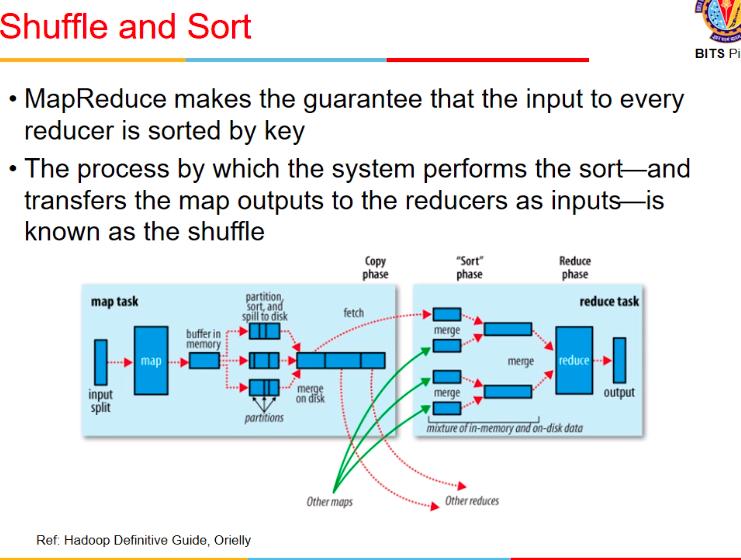

### Multiple reduce

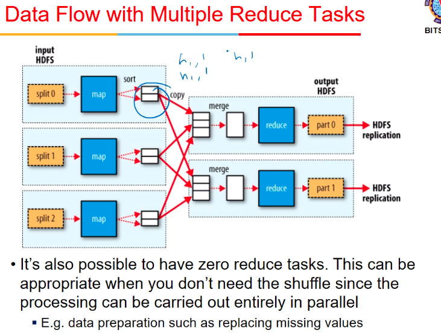

### Compressor

- when I sent h1,1 , h1,1 , I can combine it within this machine itself before sending
- bcz network me bhejna

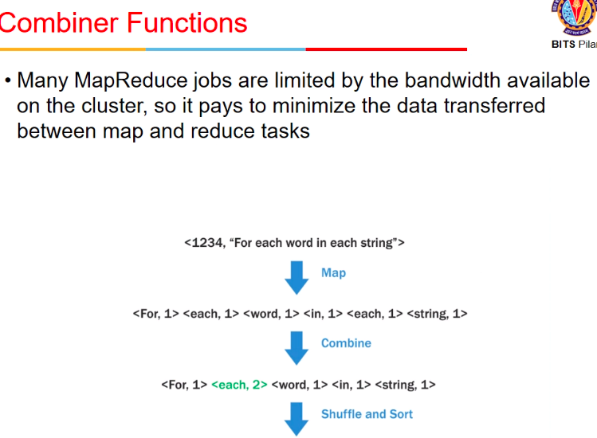

### WordCount example

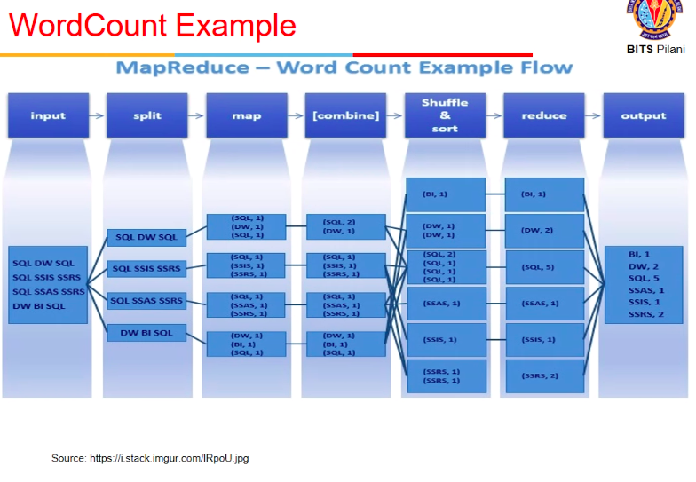

## Homework problem

- <userid, followerid>
- Write map() and reduce() logic for Twitter follower count
- answer

```python
map():
    # assuming n users, and m machines m << n
    within the machine combine all occurences of a particular user_num by adding the num_followers
    at the end, u have in a machine, a set of <user_num, num_followers>
    map each entry to a machine by using say a hash function user_num % m

reduce():
    for each user_num in list:
        if user_num is not in output list:
            add to output list entry <user_num, 0>
        add num_followers to entry in output list corresponding to user_num
    in the end u get a list of <user_num, num_followers> where each user_num is distinct in the list
```
