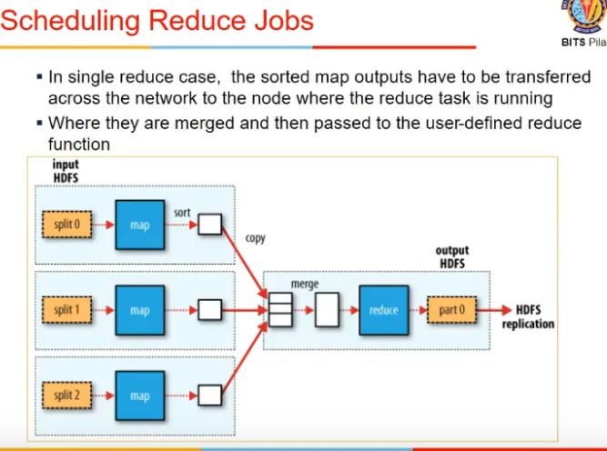

# Lecture 5

- [Lecture 5](#lecture-5)
  - [Video](#video)
  - [Summary](#summary)
  - [Scheduling in Hadoop](#scheduling-in-hadoop)
    - [Map jobs](#map-jobs)
    - [Reduce jobs](#reduce-jobs)
  - [Multiple Reducers](#multiple-reducers)
  - [Shuffle and sort](#shuffle-and-sort)
  - [Data flow with multiple reduce tasks](#data-flow-with-multiple-reduce-tasks)
  - [Combiner functions](#combiner-functions)
  - [MapReduce Example](#mapreduce-example)
  - [Chaining MapReduce Jobs](#chaining-mapreduce-jobs)
  - [Joining data from different sources](#joining-data-from-different-sources)
  - [References](#references)

## Video

[link)](https://drive.google.com/file/d/1NzLHOlQ3Xn91DFWyaIdHZNfAdJGjEzdz/view)

## Summary

- map is executed for every record in database
- it outputs a (key, value) pair
- there is a middleware between map and reduce, which does shuffle and sort
- it takes output of map and sorts them locally, sends to a particular reducer
- one key goes to one reducer only, key is not split across reducers
- 
- 
- 
  - data locality is followed so that #movements are minimized
  - #map jobs = # input chunks to avoid moving data

## Scheduling in Hadoop

### Map jobs

### Reduce jobs

## Multiple Reducers

## Shuffle and sort

## Data flow with multiple reduce tasks

## Combiner functions

## MapReduce Example

## Chaining MapReduce Jobs

- cannot be done via a single mapreduce
- I might need 2 mapredyces
- first will find for each year, max avg temp
- this is input to second mapreduce
- it has to output top 5
- for 2nd map, key will be a dummy value : all elems will have same key
- and value will be <year, temp>
- sari keys go to 1 reducer
- it will give top 5

## Joining data from different sources

- I need additional data which is not with me, I might need to take it from file and file might not be with me, since Hadoop me file bati hoti na
- there are high level frameworks for it
  - pig
  - hive
    - like a SQL language for Hadoop
    - u write a query
    - query is converted into MapReduce queries internally

## References

- Hadoop: The Definitive Guide, 4th Edition [Book] - O'Reilly Media
