# Lecture 6

## Job Tracker in Hadoop

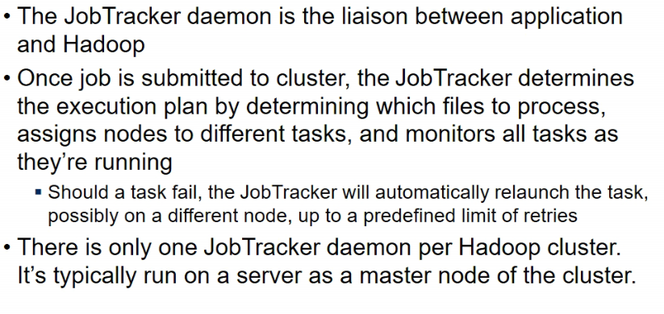

## Task Tracker

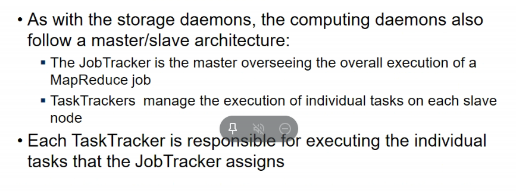

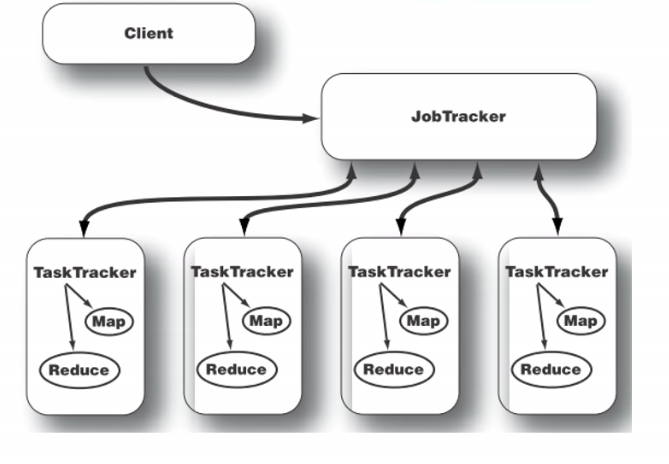

## MapReduce and Spark

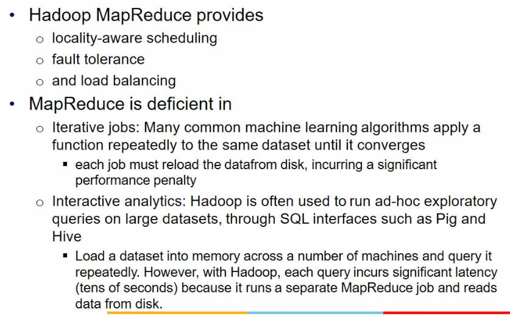

- fault tolerance, how?
  - replication: active, passive replication
  - when job fails, it is reinitiated again
  - it cannot be started from the point it finished, that's what Hadoop's principle is
  - if data is lost in one data node, it is available in 2 other data nodes
- Load balancing
  - distributed to multiple nodes na bhai
  - also, while I do processing, mapreduce, map jobs are distributed

- MapReduce is not suited in all situations
  - it is good in most of jobs
  - but for iterative jobs like k-means algorithms where u have to keep doing jobs until threshold condition is specified, this is diff in mapreduce
    - no clear cut demarcation in map reduce
  - hadoop is meant for offline analysis = batch analysis
    - offline = file me hai cheejein
    - for interactive analysis = when I want to interact with the dataset like SQL query likha and then uske upar queries likha
    - Hadoop me this is quite problematic
    - bcz sab cheejein disk me likhi jaati, har cheej ka output gets to disk
    - so if multiple mapreduce chained, then first wala disk me likhega and then agla read waha se
    - it is not good for interactive data

## Spark

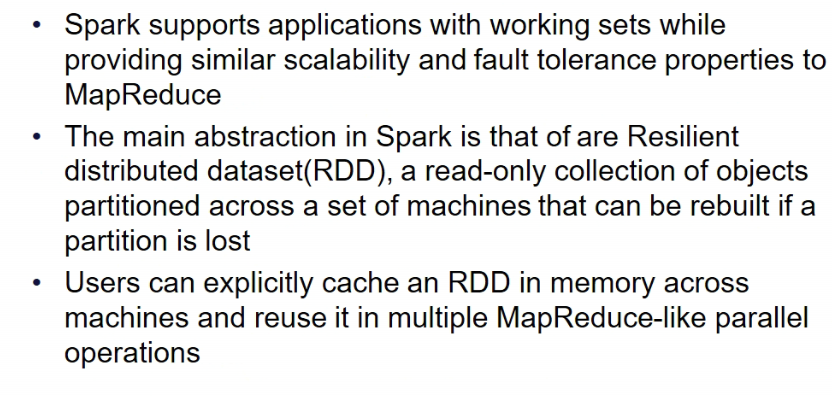

- it works with working sets mtlb it has a feature jisse I can tell it ki this data should be held in memory
- ***Resilient Distributed Dataset*** => it is like a table but partitioned on multiple machines
  - and if some partition is lost, it can be rebuilt
  - there is no replication but what all operations have been done since built can help in so

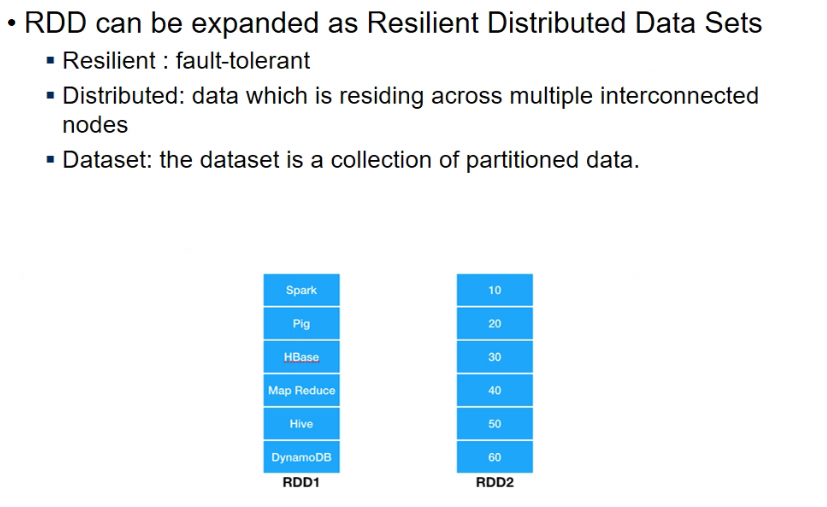

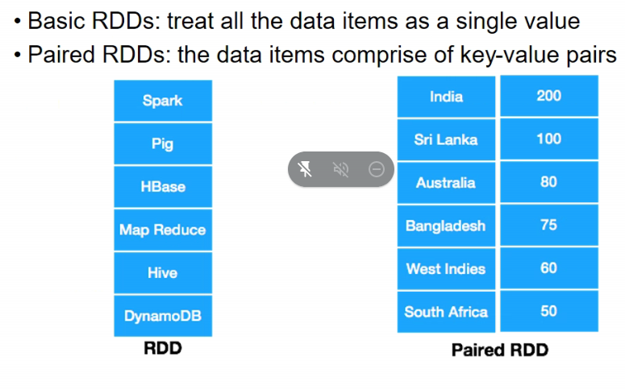

- basic contains each item as a single value
- paired is key,value pair

### Transformations

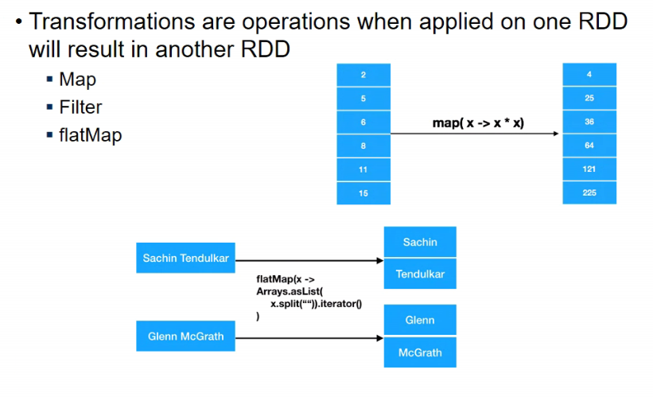

- flatmap = one to many
- each element is transformed into multiple elements, so size of source and destn rdd might nto be same

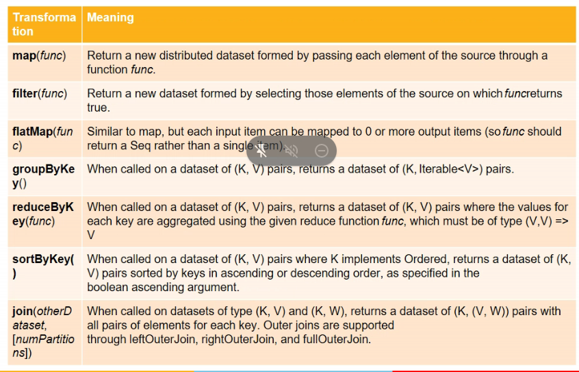

- example 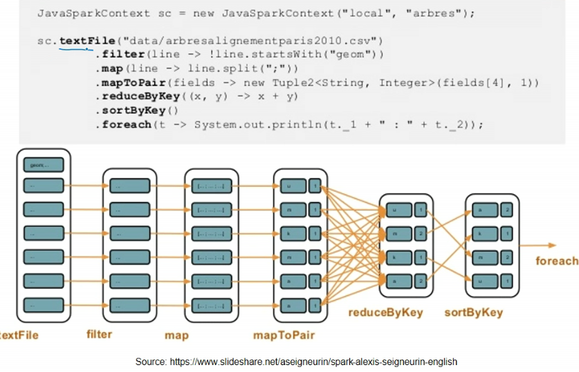
- stream operations hai
  - pipelining the operations
- last is not RDD transformation, rest are
- mapToPair gives paired RDD
- reduceByKey involves cross communication
  - i.e. if RDD is stored across multiple nodes

## RDD Lineage

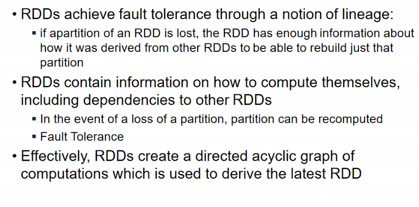

## Spark Example

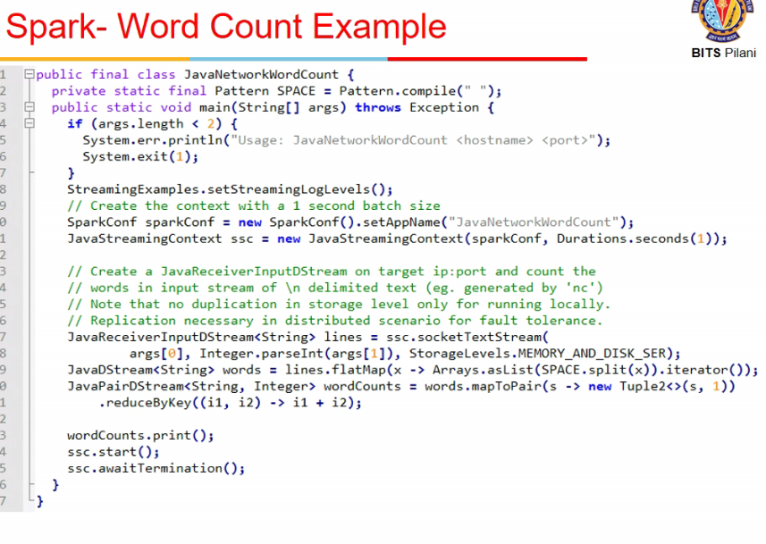

## Cloud Applications

- pipelined execution
  - microservices
- bactch procesing
  - did today
- real time processing
  - will do abhi
- web applns

## Real-Time processing applns

- 3 dimensions
  - accuracy
  - time
  - memory
  - need methods to obtain maximum accuracy with min time and low total memory
- Stream = unbounded
  - data is being generated continuously
  - so memory that is reqd to hold is also unbounded
  - so jo programs offline analysis pe use kie the woh directly nahi use kar sakte ab
  - Sliding window(overlapping), tumbling window, tilding window, use karenge
  - I have to finish processing a window b4 other comes

## Distributed data flows

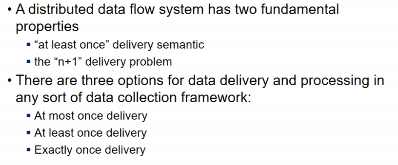

- how do we connect source and sink
- tradeoff b/w message losses and speed

- atmost once = there could be losses
- atleast = data must be delivered
- exactly = no compromise with data, it should go as it is

- n+1 delivery problem
  - say 3 systems are supposed to rcv data
  - ab agar new system is added rcvr4 and usko I have to give dtaa in a particular format, this is n+1 dlvry prob

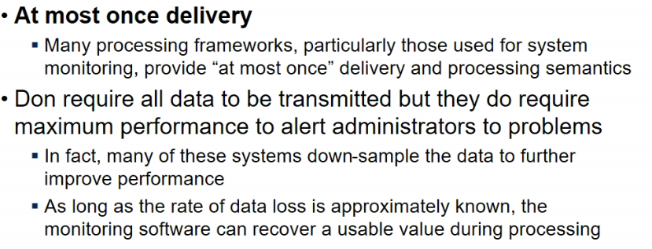

- max perf a rahi even if there is some loss, no delays

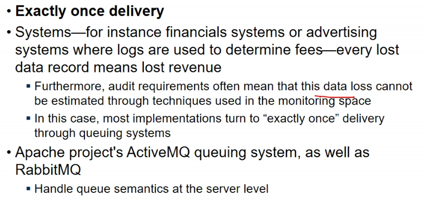

- txn systems, whatever msg is sent, should reach system
- no losses, no repetition
- RabbitMQ is one such platform

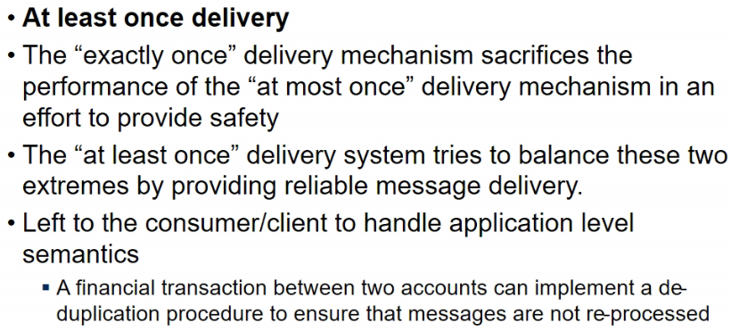

- loss cannot be tolerated = reliability is reqd

## The n+1 problem

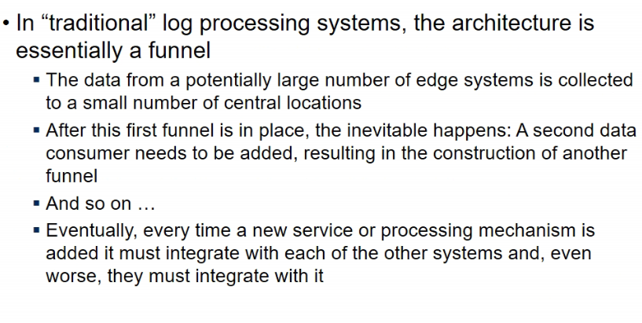

- bits me sare depts (swd, augsd, etc) ko same student data chahiye but some different formats me
- now if new dept is added and usko naye form me chahiye, I need to add certain adapter/bolt in system which wil ltransform the data according to consumer needs

### Solution

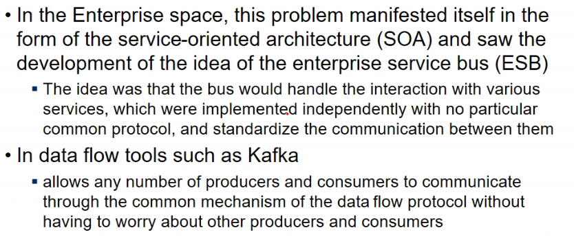

- service Oriented Architecture
- bus hai, koi bhi usse connect kar sakta
- bus will handle interaction with services
- the consumer/middleware will itself convert data to the format it wants

- PubSub systems (Publisher/subscriber)
  - pub = producer of data
  - sub = consumer of data

## Apache KAfka

### Design and Implementation

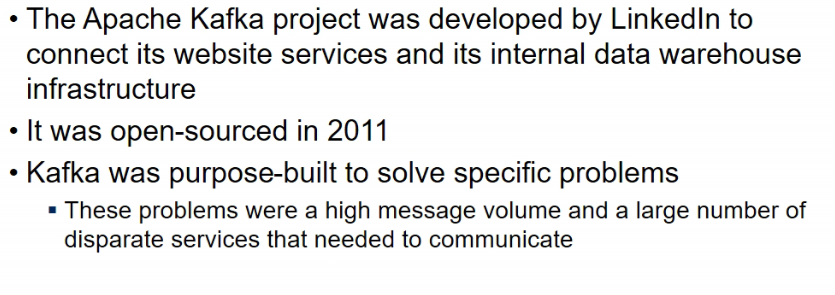

### Architecture

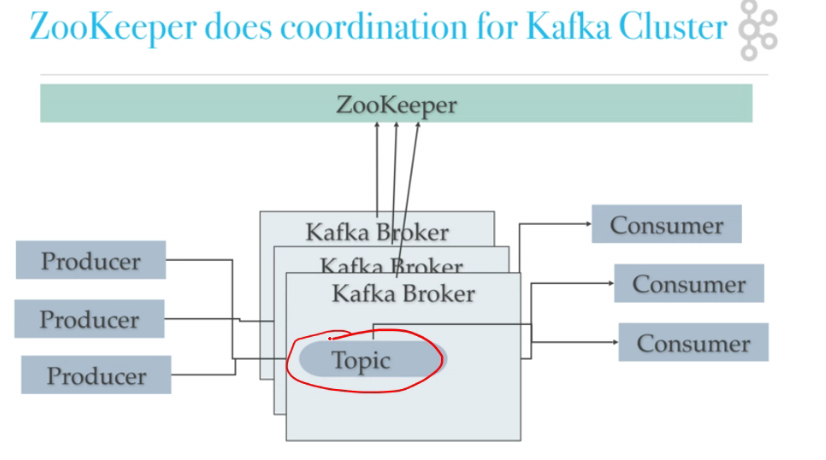

- producer produces data with a topic
- consumer subscribes to the topic
- topic is divided into partitions
- each partition resides on a separate physical server
- each partition is capable of supporting some b/w
- increase #partitions agar handling capacity badhaani

- broker looks at incoming data, each broker resp for multiple partitions

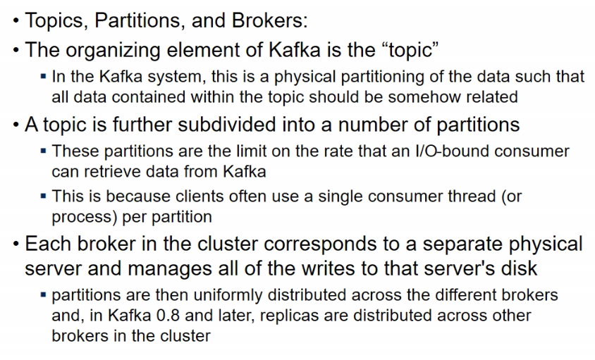

- msgs come from multiple topics
- broker should go to write partition in the topic

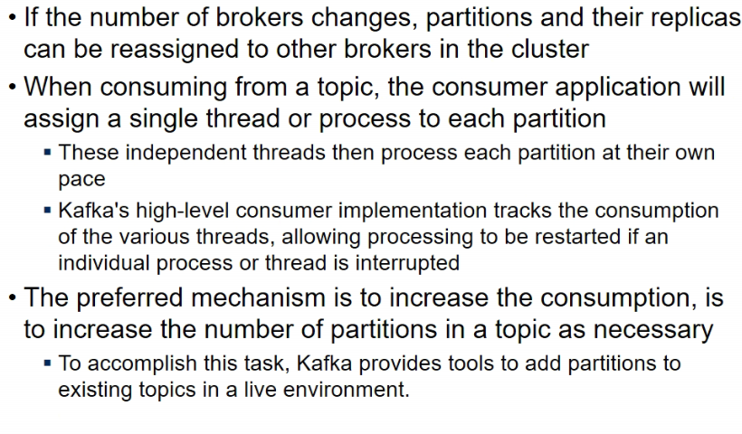

- dynamically i can add partition to a topic

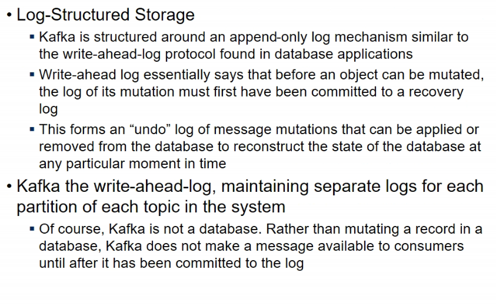

- write ahead log hai
- first ensure log is commited to the disk, then only write to partition

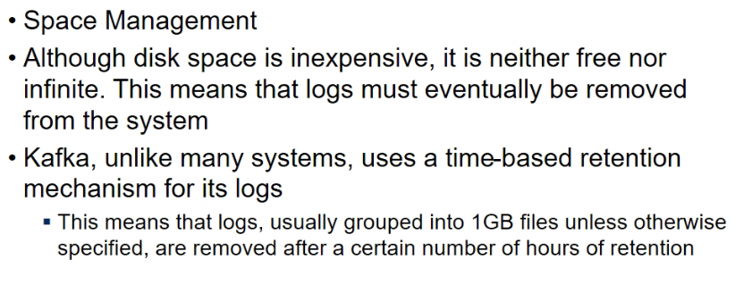

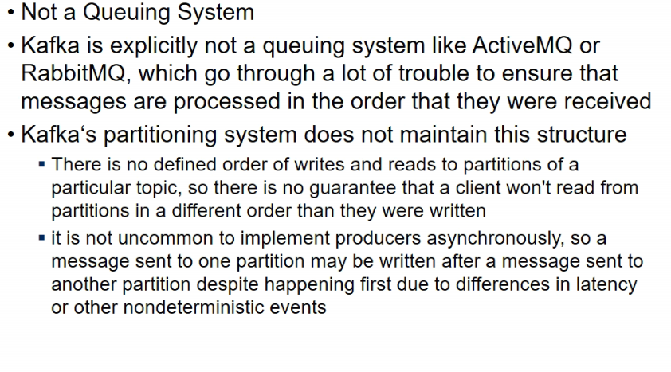

- FIFO nahi le sakte, RabbitMQ vagairah me hota
- msgs might not be coming in same order to consumers might not be same as in which they were published

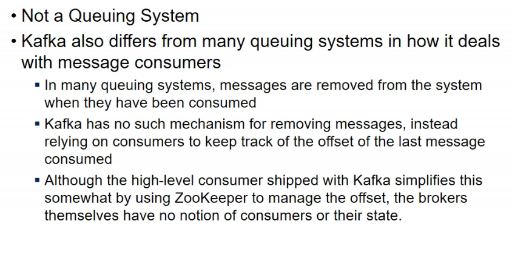
