# Lecture 7

- [Lecture 7](#lecture-7)
  - [Video](#video)
  - [Slides](#slides)
  - [Apache Kafka](#apache-kafka)
  - [Apache Storm](#apache-storm)
    - [Internal Architecture](#internal-architecture)
    - [Stream Grouping](#stream-grouping)
    - [Word Count eg](#word-count-eg)
  - [Scaling of Web Applications](#scaling-of-web-applications)
    - [Sources of Web traffic](#sources-of-web-traffic)
    - [Scalibility](#scalibility)
      - [Vertical and horiozntal scaling](#vertical-and-horiozntal-scaling)
      - [Load Balancer](#load-balancer)
      - [Database Replication](#database-replication)
    - [Improving Response time](#improving-response-time)
    - [Stateless Web Tier](#stateless-web-tier)
    - [Hosting on Multiple datacenters](#hosting-on-multiple-datacenters)
    - [GeoDNS](#geodns)

## Video

[link](https://drive.google.com/file/d/18Lt68TCIgU8dPPOlNYAWt-jz8dkRC8xQ/view)

## Slides

[link](https://drive.google.com/file/d/1jE8m7YKZ36XYxktIlrFoWMWGTvlGo472/view?usp=sharing)

## Apache Kafka

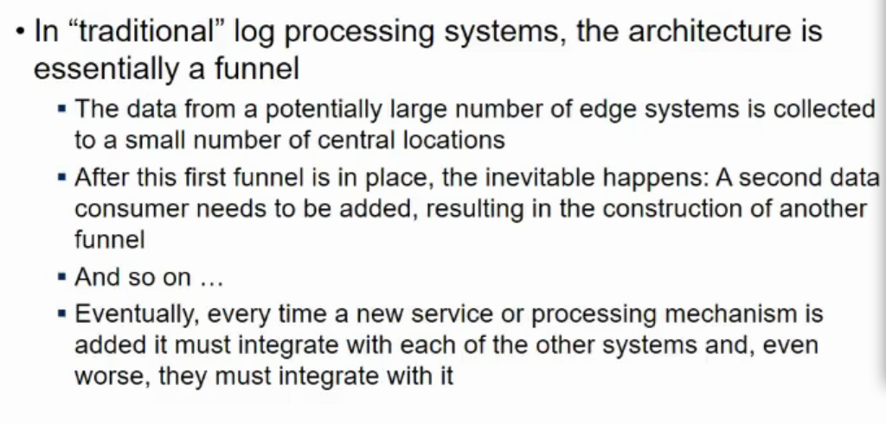

- network issues
  - tradeoff b/w reliability annd speed

- Kafka tries to address problems
  - broker is resp for a physical server
  - a server handled by a broker
  - broker is a s/w which deals with prod and cons
  - prod writes a msg to a topic, and consumer consumes from the topic

- Scalability of Kafka
  - achieves by dividing the topic
  - divide a topic into partitions
  - msgs are partitioned
    - say several prods and consumers hai, each can write to a partition. How much it can pe limit hai
    - if u want to write more than that, increase #partitions
  - How much consumer has consumed, or producer has produced will be maintained by consumer and prodc itself, kafka does not
  - so state is not maintained  by kafka and hence scalable

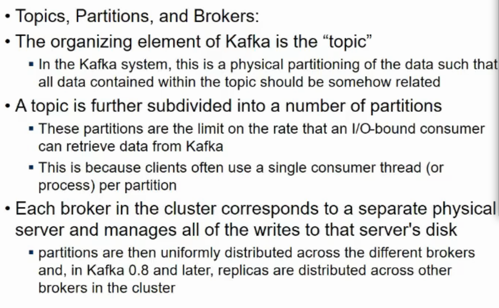

- not a queuing system, FIFO nahi hoga necessarily

- Replication
  - when a partition is created to a topic, replica set is created (2 others added to the topic)
  - when msg comes, pehle log me jata and then dono replicas me and when ACK is rcvd, tbhi data goes to consumers

- used in multiple datacenter deployments

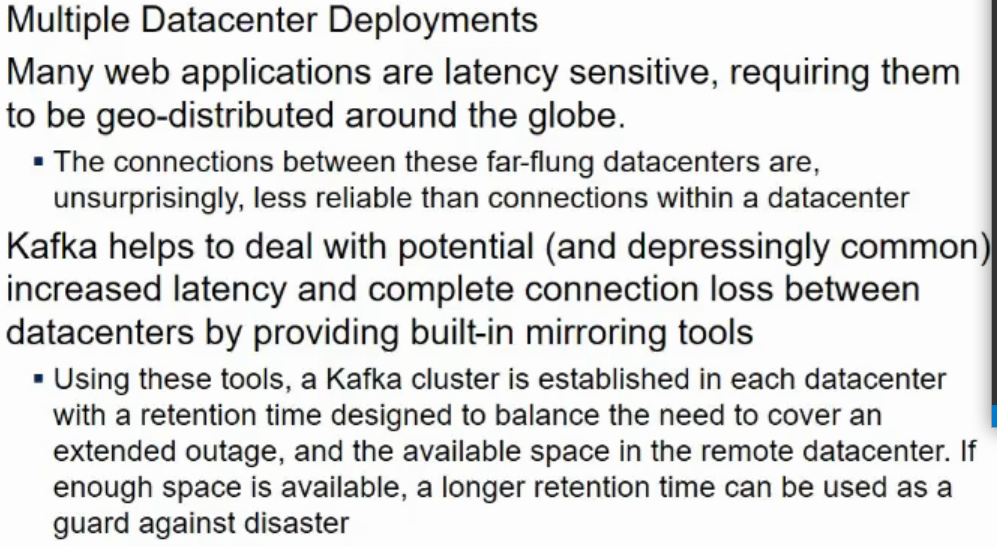

## Apache Storm

- kafka is only data mgmt system. It is not processing anything, it just brings data at one place

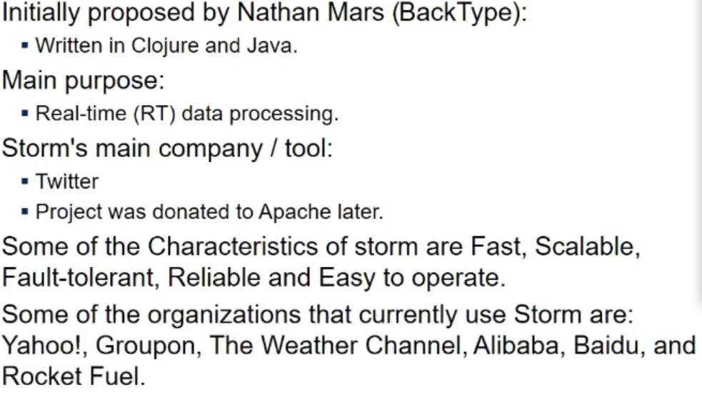

- storm has good abstraction for managing streams

- storm has topology concepts

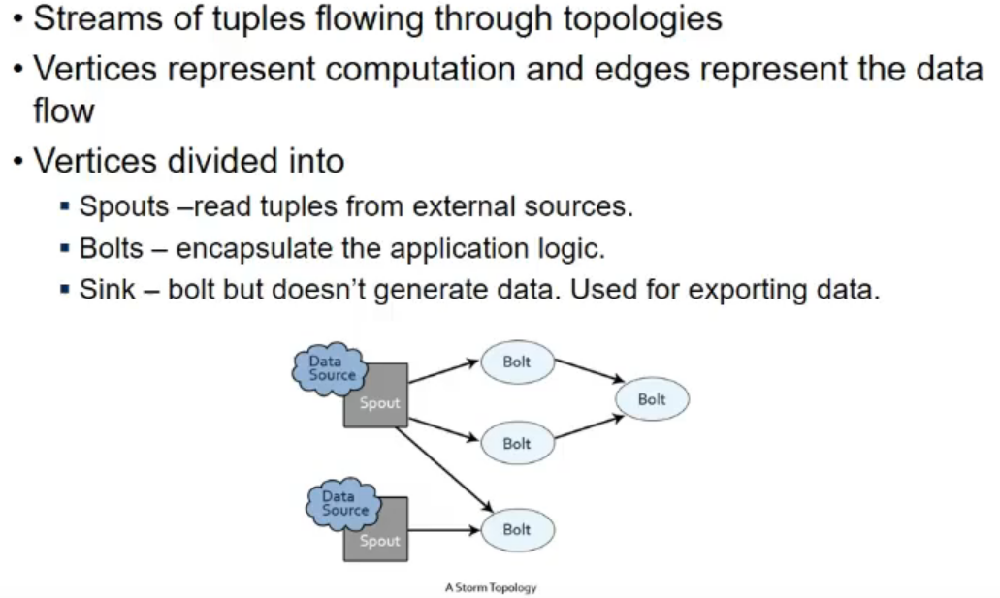

- programming abstraction
  - I have a data source which could be file/socket/stream mgmt system/kafka
  - i can connect with that with spout (it reads a tuple at a time and writes to stream)
  - I can connect a spout to multiple bolts
    - bolt is processing logic

- sink does not generate data, it is like the end piece. writes to console or smth

### Internal Architecture

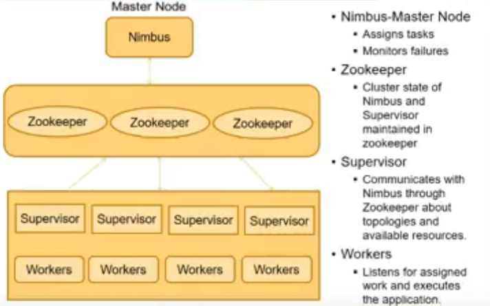

- coordination b/w workers and supervisors is done by zookeeper
- nimbus is cluster mgmt system which takes care of communicating with system and tracking if system is down etc
- this is done by state sharing

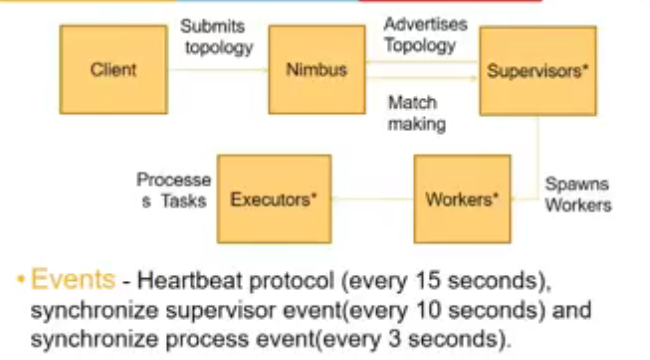

### Stream Grouping

- we had spout, bolt and sink
- connection b/w spout and bolt and bolt and bolt can vary bcz eAch bolt can have multipl einstances
- data being processed by different instances of a bolt could be different

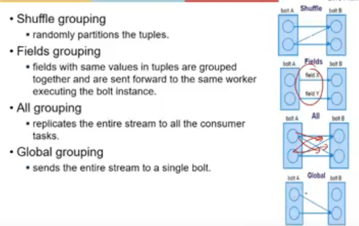

- here both bolts have 2 instances
- how to send data from A to B
- that is specified by streams grouping

- field grouping is like reduce operation
- all is like cross product

### Word Count eg

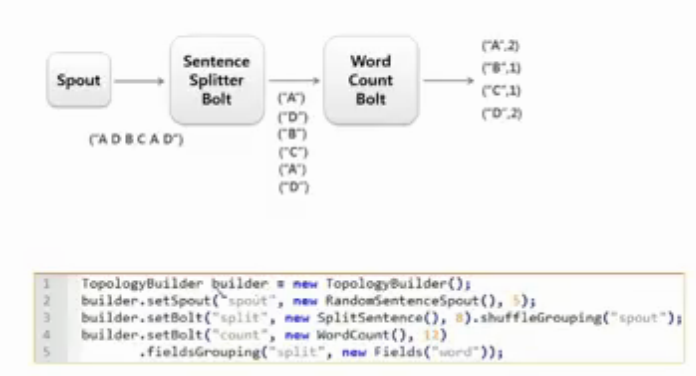

- we build the topology
- set the spout (source data)
- set split bolt = split the sentence and make words out of it
- connection by shuffle grouping
- count bolt = we are specifying ki take key as word field
  - and do its field grouping
- 5, 8, 12 in figure means the number of instances we are creating

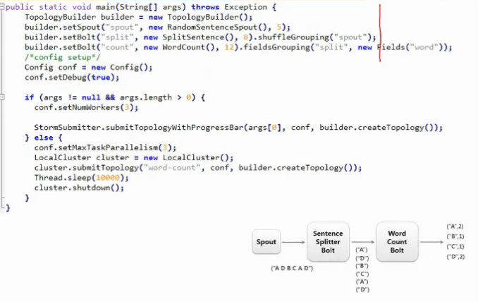

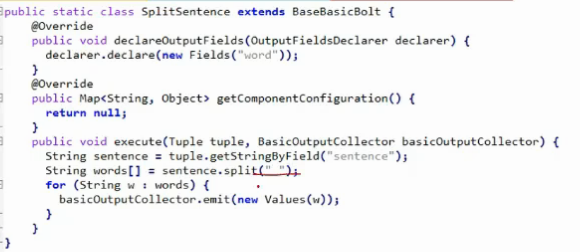

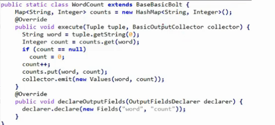

- this code  will be running on all the servers and how the data will be going on from one server to other, will be maintained by internal architecture

## Scaling of Web Applications

### Sources of Web traffic

- traffic for a webserver has 2 sources
  - web browser
    - web server generates a html page and browser renders html page for users
  - mobile apps
    - communication protocol used b/w mobile app and web server is usually HTTP protocol
    - JSON ki form me data ataa and they locally render it

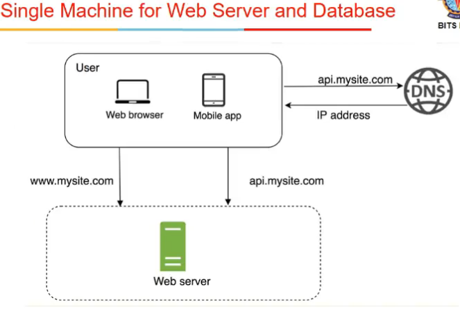

### Scalibility

- as user base grows, I want to increase my capabilities
- How to measure scalability
  - manle x time lagta ek req ko proces karne me, then 1/x req in a second
  - if cpu has multiple cores, say n, then n/x requests

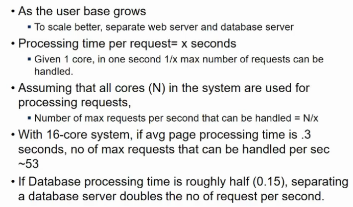

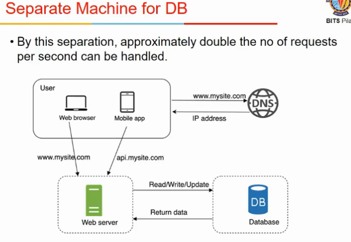

- hacing database and server on same system limits scalability
  - so separate webserver and database server

- Think  time
  - how many users can I serve simultaneously, not #requests
  - user takes some time before requesting another link from a site
    - time difference b/w 2 requests is **think time**

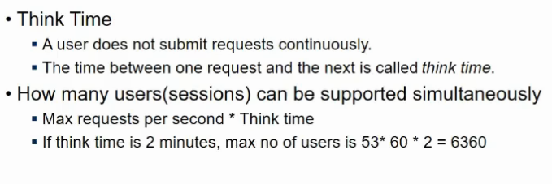

- there is a limit on how much can I scale my system

#### Vertical and horiozntal scaling

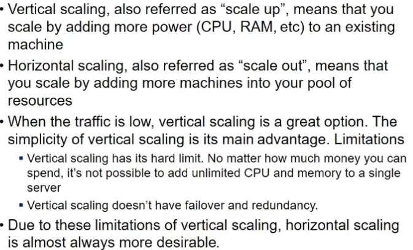

- vertical scaling cannot tolerate failures
- so we have failover options
  - 2 system hai, 1 fail hua toh 2nd laga le

#### Load Balancer

- say horiz scaling karli, I have 10 systems
  - how to tell customers ki is system pe ja ya ispe

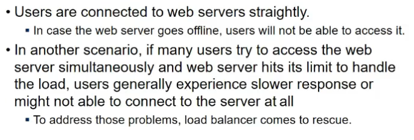

- it is a single public IP
- it is the only thing visible outside
- servers private IP addressed hai

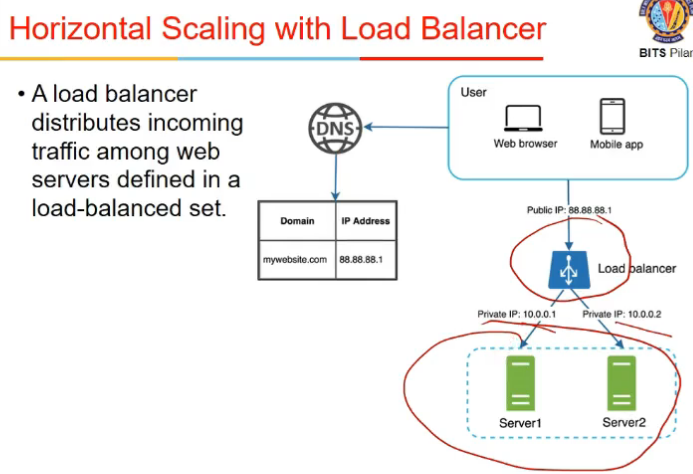

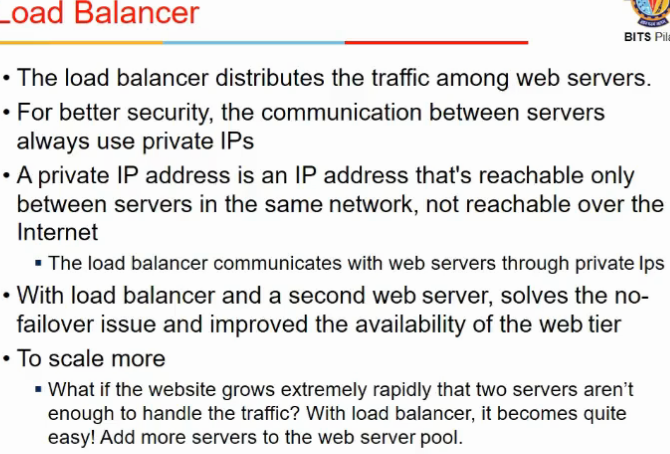

- load balancer knows ki kaunsa server up hai , kaunsa down so it will handle it

#### Database Replication

- another way to scale up
- database server scale-out (pichla web server scale-pout tha)
- master slave architectures
- slave only get read requests
- writes are done only on master servers
- this works bcz read req jyada hoti in gen

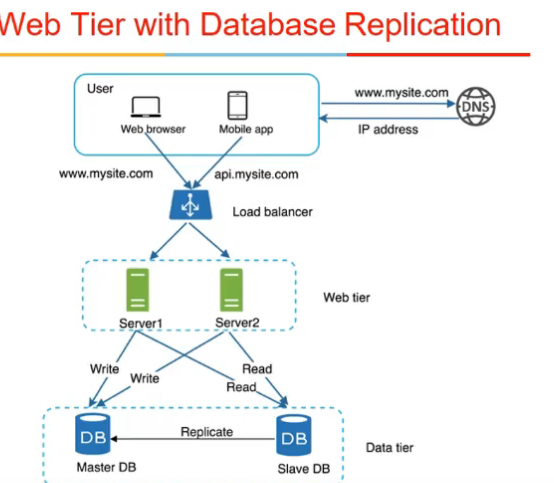

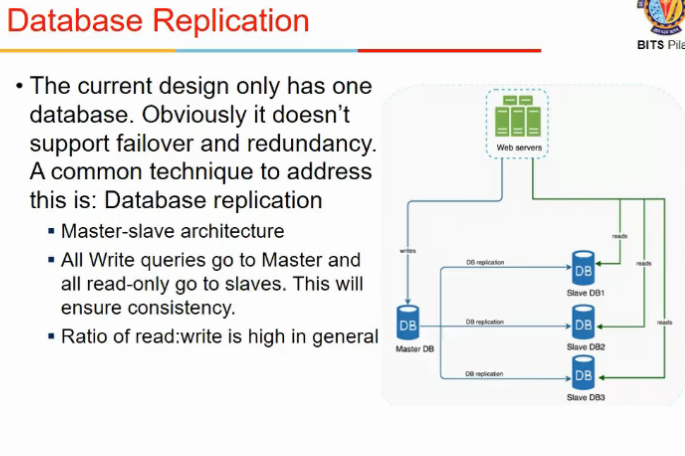

### Improving Response time

- just by scaling I am not good
  - query resp time depends upon other factors too
  - n/w and disk latency rahegi

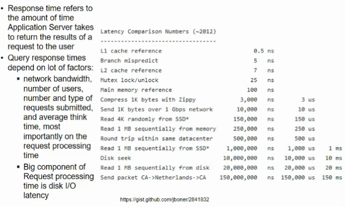

- add a cachee layers
- memcache
  - brings thing to memory as and when reqd
  - improves resp time

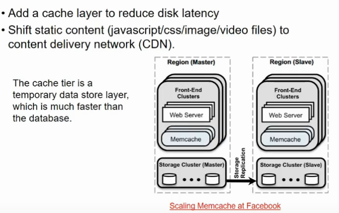

- it is not cache at l1, l2 , l3 wala, it is memory cache

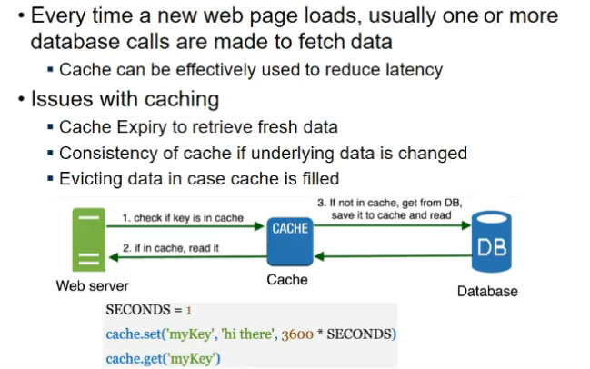

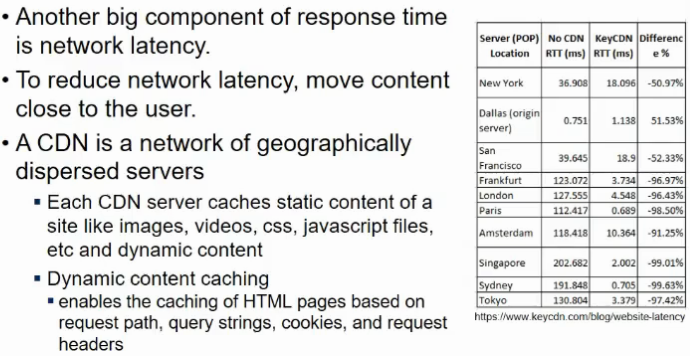

- another is **Content delivery network**
  - reduces latency
  - content is brought from server, and cached to nearest CDN server
  - generally static content is cached

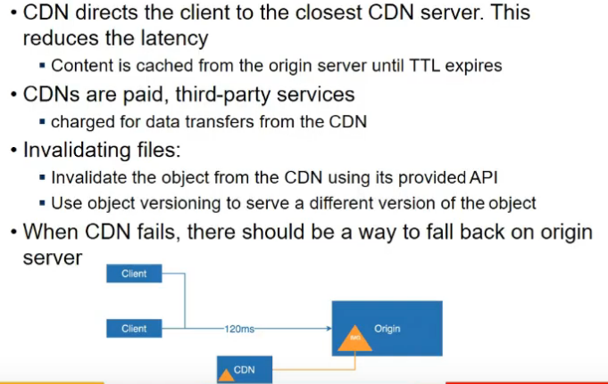

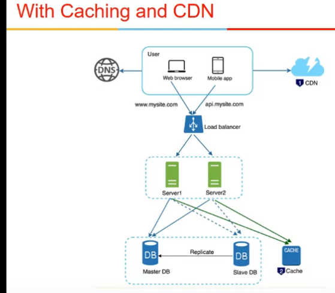

### Stateless Web Tier

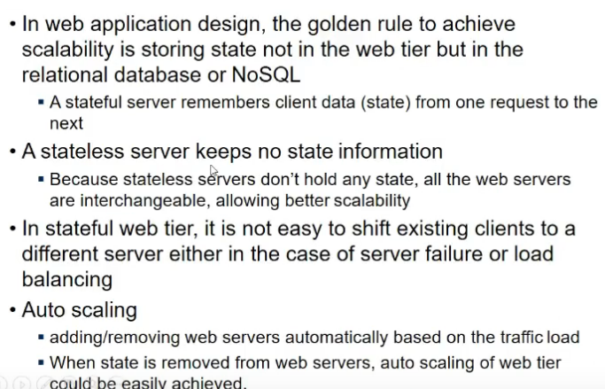

- one other limitation to scaling
- webserver keeps track of who have logged in
- this makes scaling difficult, why??
  - stateless server does not store anyth in memory, sab kuch db server me
  - whaa se read and then process
- if a webserver is stateful and memory bhar chuki, nayi req ayi toh it cannot handle, load balancer should be able to separate this req and move to other server but it cannot do agar stateful hai, bcz in-memory se shift karna is mushkil
- stateless stores all session data in storage layer
- next req can be redirected to any serer and they get user data from storage layer
- auto scaling
  - stateless le

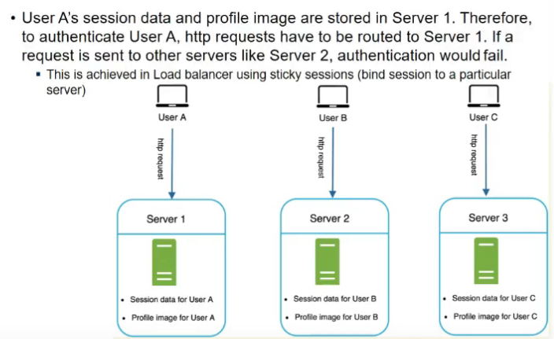

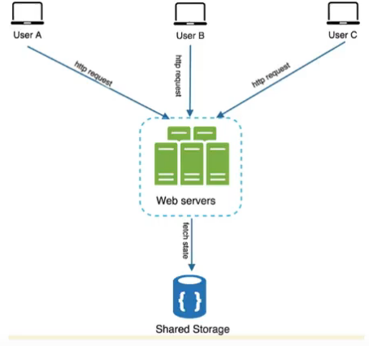

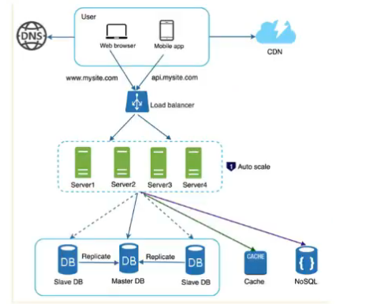

### Hosting on Multiple datacenters

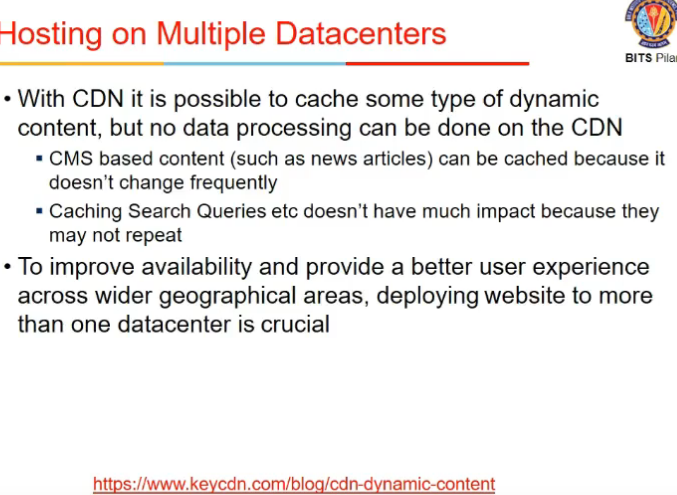

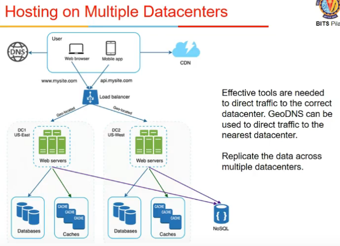

### GeoDNS

- maps ip to location and tells kis server ko lu

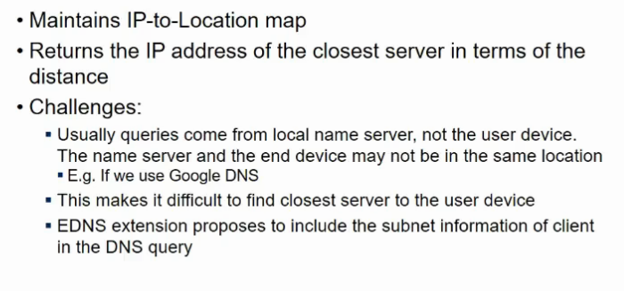
