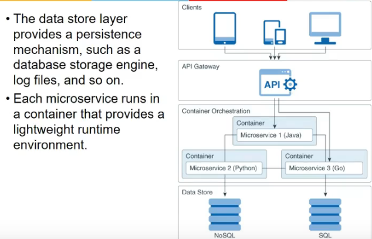
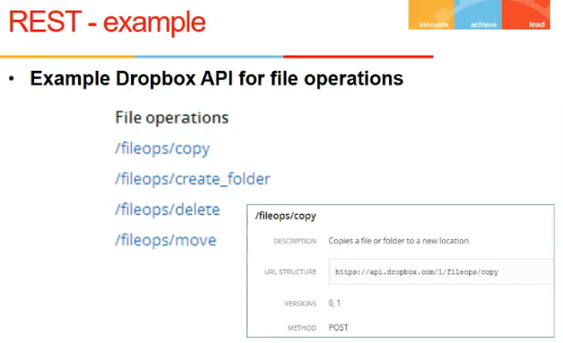

# Lecture 8

- [Lecture 8](#lecture-8)
  - [Video](#video)
  - [Slides](#slides)
  - [Summary](#summary)
  - [Further Scaling of Web Tier](#further-scaling-of-web-tier)
  - [Microservices - Intro](#microservices---intro)
  - [API vs Message Queues](#api-vs-message-queues)
  - [Messgae Queues and microservices](#messgae-queues-and-microservices)
  - [Scaling Database Tier](#scaling-database-tier)
  - [Complexities Introduced by Sharding](#complexities-introduced-by-sharding)
  - [Microservices](#microservices)
    - [Differences between microservices and monolithic architectures](#differences-between-microservices-and-monolithic-architectures)
    - [Communication mechanism](#communication-mechanism)
    - [Limitations](#limitations)
    - [Deployment](#deployment)
  - [Web Services](#web-services)
    - [Formats for Encoding data](#formats-for-encoding-data)
    - [JSON Syntax](#json-syntax)
    - [Text and binary](#text-and-binary)
    - [Data Flow between processes](#data-flow-between-processes)
    - [Data Flow through services](#data-flow-through-services)
    - [REST](#rest)
    - [SOAP](#soap)
  - [REST - Representational State Transfer](#rest---representational-state-transfer)
    - [References](#references)

## Video

[link](https://drive.google.com/file/d/1i_NAVYwEX6FirdNLx2GJVcAE7bVgU7mP/view)

## Slides

[link1](https://drive.google.com/file/d/1wh0FMdoGBa1_5gKTZRfLyAt6cjdSgpWQ/view?usp=sharing)
[link2](https://drive.google.com/file/d/1njHzjlWuwZ1_pPCME9DOnRauAevppEIv/view?usp=sharing)

## Summary

- How can my web-server handle increasing load/number of users
- Horizontal and Vertical scaling
  - vertical = increasing capacity of system
  - fault tolerance nahi
  - horizontal = # of servers increased
  - need load balancers then
  - improving response time
    - network latency
      - users might be far away
      - CDNs
        - generally static content duplication
    - Disk latency
      - content stored in disk and has to be read
      - cache is a solution
      - mem cache is used for it
- Making wev tier stateless
  - if state hua, user session is bound to physical server and to move it across is difficult, all requests coming from user, only 1 webserver can beu sed
  - so decouple it and load session in the dtaabase
  - and now load balancer can accordingly balance the requests
- Cluster
  - horizontal scaling
  - number of servers badha and get more # of users
  - scaling should be in terms of the servers

## Further Scaling of Web Tier

- serving static file
  - html, css, images
- website is composed of these different pages
- when it is registration day
  - search faculty
  - search student will have more requests coming in(this is only for one day)
- say I have 4 servers ,each have its own apache, JSP or .NET maybe db is shared
- If I increase another webserver, I will have to replicate everyth in it also, if it is monolithic webserver
- say, jo server I am adding I only add them for search faculty facility, I cannot do.. this is problem of scalibility. I have to do for entire stack
- this is where **microservices** come in
  - divide web tier into small services(microserivces) and it leads to btr scaling

## Microservices - Intro

- initially every request was coming to port 80 ,it was viewed as single application
- again, it will come to a kind of gateway, and there will be some small small services running on webserver, entire set of services might not be running on all servers
- gateway decides where to forward request
- a microservice might need other microservices  and send reply back
- now we can scale in terms of services instead of servers
- Service composition

## API vs Message Queues

- say service 1 and 3 are reqd for completing service 4 request
  - now 4 has 2 means of accessing these services
    - API
      - wait for request to complete and then only call another fn/API
      - this is tight coupling
    - MSG queues
      - 4 puts a msg req in msg q, 1 and 3 checks agar uske lie req ayi hai
      - so asynch hai yeh
      - also, it acts as a buffer
        - agar traffic ekdm se aaya, store requests here
      - it decouples sender and rcvrs
        - rcvr need not be awake when sender sends msg
      - also language prob nahi
        - API me language matters
        - Remote Method Invocation = can be done only if java version matches

## Messgae Queues and microservices

- mqs help in decoupling services
- one service down => entire system down in monolithic arch
- here no
- also, scaling on based of serices

## Scaling Database Tier

- Sharding
  - splitting records on multiple independent servers
  - records are disjoint
  - hash function used by load balancer to find ki kis server me hoga record
    - hashing on primary key
  - 
  - Advantage
    - easy to scale up
    - to get more perf, add more shards
  - 

## Complexities Introduced by Sharding

- some key, values might be very popular so ek particular shard pe bahut load

- denormalize
  - duplicate data to get efficiency(not storage eff)

## Microservices

- monolithic
  - writing a single appln and hosting it
  - why can't we divide into services and run each separately
  - one microservice runs in a container
    - container is like an abstraction of an OS within which microservice will run
    - so we can run diff microservice in one system, each runnign in one container
    - and anyone can be using any language
- microservice is loosely coupled
  - no coupling
  - each service depends upon some resp from other service, not more than that
- shared nothing model
  - have nothing shared in between
- database they might share
- but in gen, each have its own db view
- one responsibility with one microservice
- some microservice might be composed of multiple microservices
- communication can be done via REST API, gRPC, TCP/UDP
- microservice is generally stateless
- sees each req as new
- stores state inside db, so that state is consistent

### Differences between microservices and monolithic architectures

- in monolithic
  - all things are part of a single appln
  - tho there can be layered
  - that is we can change one without affecting other
  - but scaling limitations, and one fails => whole service fails
- in microservice
  - each ms dealing with buisness logic
  - each has its own data access layer
  - data processed and send resp and UI renders it

### Communication mechanism

- REST API
  - is like HTTP request
  - URLS act as object identifier
  - it follows same semantics as HTTP
  - a HTTP req is treated as a txn
- 
- AMQP
  - advance dmsg queuing protocol
  - when commu is using msg queues

- client directly communicate with ms
  - then every ms access have to be known
- API gateway
  - mapping using url patterns to ms
  - url pattern maps to a ms
- minimize communication b/w services

### Limitations

- if bahut jyada
  - n/w overhead
  - debugging mushkil
    - kaha prob aayi, itna dher saara toh hai

### Deployment

- kubernetes help to deploy containers and each container can contain a ms

## Web Services

### Formats for Encoding data

- diff services runnning on diff systems and they want to communicate
  - data format should be standardized
- we have in-memory representation of int, float, ptrs
- when it is written on the n/w
  - int is not a single byte, it is 4 bytes
  - how these 4 bytes will be sent should be standardized
  - like MSB first etc
  - order pata hoga tabhi to decode kar payunga na bhai

- python me pickle
- java me serializable interface, etc
- these are lang dependent formats
- lang independent formats = csv, xml, json

### JSON Syntax

### Text and binary

### Data Flow between processes

### Data Flow through services

- REST and SOAP

### REST

- SOAP has its own msgs formats that has to be put in HTTP body
- REST doesn't has that
- HTTP verbs act as semantic actions
- and body as data

### SOAP

- WSDL is machine readable
  - web service description language
  - any web service can be described and kkept in registry
  - any prog which want to use this webserv, read from registry and see how to call it etc

## REST - Representational State Transfer

### References

