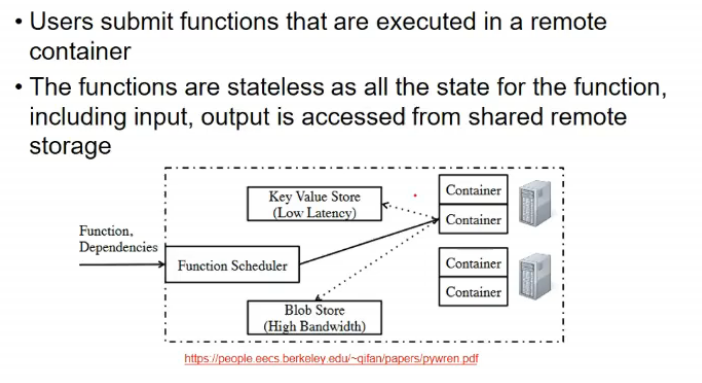

# Lecture 9

- [Lecture 9](#lecture-9)
  - [Slides](#slides)
  - [Video](#video)
  - [Serverless Computing](#serverless-computing)
  - [Programming Model](#programming-model)
  - [Platform as a service vs Serverless Computing](#platform-as-a-service-vs-serverless-computing)
  - [Serverless Comp. vs Microservices](#serverless-comp-vs-microservices)
  - [Service Level Agreements (SLAs)](#service-level-agreements-slas)
  - [Reference](#reference)
  - [Distributed Computing - Clusters](#distributed-computing---clusters)
  - [Objectives of Cluster](#objectives-of-cluster)
  - [Cluster Components](#cluster-components)
  - [Cluster Classifications](#cluster-classifications)

## Slides

[link1](https://drive.google.com/file/d/1zrrEBC4XTR1w2TgzHOPcLbZNUsUi1zWs/view?usp=sharing)
[link2](https://drive.google.com/file/d/1jVNjw-B_ftXuwlbDwSaVWkrS6YSkCoe_/view?usp=sharing)

## Video

[link](https://drive.google.com/file/d/1Uc0_OnVU4PdQxaak3kyNzcAEbRijXa5W/view)

## Serverless Computing

- does not mean servers nahi hongey
- it is just that developer ko yeh sab nahi sochna, woh cloud provider dekh lega
- u just write functions that handle incoming events say.

- AWS me lambda is serverless computing
- Container me functions execute hote, but that scheduling cloud wala dekhta
- these functons are stateless

- there are execution logs

## Programming Model

- for every event a new instance is executed, so if u want to store smth, write it to permanent storage

- boto3 is AWS's SDK
- lambda lightweight service, much used
- serverless computing is closely related to microservices.
- programmer does not worry about how to allocate resources, how many functions to run etc.
- the functions are stateless so can run in parallel, they do not share state
- they might share db state, but that db will take care of

## Platform as a service vs Serverless Computing

- Paas me bhi api de deta provider, and abstracts out things
- diff is in terms of stateless functions
  - in paas, whole programming env is stored
  - every event that comes can see cumulative state of environment
  - in serverless compu, state is stored in db and not runtime env
  - and, we can write any code w/o cloud provider packages
  - so I can shhift it to any other cloud provider
  - i.e. loose coupling here

## Serverless Comp. vs Microservices

- look up aws lambda, google cloud functions, microsoft azure ka bhi

## Service Level Agreements (SLAs)

- any service a provider offers, a agreement goes on b/w cloud and service provider
- SLAs have aspexts about service availability, performance, security, privacy etc

- there are quantifiable metrics as well called Service Level Objectives
- and if cloud provider does not provides it at any point of time, paisa bharegea

- availability rate = % time it was up

- reliability rate is only applicable to Software as a service model

- instance starting time = new VM ko start hone me max kitna time, avg kitna etc
- response time is for synchronous services
- completion time is wrt asynchronous service

- resilence = recovering

- switchover is kind of backup thing, primary fail hua, switching to second
- recovery is like system is down, kitni der me wapis a jayega

## Reference

## Distributed Computing - Clusters

- a clustyer is collection of stand alone computers on which we do some parallel processing

- pipelining
  - instruction level
- super scalar
  - having multiple pipelines, divide instrns such that no overlap b/w piipelines
- multi threaded
  - single pipeline exposed as 2 diff processors to os, and os schedules
  - ek stall hua toh dusre se lele
  - pseudo parallel - not visible to programmer
- multi-core, many-core
  - visible to os
  - it can schedule accordingly
- shared memory over custom interconnect
  - shared memory hai
- message pasing over custom interconnect
- clusters
  - systems connected over a n/w
  - not generally high-end systems
  - normal pcs le lie markets se
  - easy to use distributed parallel computing
- grids
  - sharing resources across multiple administrative boundaries
  - another laboratory ko connect kr raha and using resources
- cloud
  - it is pay per use thing

- parallel is within the system
  - I can process job within system
- clusters
  - intersection of parallel and distributed
  - parallel in terms of algorithms
  - distributed => multi-tasking system
    - bahut kam hai, har system ko kuch kam de de
    - Hadoop ki tarah
      - the ndoes ar not executing some algo

## Objectives of Cluster

- high performance
  - running on multiple systems
- high availability
  - redundancy
  - storing same data or running same service on multiple systems

## Cluster Components

- high speed n/w = infiniband, gigabit ethernet or smth
  - to enable faster communications b/w nodes
- nodes also have os on top of that
- on top of os, we have runtime environment
  - where eveloper writes code and executes
  - cluster middleware implements whatever parallel programmig task is to be done

## Cluster Classifications

- dedicated => all nodes within cluster are avilable for cluster only
- sometimes ek system pe kuch aur bhi kam ho rah eho sakte
- os in gen sabme same hota
- homogeneous => same congiguration and os sabme
- level of clustering
  - group
    - custom switch = custom build h/w
