# Lecture 10

- [Lecture 10](#lecture-10)
  - [Video](#video)
  - [PCA](#pca)
  - [SVD](#svd)

## Video

[link](https://drive.google.com/file/d/1mxnjdoizboe8pVDFHtOlFhWY_B3GR0n-/view)

## PCA

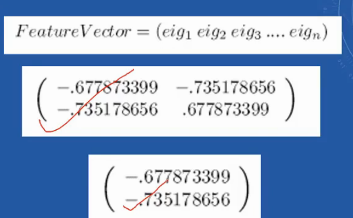

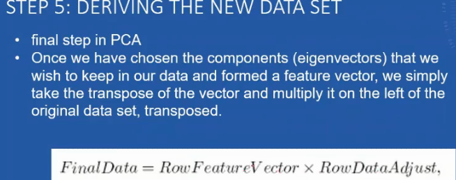

## SVD

- produces same new axes as PCA

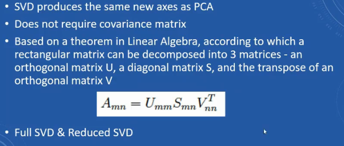

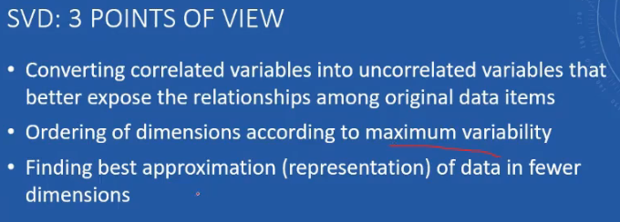

- when I try to reduce some dimensions, I loose some information
- we need to minimize that loss, that's what we do by removing least variance data

- PCA is unsupervised
- PCA is not good for labelled data - class labels wale, bcz overlap aa jayega

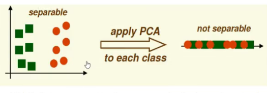

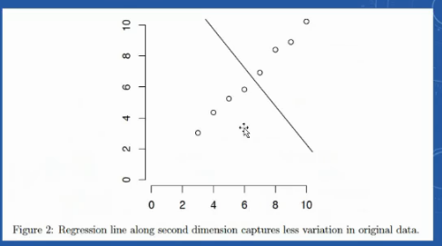

- best fit ke perpendicular line
- so 2nd best

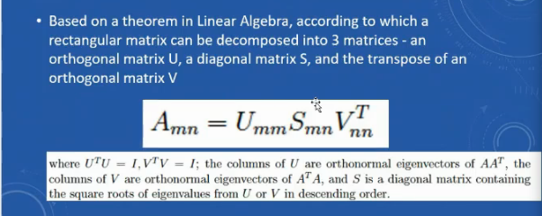

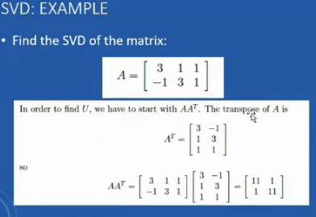

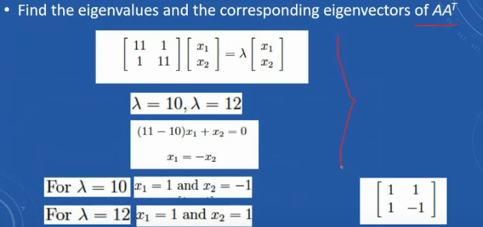

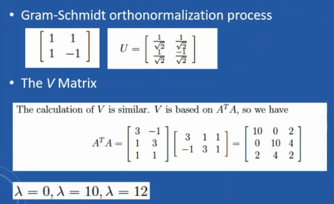

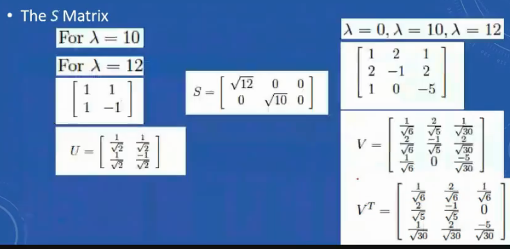

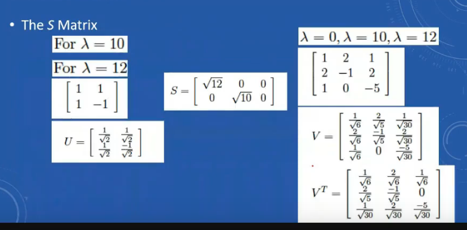

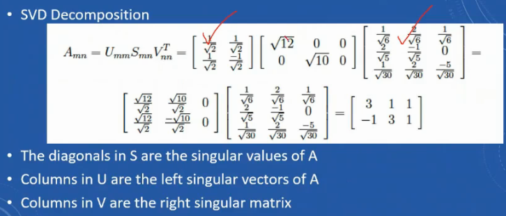

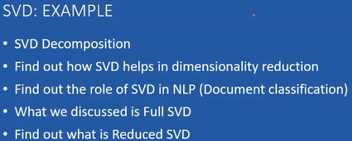