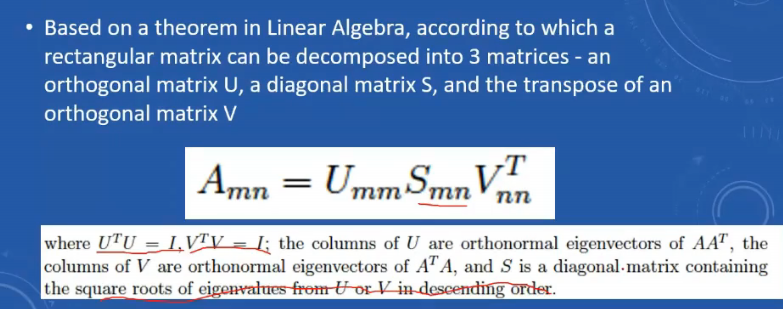
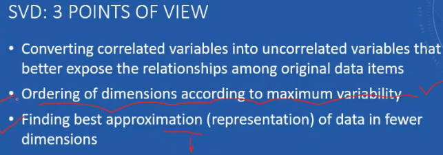
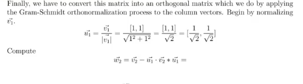
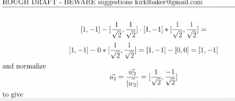
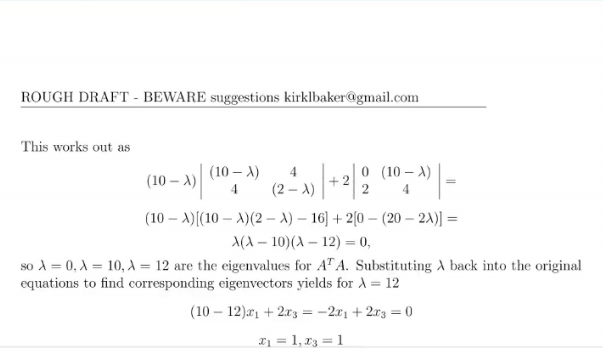
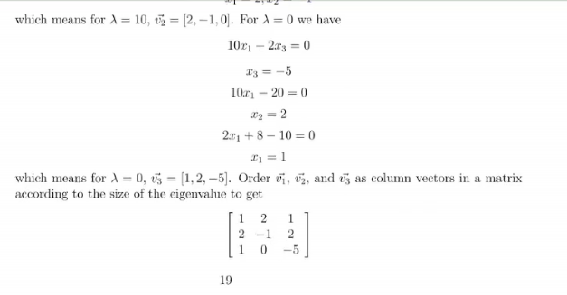

# Lecture 11

- [Lecture 11](#lecture-11)
  - [Video](#video)
  - [SVD](#svd)
  - [Inv Scree Test](#inv-scree-test)
  - [Gram Schmidt Orthonormalization](#gram-schmidt-orthonormalization)

## Video

[link](https://drive.google.com/file/d/1Tc5lSDew-UlEZ2R4Hvf14poq2pfp3l2d/view)

## SVD

- we decomposed a matrix to 3 orthogonal matrix aa' = a'a = i

- purpose of svd is not to find a but to dimesnionality reduce

## Inv Scree Test

- graph bana
- y pe percentage variance
- x pe pc1, pc2, pc3.... pcn for n dimensional data which are ordered
- pc1 = best variability, pcn = lease

- slope of curve is pehle mast, then same hora aage badh ke
- it helps to decide ki kitni dimens reduce karu

## Gram Schmidt Orthonormalization

- dimension of S matrix tells me ki kitni dimensions I am taking
- S has to be reduced diagonal matrix
