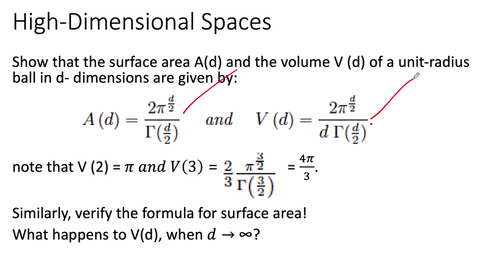
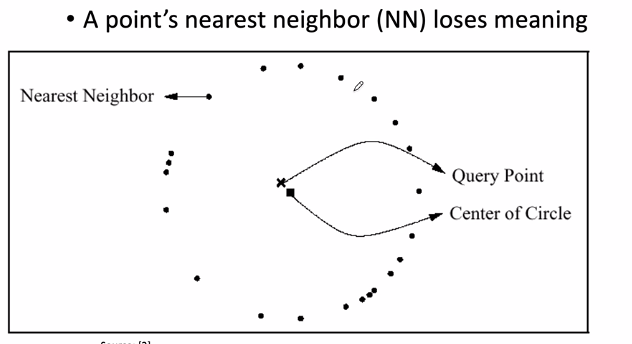
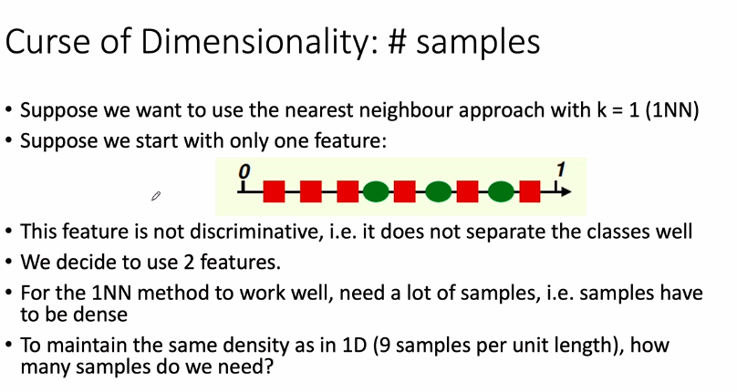
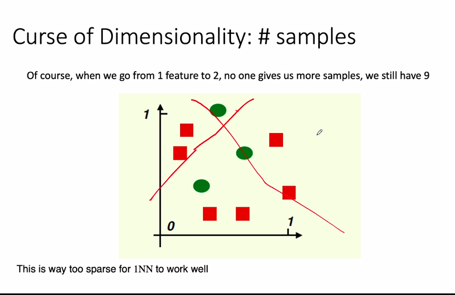
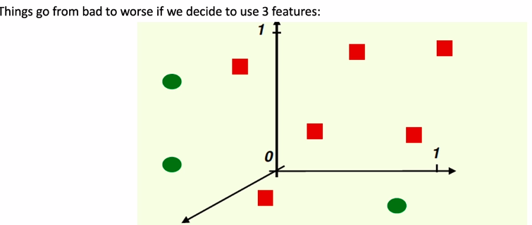
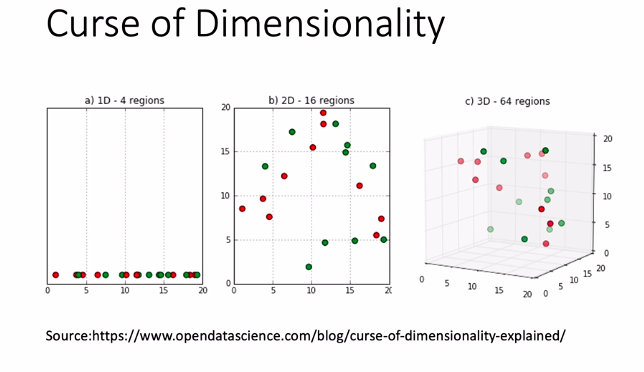
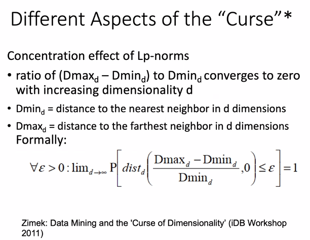
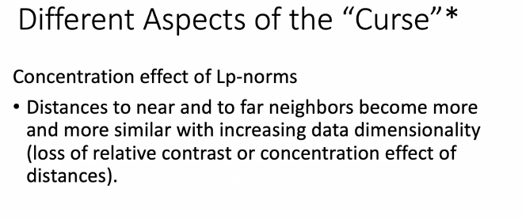

# Lecture 2

- [Lecture 2](#lecture-2)
  - [Video](#video)
  - [Summary done so far](#summary-done-so-far)
  - [High Dimensional Data](#high-dimensional-data)
  - [Gamma Function](#gamma-function)
  - [Nearest Neighbor Search](#nearest-neighbor-search)
  - [Problems with high dimensional Data](#problems-with-high-dimensional-data)

## Video

[link](https://drive.google.com/file/d/1cyRdxc2Y81-fJLvOIql-LeexTVlKRYW0/view?usp=sharing)

## Summary done so far

- Dimensionality concept

## High Dimensional Data

- n dimensional vectors - last class me dekha
- Any point in n-d space is a n-d vector
- Similarity between points
  - Use distance between two points as the criteria
  - Dot product between two product gives cosine similarity
    - Similar vectors will give high dot product

## Gamma Function

- generalization of factorial for real and complex numbers

## Nearest Neighbor Search

- given some points in d-dim space
- and given a query point, find nearest neighbor
- 2d me I can visually determine as well
- In high-dimensional space, nearest neighbor loses meaning

- The reason is the ***Concentration of Lp Norm***
  - Manhattan and Eucledian dists are spl cases of Lp Norm
  - p = 1 => Manhattan, p = 2 => Euclidean

## Problems with high dimensional Data

- collectively these probs are called *Curse of Dimensionality (CoD)*
  - Running time
  - Overfitting
  - Number of Samples reqd

- the given feature is not discriminated
  - i;.e. I cannot draw a vertical line and say one side is squares, and one is circles
  - so I am not able to distinguish 2 types of points in 1d space
  - so, let's add one more dimension and maintain same density
    - 9 points in 1d => 9x9 points in 2d?
    - but we have 9 points only bhai
  - 
- 
- Linearly Separable data
- what we can do to make data not linearly separable in lower dim space to make it linearly separable in high dim space
- to keep same density ,I will need 9x9x9 = 729 points but I only have 9 points
- so data become sparse
- 
- and most of the techniques like 1nn do not work when data is sparse, bcz in high-dim spaces, concept of dist becomes meaning less, all appear at equidistant

