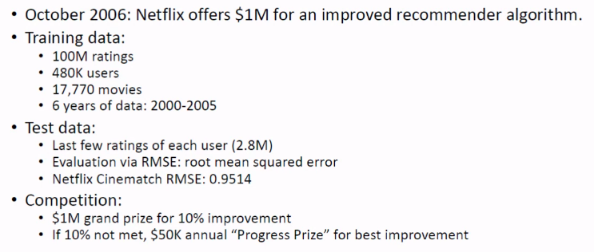
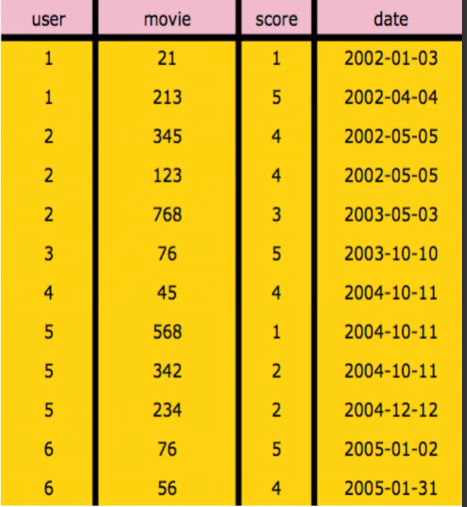
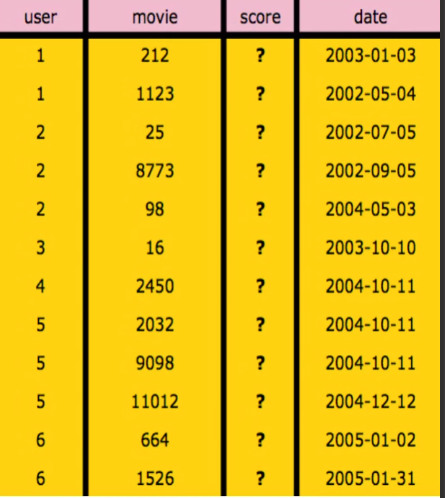
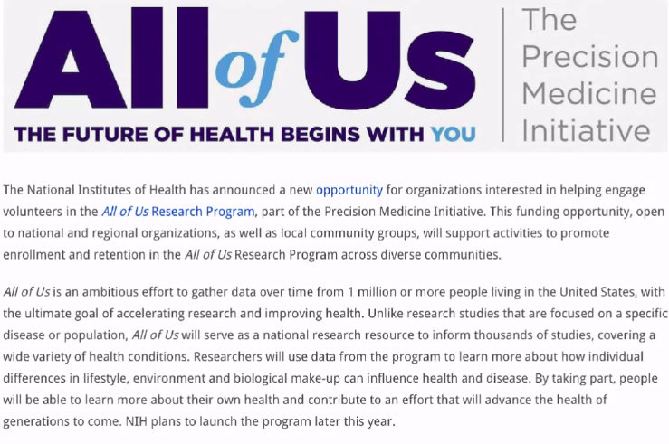
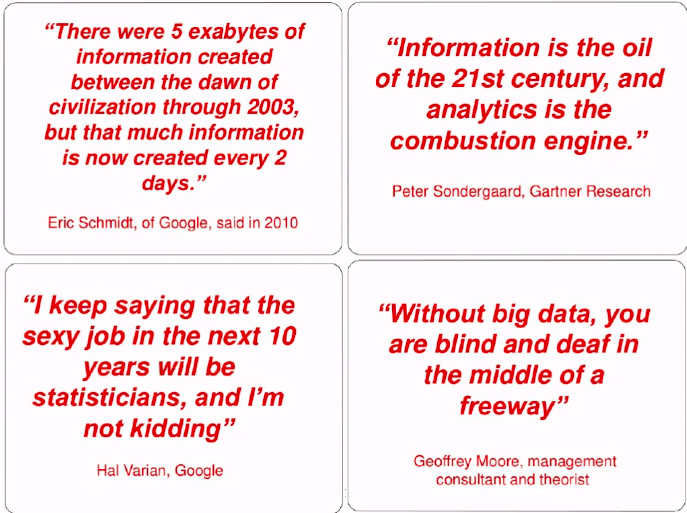
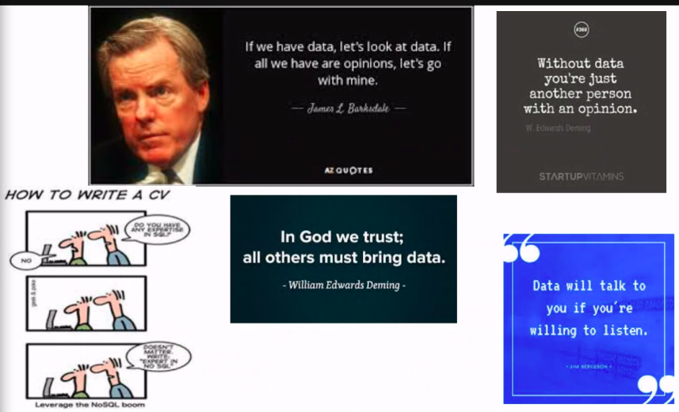
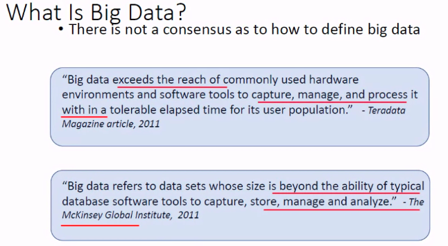

# Lecture 3

- [Lecture 3](#lecture-3)
  - [Video](#video)
  - [Some Interesting Success Stories](#some-interesting-success-stories)
    - [Netflix](#netflix)
    - [Input data](#input-data)
    - [Test data](#test-data)
  - [All of Us](#all-of-us)
  - [Is Data all we need](#is-data-all-we-need)
  - [Data](#data)
  - [BIG DATA](#big-data)

## Video

[link](https://drive.google.com/file/d/13lj7dZfJc6zCzp_8GMwyI0GiRp3wYgW1/view?usp=sharing)

## Some Interesting Success Stories

- [link](https://drive.google.com/drive/folders/11qO6rEmSuQf9vvpCbGIxRmvLzhREdpVf?usp=sharing)

### Netflix

### Input data

### Test data

## All of Us

- personalized medicine

## Is Data all we need

- article - unreasonable effectiveness of data - Peter norvig
- The end of theory: the data deluge makes the scientific method obsolete

## Data

- what is data
- why are we interested in it
- sources of data
- management of data
- big data
- what's the biggest asset of companies like Google, Yahoo, Amazon, FB, Walmart, etc.?
  - DATA

## BIG DATA

- growing at a very fast rate
- as it grows, it renders the computing power obsolete very quickly

