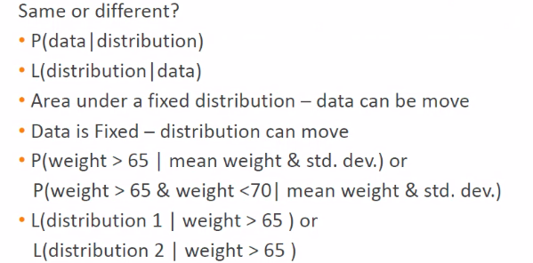

# Lecture 4

- [Lecture 4](#lecture-4)
  - [Video](#video)
  - [BIG Data](#big-data)
  - [Real-time data](#real-time-data)
  - [3 Vs of BIG Data](#3-vs-of-big-data)
  - [Skill sets required for data science](#skill-sets-required-for-data-science)
  - [Importance of beliefs](#importance-of-beliefs)
  - [Probability and Likelihood](#probability-and-likelihood)

## Video

[link](https://drive.google.com/file/d/1KSGNQ7ZsmuSrh6c8sBh94wWCOyew8Bvi/view?usp=sharing)

## BIG Data

- one which renders ur computing power obsolete very quickly

## Real-time data

- [aircraft](aircraft.png)

- social media
  - 
- smart meters

## 3 Vs of BIG Data

## Skill sets required for data science

- prob n stats
- linear algebra
- vector/tensor analysis
- modelling high dimensional data

## Importance of beliefs

*If I hadn't believed it, I would never have seen it* - Anon- The Film(2018)

## Probability and Likelihood

- in medicine case, I would like second probability, it is aka posterior prob