# Lecture 5

- [Lecture 5](#lecture-5)
  - [Video](#video)
  - [Types of information](#types-of-information)
  - [Probability](#probability)
  - [Bayes' Theorem Overview](#bayes-theorem-overview)
  - [Bayes properties](#bayes-properties)
  - [2 approaches to prob - Bayesian vs Frequentist](#2-approaches-to-prob---bayesian-vs-frequentist)
  - [Problems with Bayesian](#problems-with-bayesian)

## Video

[link](https://drive.google.com/file/d/1rcXCTT2lRxjlGOKBg3SL8I_EVsqqYLMB/view?usp=sharing)

## Types of information

- want to  convert from not useful to useful one
- want to convert from one I **have** to one I **want**

## Probability

- extension of logic to deal with the uncertainity
- logic - set of formal rules to determine what propositions are implied to be T/F given the assumption that other porpositions are T/F
- prob = set of formal rules to determine likelihood of a  proposition being T given the likelihoods of other porpositions being T

## Bayes' Theorem Overview

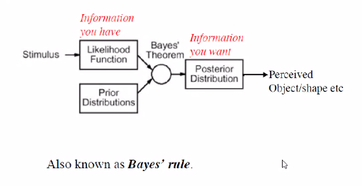

- on the left side I have info
- on right side I get in form of posterior distribution, the info I want
- eg: left me jayega my test came positive, right me aayega whether I have corona

- I have an acoustic signal, I want to find what is being said 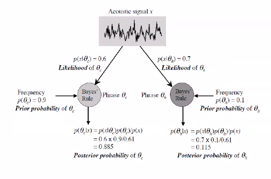
  - last lec's video me se = four candles vs fork handles
  - frequency
    - freq of ppl asked for fork handles
  - **MAP rule** - Maximum a posterori
    - jiski posterior prob jyada, woh le le
    - so customer is asking for candles
  - p(x) is acoustic signal that person is generating
    - so we are taking into account what he generated + what was historical data
- This is **Baye's inference engine**
  - it is perfect
  - no other engine gives btr results than this
  - it doesn't means ki this doesn't gives wrong results

- Suppose u went to a doctor with some symptoms and ur doctor says ~90% of ppl who have a particular disease have these symptoms
  - => P(symp | disease) = 0.9
  - should I be worried
  - should the doc have told u this
  - what would the doc have told u
    - P(d|s) would have been btr
  - so we have to convert not-useful to useful
  - 1st prob is likelihood, second is posterior
  - What is stimulus in this case
    - patient going to doctor is a stimulus
- Another example - 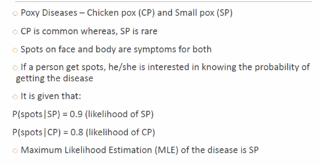, 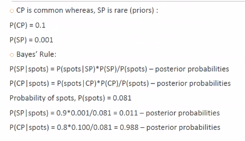
- there is a diff b/w MLE and Maximum A Posterior prob

## Bayes properties

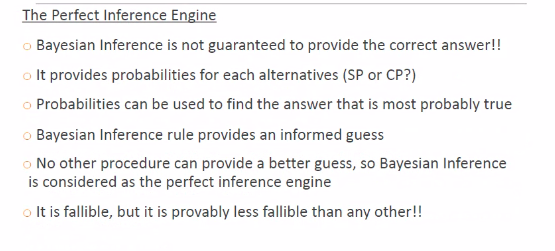

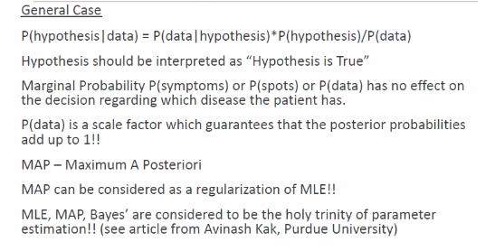

## 2 approaches to prob - Bayesian vs Frequentist

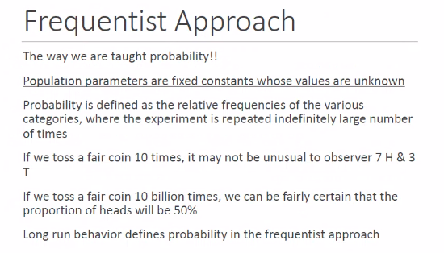

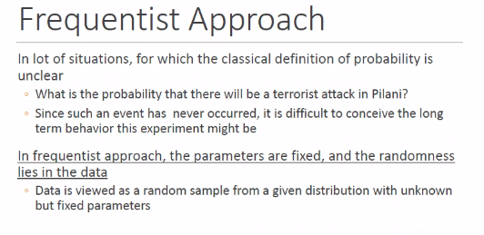

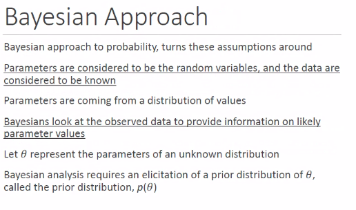

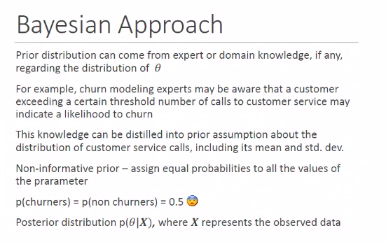

- non-informative priors, sabko equal prob de di maine

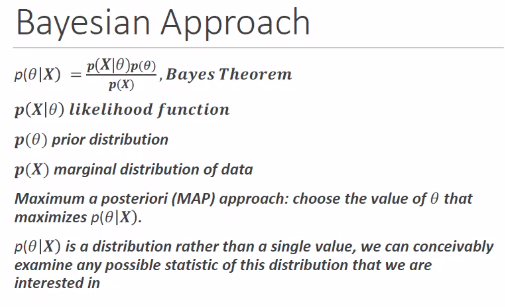

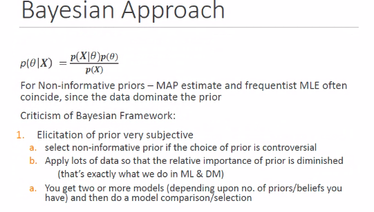

## Problems with Bayesian

