# Lecture 6

## Video

[link](https://drive.google.com/file/d/1q4PKzQiPmKZ6qtboBpp79424jgoreo-E/view?usp=sharing)

## Bayesian

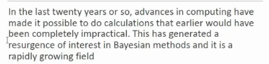

## Bayesian Estimation

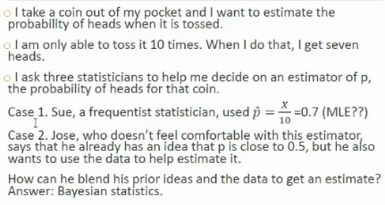

- I have no idea if coin is biased or not
- so I will not directly say P(head) = 0.5
- 3 statistician se pucha
  - first ne MLE lagaya and .7 boldia
  - second ko lagta tha .5 ke close ana chahiye tha
    - isko kuch belief tha ki p close to .5, but belief se nahi jana tha, so use karega bayesian 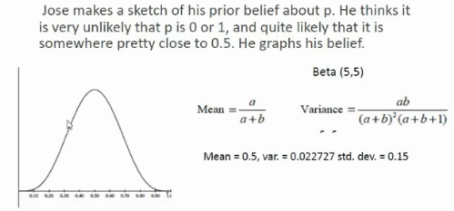, 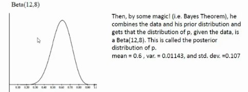
  - third statistician 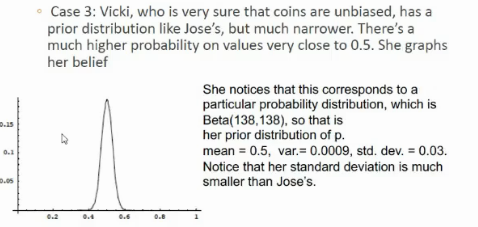

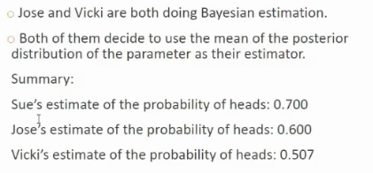

- sue toh barbaad hai, bcz 7 out of 10 ek bar aya ok, bar bar nahi aayega

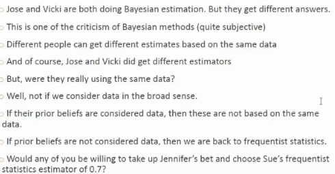

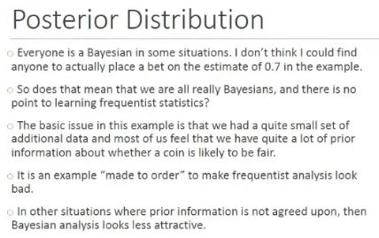

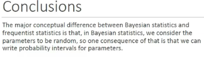

## Bayesian ML Algos

- Naive Bayes classifier
- bayesian belief networks
- bayesian linear regression
- expectation maximization clustering

## Gaussian

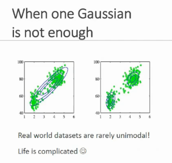

- unimodal = generated by single distribution

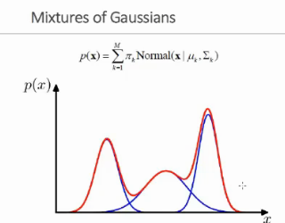

- 3 gaussians hai
- and red = the curve I wanted to model
- gaussians are used as basis functions
  - basis = stack some functions to approxximate a function

## Summary

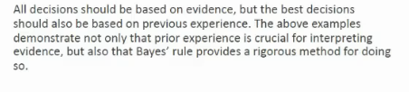

## Bayes Theorem overview

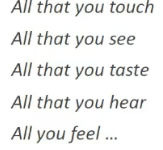

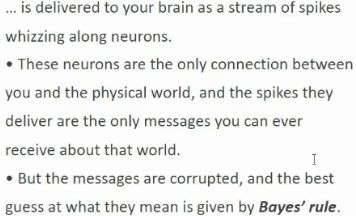

## Quiz

- what kind of world we live in?
  - multimedia world, video pictures see kar rahe
  - what about machines?
    - does it see image as 2 dimensional
      - no, it sees as collection of px
      - so mxn dimensional for machines
      - neural n/w yehi karte
