# Lecture 7

- [Lecture 7](#lecture-7)
  - [Video](#video)
  - [Topics](#topics)
  - [Probability Distributions](#probability-distributions)
  - [Random Variable](#random-variable)
  - [Probability](#probability)
  - [Prob Distribution](#prob-distribution)
    - [Binomial Prob Distribution](#binomial-prob-distribution)
    - [Expected Value and Variance](#expected-value-and-variance)
    - [Normal Distributions](#normal-distributions)
    - [Beta Distribution](#beta-distribution)
    - [LogNormal](#lognormal)

## Video

[link](https://drive.google.com/file/d/1zeKEZCz8xDcJZC6v-cDPDnAvYDlGlLtQ/view)

## Topics

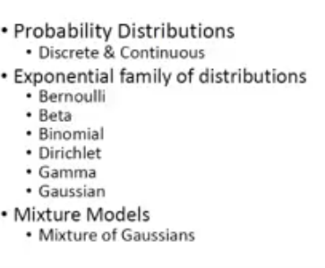

## Probability Distributions

- What is the importance of it?
- maan le avg height of students nikalni bits ke, how do u do?
  - we will collect data.
  - Can u associate it with some prob distribution?
    - most ppl will be around avg, kuch hi bahut tall ya short => normal
    - similarly marks of students bhi normal se..
- most of real life problems are not unimodel, we can have many distributions and of different types
- in case of heights, we will have 2 distributions mixture, ek for avg ht of males, ek for females

## Random Variable

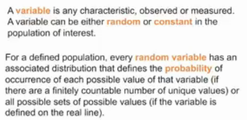

- point prob of a continuous distribution is 0

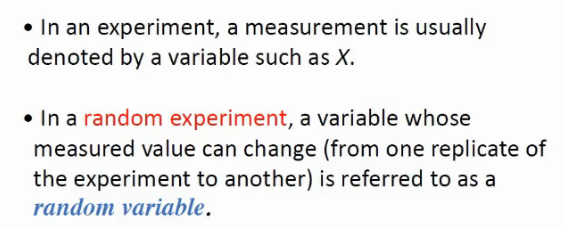

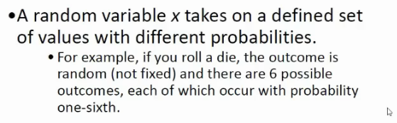

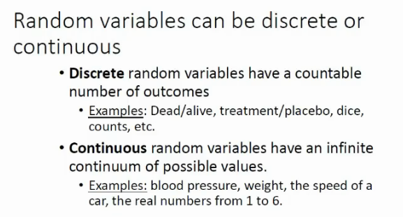

## Probability

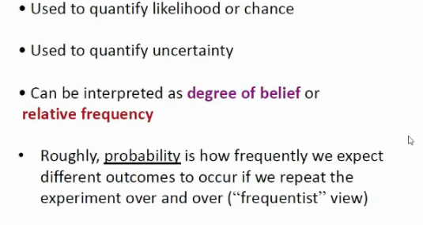

## Prob Distribution

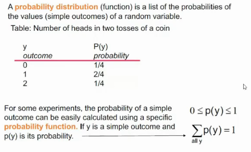

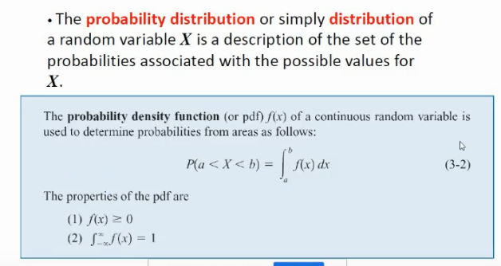

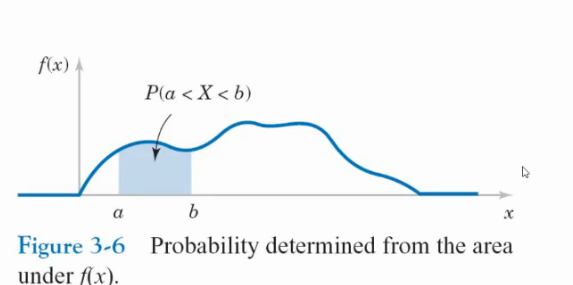

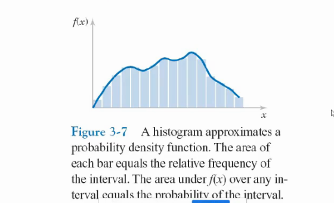

### Binomial Prob Distribution

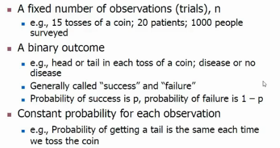

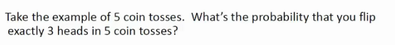

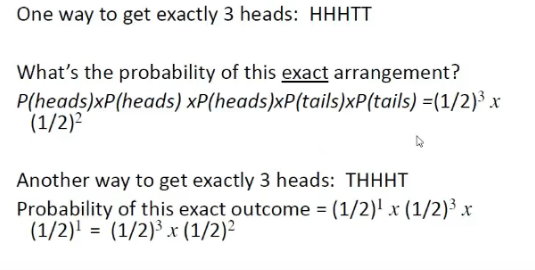

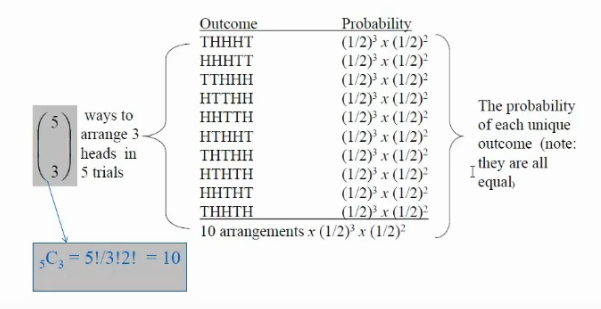

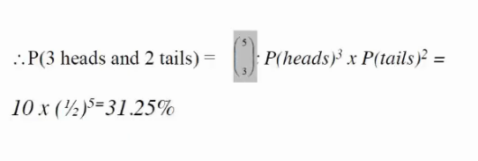

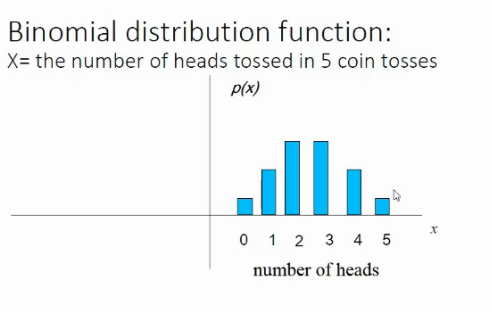

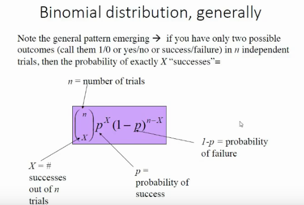

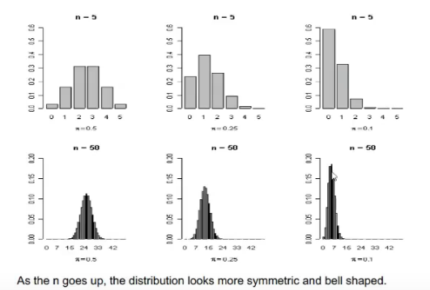

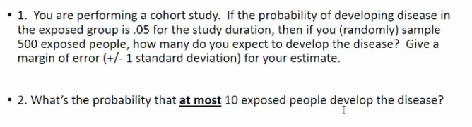

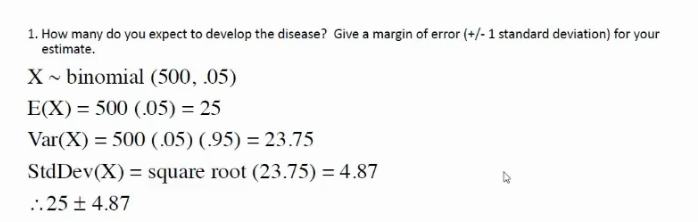

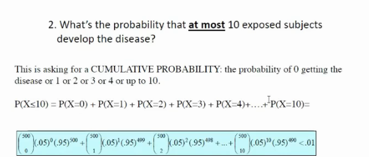

### Expected Value and Variance

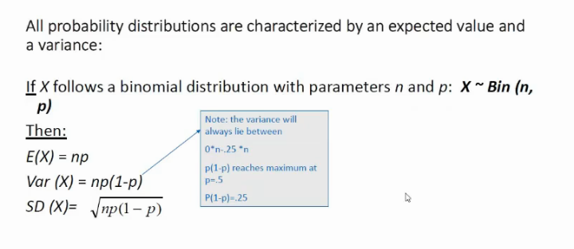

### Normal Distributions

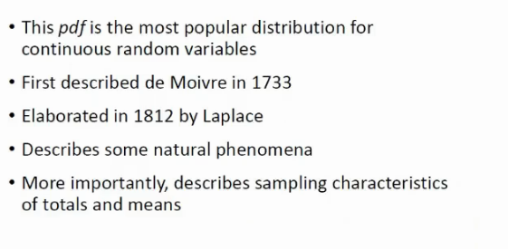 

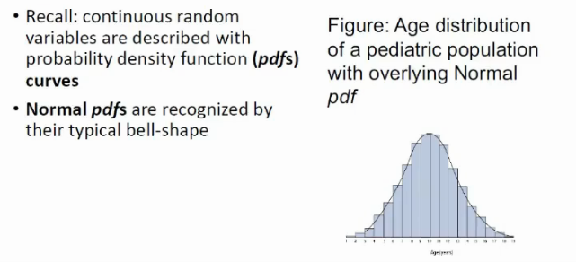

- this is for 1 dimensional variable, what if 2 dimensional ho variables
- say age and height
- expand it to 3d

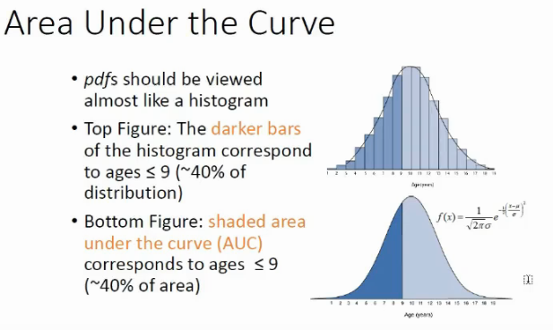

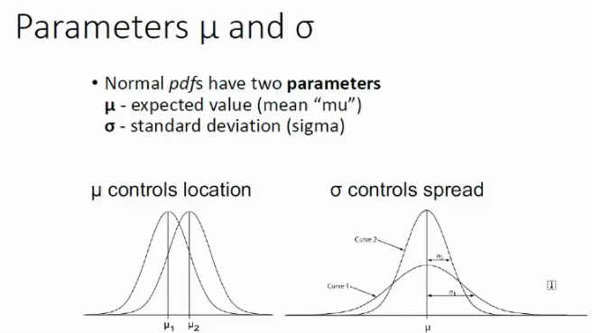

- say u1 is ht of mails, and u2 of femails

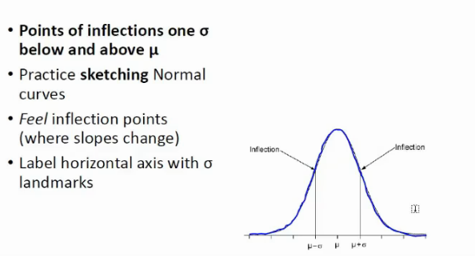

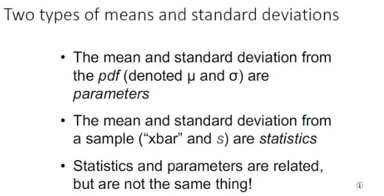

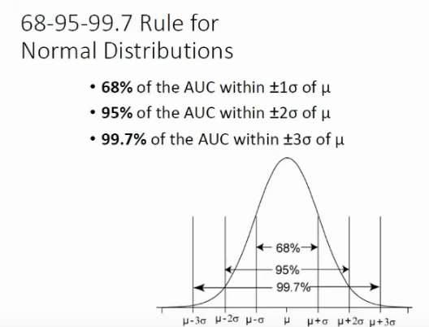

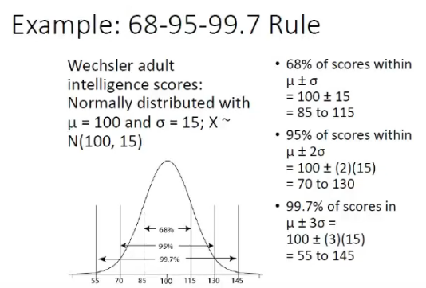

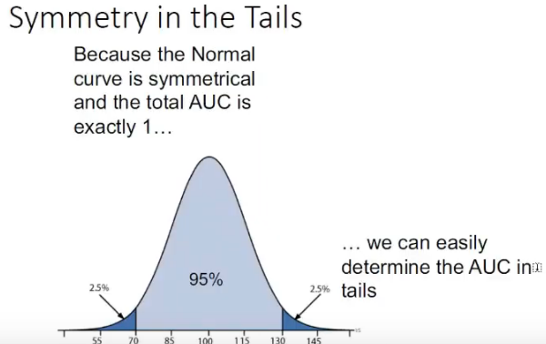

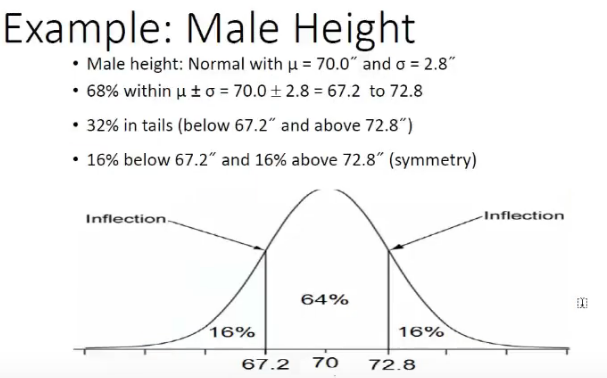

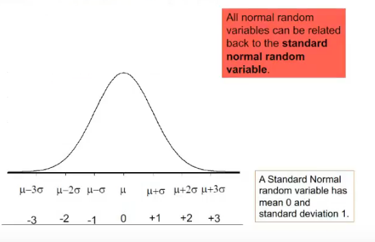

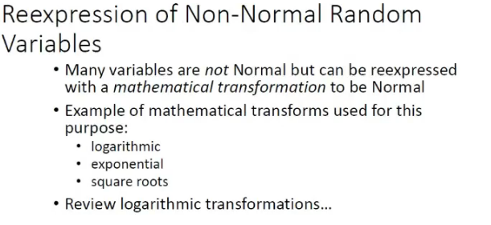

- sometimes values might not follow normal distribution, we might take sq roots or smth and make them normal

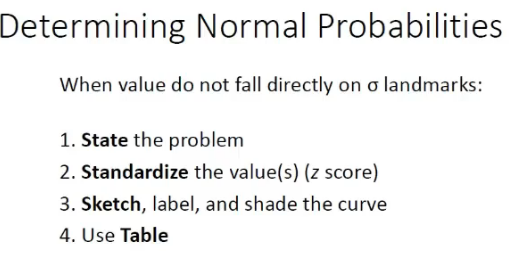

### Beta Distribution

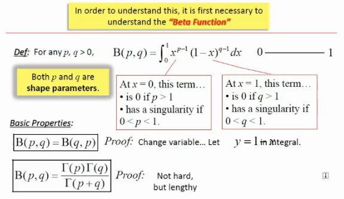

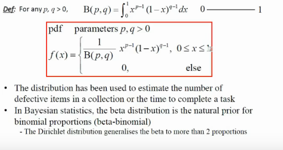

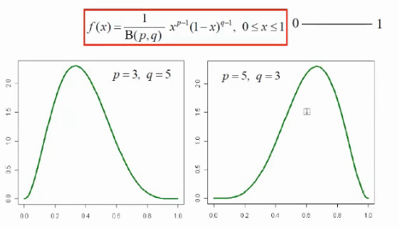

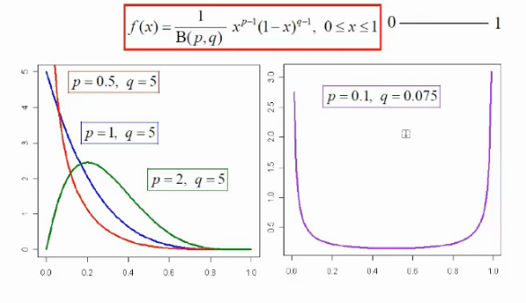

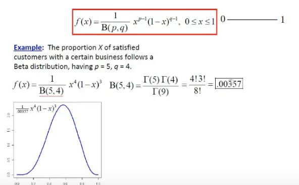

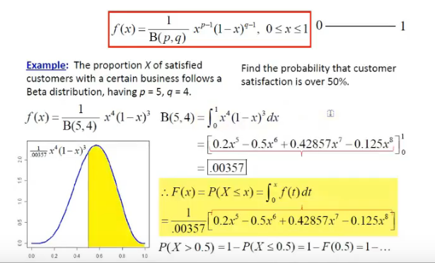

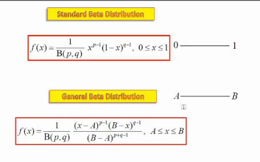

### LogNormal

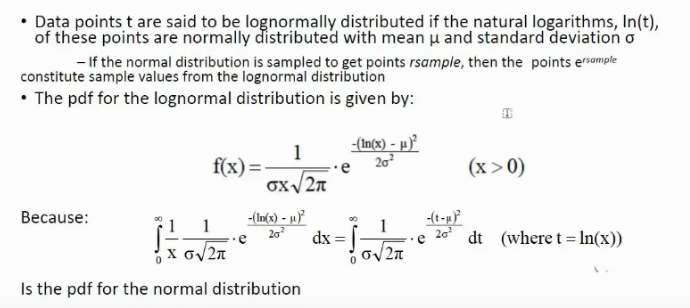
