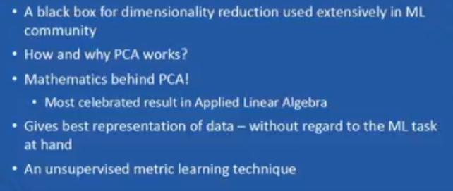
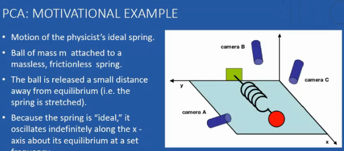
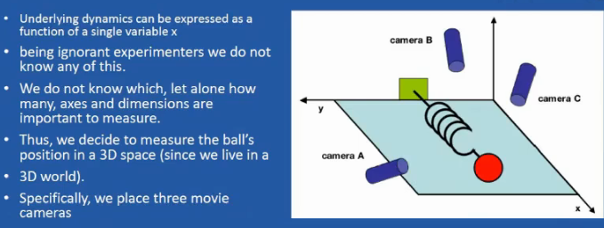
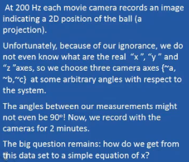
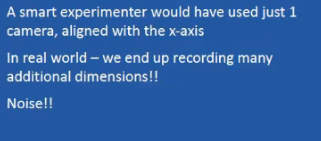
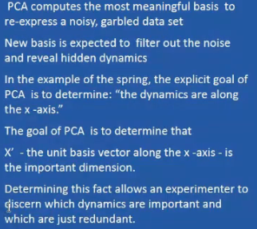
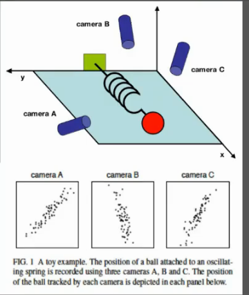
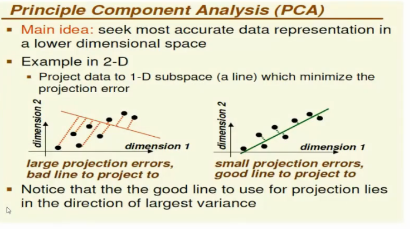
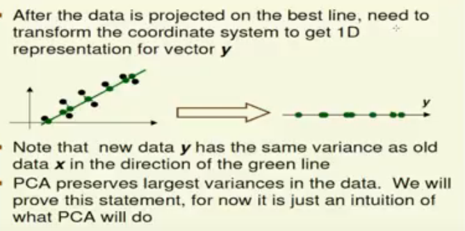

# Lecture 8

- [Lecture 8](#lecture-8)
  - [Video](#video)
  - [Topics](#topics)
  - [PCA](#pca)

## Video

[link](https://drive.google.com/file/d/1-csK8Ra1b1Nu5_UWLKx_5J5aYHZne2D5/view)

## Topics

- dimensionality reduction
  - Principal Component Analysis - PCA
  - Singular Valued Decomposition - SVD

## PCA

- to reduce number of dimensions
- why?
  - we might not have enough computational power

- the cameras placed are arbitrary oriented

- so how do we remove unwanted data

- I have to fidure out from these 3 figures ki movement is along x-axis

- red and green lines depict a line along which I am projecting
- red line me bahut error
- data points ke term me variance is more in red line
- green is the best fit line
- so find best fit line
- aagr 3d data hai, best fit plane nikal
- agar n-d space hai find n-1 dimensional hyperplane
- so pca ko kisi bhi dimensions pe laga sakte
- I want to reduce one dimension out of the two, the new dimension need not be either of these axes
- say x ya y ko remove karna, toh project kar x and y pe, yaha pe I will choose x (one having largest variance)
- but x axis does not have largest variance
- so we need to find a new dimension, which I should keep
- What PCA does?
  - I will rotate x axis, to get max variance
  - and orthogonal

- PCA allows to order dimensions wrt variance ind ecreasing order

