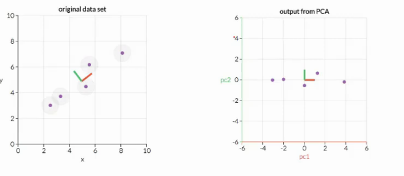

# Lecture 9

- [Lecture 9](#lecture-9)
  - [Video](#video)
  - [PCA Maths](#pca-maths)
  - [PCA: Steps](#pca-steps)

## Video

[link](https://drive.google.com/file/d/1nISvDA82CZmMk7A9SYDLH0Xs7MZgNGJN/view)

- We use PCA to avoid Curse of Dimensionality
- entropy = measure of information, depends upon variability
- more the variance, btr, else no info
- say ht, wt data tha
- I rotate coordinate axes, how to assign some semantic now
- new x,y = x', y' is a linear combination of x, y
- we might not be able to attach some semantics to x', y'

## PCA Maths

- pca is interested only in direction, and not actual origin' value, so we shift and make vector pass through 0

- covariance matrix is symmetrix

- column vector (3,2) is an eigen vector and 4 is an eigen value

## PCA: Steps

- eigen vector give me the best direction

- mean adjust data
- get covariance matrix
- find eigen values and vectors
- arrange values from highest to lowest
- corresp vectors gice principal components
