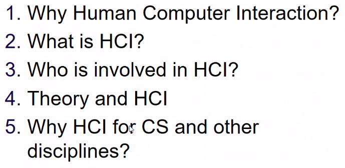
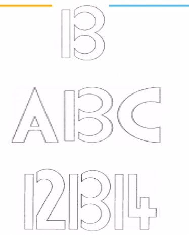
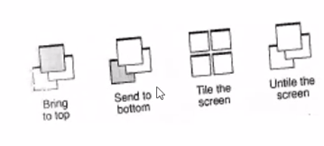

# Lecture 1

- [Lecture 1](#lecture-1)
  - [Video](#video)
  - [Prereq](#prereq)
  - [Overview](#overview)
  - [What is HCI](#what-is-hci)
  - [Who is involved in HCI](#who-is-involved-in-hci)

## Video

[link](https://drive.google.com/file/d/1-CBen6LU1yi25p3sZBUqGxoDi-FqHZyZ/view?usp=sharing)

## Prereq

## Overview

- focussing on middle dot, left characters are recognizable easily but not right ones
  - bcz, over time we have trained ourselves to read from left
  - size of left chars is more
  - proxximity of left chars is more

- same thing can be interpreted as B, or 13
- so context also matters
  - ***perception also depends upon proximity, conte***

- upper line looks larger than lower one bcz of concavity and convexity

- upper box looks longer length wise, though they are same in size and symmetrical to center

- upper ui is poorly designed, lower is btr

- scroll bar ko left me daal de toh btr  = balanced

- upper is btr than lower bcz thick border ki vajah se eye catch kar ra alag se difference dekh pa raha main

- last wale me alag se specified hai, top down ke lie usi form me aligned bhi hai so btr

## What is HCI

- Designing an interface liked by ppl, and easy to use
- Human-Machine interaction

## Who is involved in HCI

- Computer sicentists, social engineers, psychologists