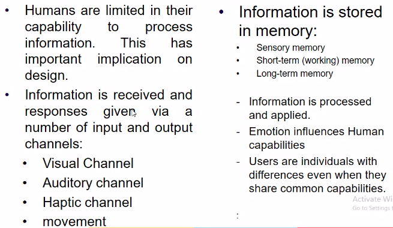
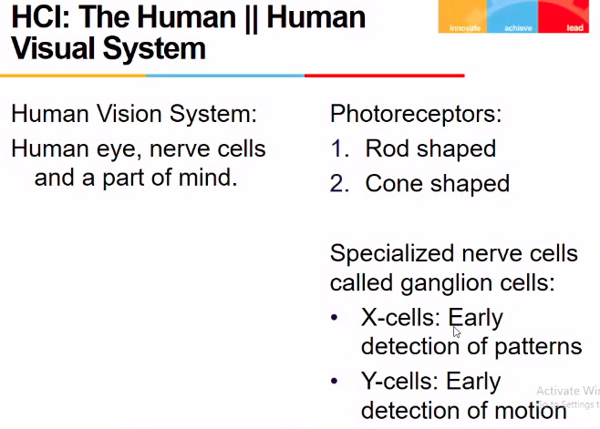

# Lecture 3

## Video

[link](https://drive.google.com/file/d/13riTHvQ6vV08swOzaTYiishFjwZdKOeX/view?usp=sharing)

## Sumamry

- there are three things
  - human
  - computer
  - task to be accomplished

## HCI : The Human

