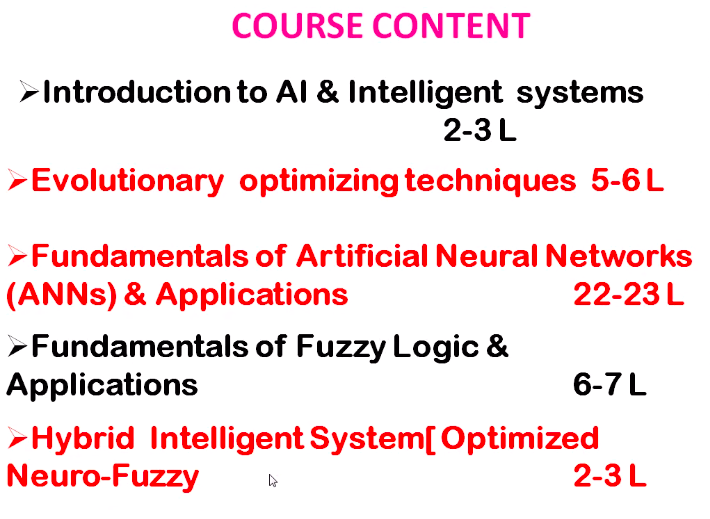
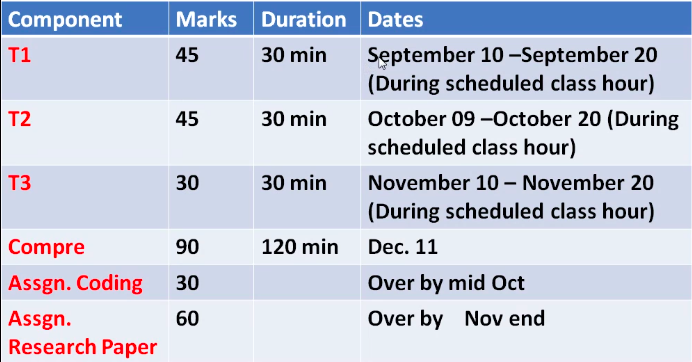
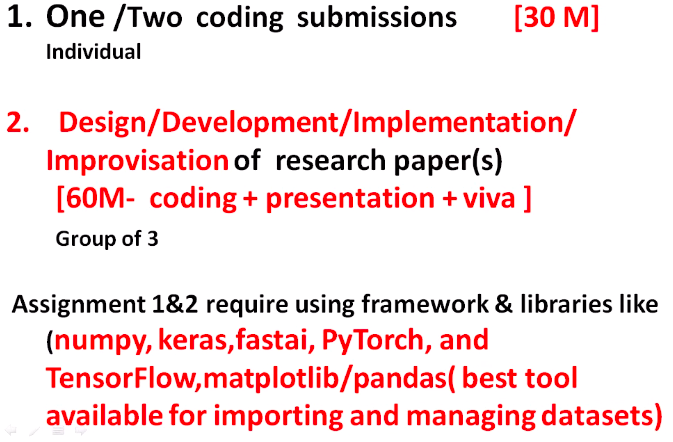
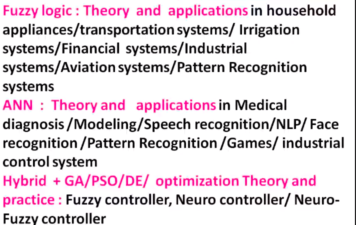
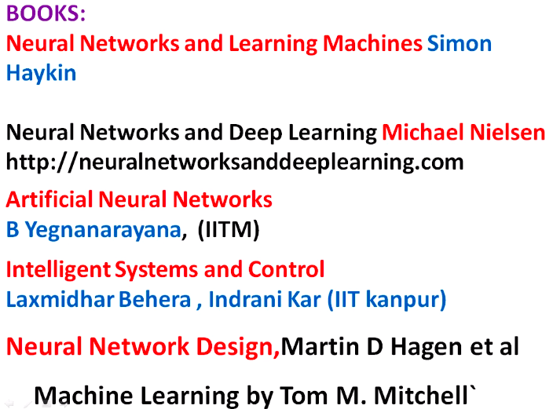
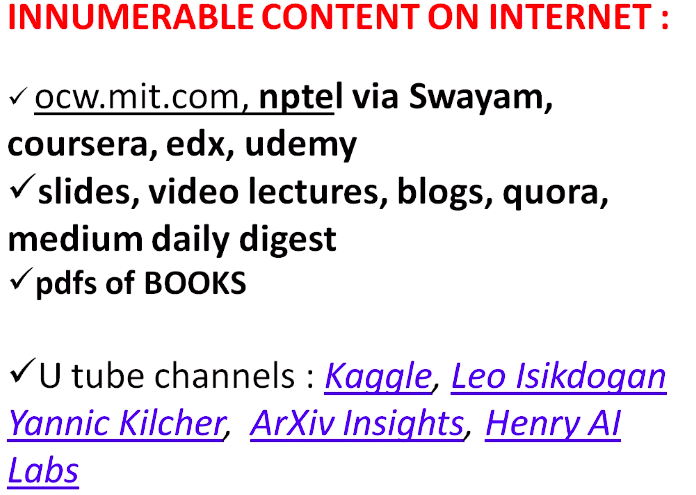
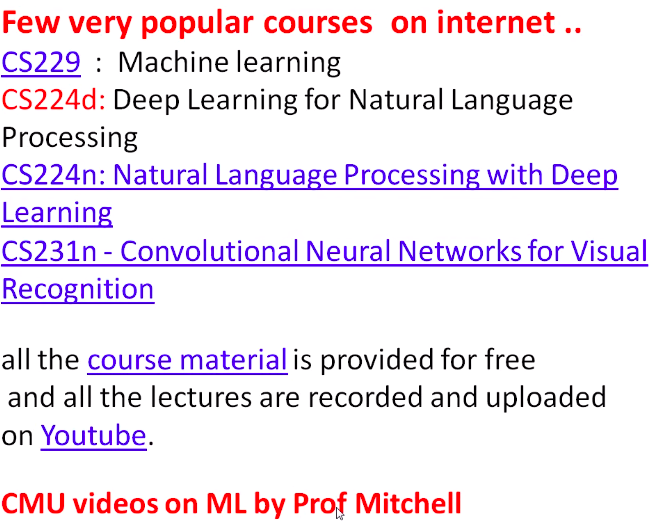
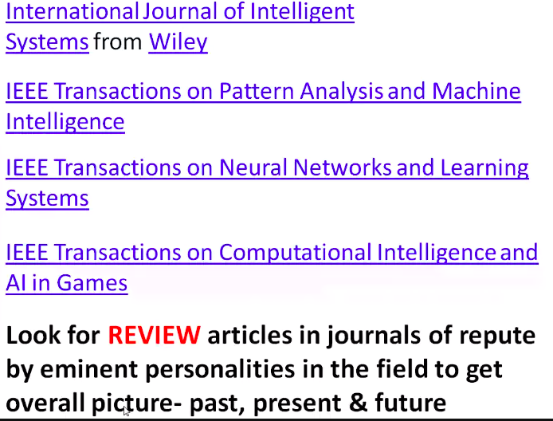
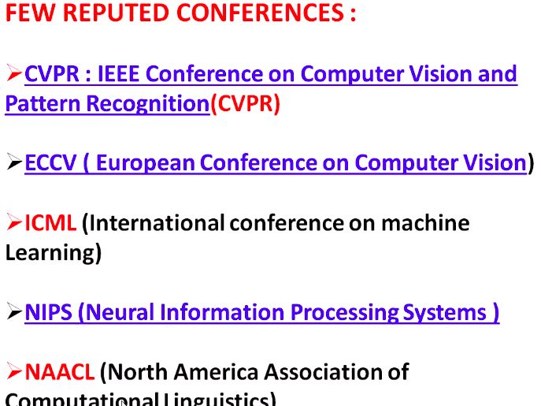

# Lecture 1

- [Lecture 1](#lecture-1)
  - [Contents](#contents)
  - [Evaluation scheme](#evaluation-scheme)
  - [Assignments](#assignments)
  - [Collab](#collab)
  - [Topics of Research paper for assignment 2](#topics-of-research-paper-for-assignment-2)
  - [Books](#books)
  - [Some Extra Materials](#some-extra-materials)
  - [Courses](#courses)
  - [Journals](#journals)
  - [Conferences](#conferences)

Neural Network = Good for learning

Fuzzy Logic = based on human reasoning

## Contents

## Evaluation scheme

## Assignments

## Collab

## Topics of Research paper for assignment 2

## Books

## Some Extra Materials

## Courses

## Journals

## Conferences

