# Lecture 4

- [Lecture 4](#lecture-4)
  - [Lecture plan](#lecture-plan)
  - [Books](#books)
  - [Topics to be covered](#topics-to-be-covered)
  - [Introduction](#introduction)
  - [Various types of optimization problems](#various-types-of-optimization-problems)
  - [Traditional and nontraditional or metaheuristic techniques](#traditional-and-nontraditional-or-metaheuristic-techniques)
  - [Some applications of optimization](#some-applications-of-optimization)
  - [A bit of history](#a-bit-of-history)
  - [Analytical method - unconstrained case](#analytical-method---unconstrained-case)
  - [Analytical method - constrained case](#analytical-method---constrained-case)

Lecturer - Bijoy Krishna Mukherjee

## Lecture plan

- module 1
  - nontraditional optimization
  - 6 lecs
- module 2
  - fuzzy logic
  - 9 lecs

## Books

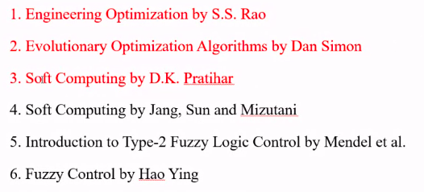

- red = module 1

## Topics to be covered

- intro to traditional optimization - 2 lecs
- nontraditional optimization - Genetical aversion - 3L
- nontraditional optimization - PSO - 1L

## Introduction

- method to find the best solution out of several feasible solutions
- first step is to express the **criteria** to judge the goodness of a solution as a function of factors wich influence the chosen criteria
  - this is known as **objective function**
- Mathematically

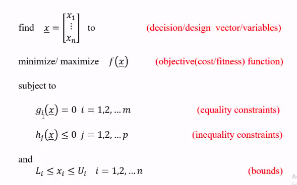

- bounds => we are confining search space

## Various types of optimization problems

- **unconstrained and constrained**
- **single** and multiobjective
  - single objective function vs multiple
- **static** and dynamic
  - dynamic => differential equations are involved
  - static => all are algebraic equations
- linear programming and **non-linear programming**
- integer programming and **real valued programming**
- we will consider bold ones in course

## Traditional and nontraditional or metaheuristic techniques

- traditional
  - based on pure mathematics
  - yields precise solutions
  - may not be suitable to solve complex real-world problems
- they both complement each other
- nontraditional try to solve acceptable soln quickly, maybe not accurate
- maximization problems can be converted to minimization problems by modifying obj functions as

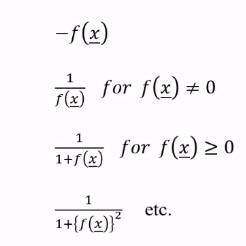

- following operations on the objective function will noe change optimum soln x*
  - multiplication/division of f(x) by  a +ve const c
  - addition/subtr a const c from f(x)

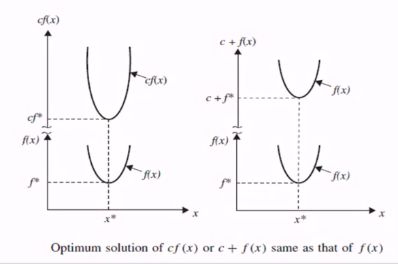

## Some applications of optimization

- almost all fields where numerical info is processed(science, engg, math, eco, commerce)
- relevant where technical or managerial decision making is involved or a trade-off is involved
- engg design applns usually have constraints since the variables cannot take arbitrary values and usually we want to minimize/maximize something
- eg designing a bridge, engg want to minimize cost while maintaining a certain min strength for the structure
- Control and signal processing applications (e.g. Kalman filter)
- many other probs can be cast as optimization problems
  - eg root finding, soln of overdetermined/underdetermined linear system of equations
    - Root Finding 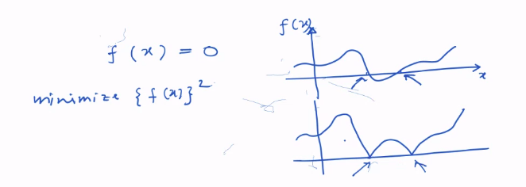
      - squaring f(x) made roots as min valued points
    - soln of overdetermined/underdetermined linear system of equations
      - overdetermined - we have more equations and less number of unknowns 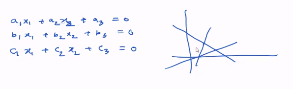
        - 3 eqns, 2 unknowns
        - from graph, no soln
        - so koi aisa point lia jo 2 ke intersection pe hai, so 3rd wala error dega, square and get sum total error
        - find a point which has least error - LEAST Square Error solution
        - write it as AX = B
        - and minimize 2 norm ||AX-B||
        - soln can be found by pseudo inverse
          - X = (A'A)inv AB, A' = A transpose
      - underdetermined
        - less equations and more unknowns 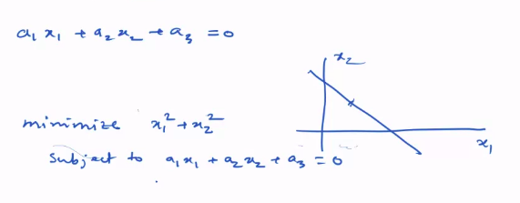
        - solution again by pseudoinverse 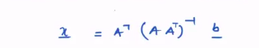
        - this is least energy solution
        - we need to find a point on line which is closest to origin

## A bit of history

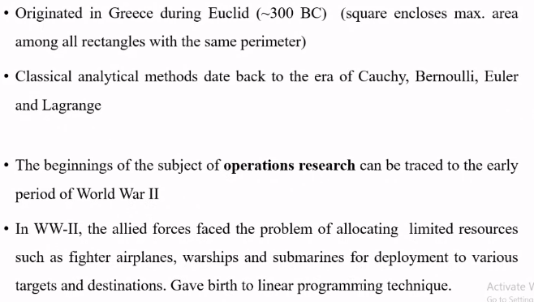

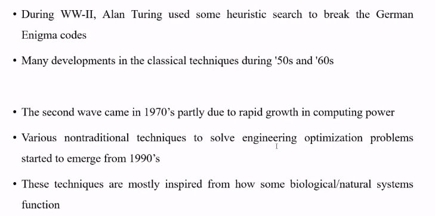

## Analytical method - unconstrained case

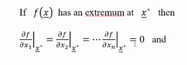

- all partial derivatives at extremum are zero
- whether it's max or min, will be given by second order - matrix is 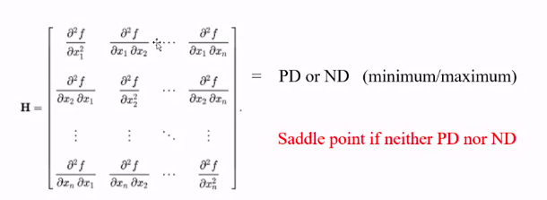
- it is multivariate extension of what we did in +2
- **Positive definite matrix**
  - determinants of leading principal minors are all positive
  - 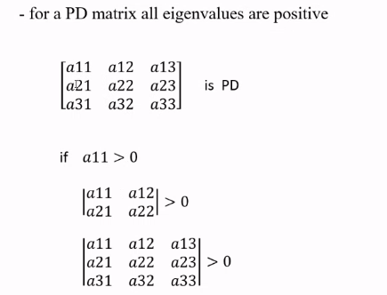
- **Negative definite matrix**
  - 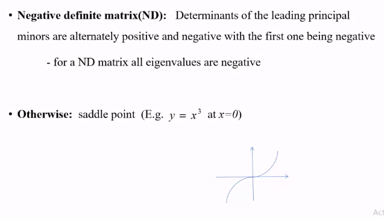

## Analytical method - constrained case

- lagrange multiplier method

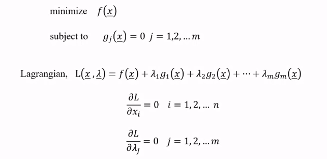

- converted equality constrained problem to unconstrained problem
