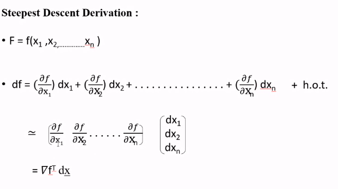
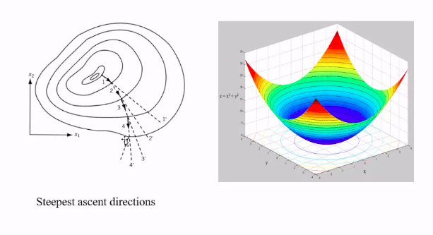
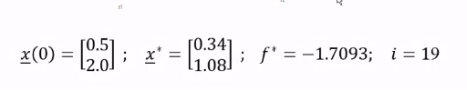

# Lecture 5

- [Lecture 5](#lecture-5)
  - [Physical Meaning of Lagrange Multipliers](#physical-meaning-of-lagrange-multipliers)
  - [Inequality constraints](#inequality-constraints)
  - [Question](#question)
  - [Numerical Method : Unconstrained prob](#numerical-method--unconstrained-prob)
  - [Steepest Descent](#steepest-descent)
    - [Stopping Criteria](#stopping-criteria)
    - [Limitations](#limitations)
  - [Momentum method](#momentum-method)
  - [Variants](#variants)

- we saw in last class Lagrange thing
  - converted equality constrained case to inconstrained thing
  - from where that was coming(formulae?)

- assume f is a function of 2 variables x1, and x2

- now moving from x1,x2 to x1+dx1, x2+dx2

then we equate dx2/dx1 from both the equations

## Physical Meaning of Lagrange Multipliers

- a measure of how rigid constraints are
- say 2 constraints g1 and g2
- λ1, and λ2 are corresponding lagrange's
- then larger λ => rigid constraint

## Inequality constraints

- we add some slack variables
- Kuhn-tucker ne ineq constrained ko eq constrained me convert kardia

## Question

- 1 eqns, 3 unknowns
- underdetermined system
- prob is 
- find lagrangian, and partial derivatives
- answer is 
- on matlab 

## Numerical Method : Unconstrained prob

## Steepest Descent

### Stopping Criteria

- so, 0.23 is optimum step size

- ans = 

- if I start from black point, I end up at another minimum, which is not optimal 
- I gpt stuck at local minimum

### Limitations

## Momentum method

## Variants

