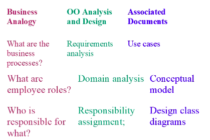

# Lecture 3

LITE

- understand buisness processes
- do domain analysis
  - identify roles of ppl who will be involved in the business processes
  - eg customer, linrary assistant, programmer, sensor, navigator
- Collaboaration among business processes
  - Who does what?
  - Object oriented design
  - assigning responsibilities to various s/w objects
  - expressed as class diagrams

## Summary

