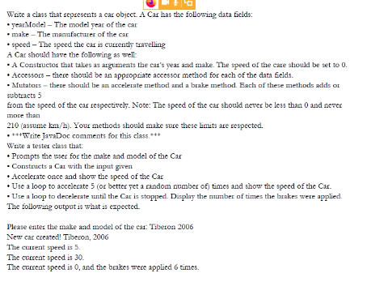

# Lecture 4

- [Lecture 4](#lecture-4)
  - [Reference](#reference)
  - [Today's Agenda](#todays-agenda)
  - [Unified Modelling language](#unified-modelling-language)
  - [Exercise](#exercise)

## Reference

- [Standish Report](https://www.projectsmart.co.uk/white-papers/chaos-report.pdf)

## Today's Agenda

- UML
- OOAD-Example
- Object Oriented software development life cycle

## Unified Modelling language

- diagrammatic language / visual language
- have to learn notations
- lang for specifying, visualizing, and constructing the artifacts of s/w system
- notational system aimed at modeling systems using OO concepts

## Exercise

