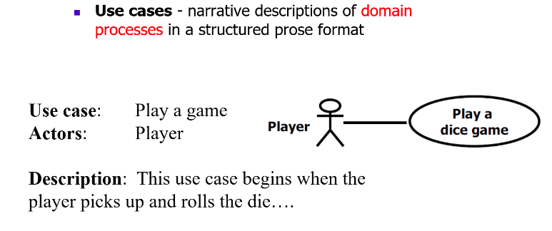
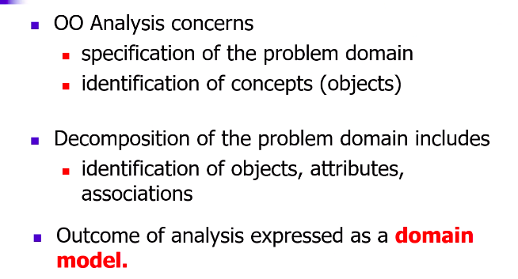
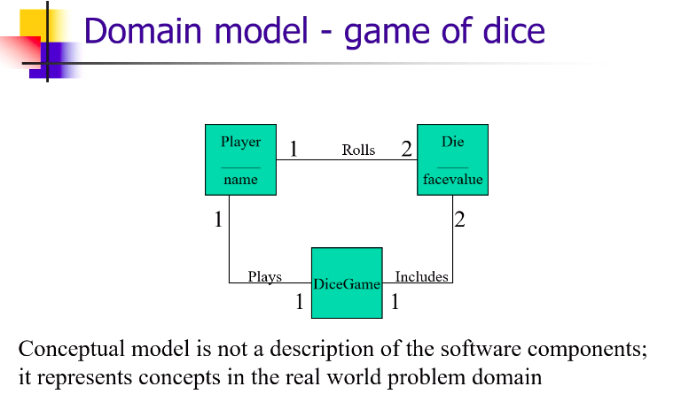
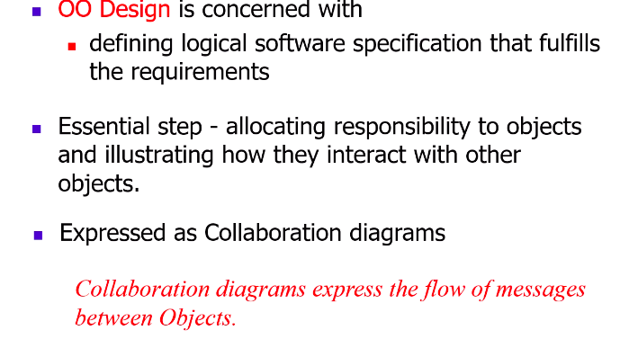
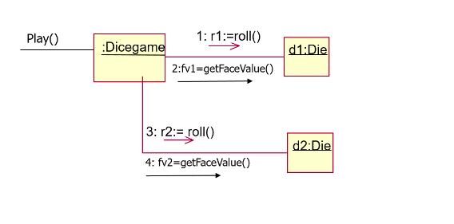
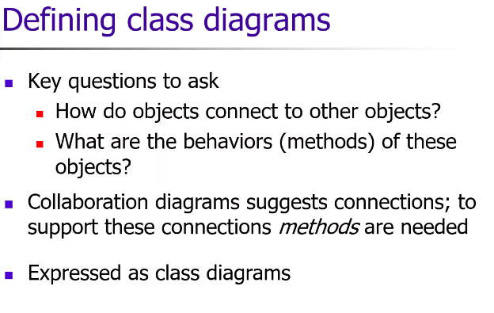
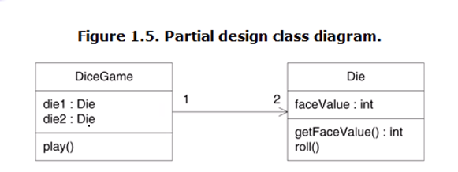

# Lecture 5

- [Lecture 5](#lecture-5)
  - [Big Picture](#big-picture)
  - [Define Use Cases](#define-use-cases)
  - [Domain Model](#domain-model)
  - [Collaboration Diagram](#collaboration-diagram)
  - [Class Diagrams](#class-diagrams)
  - [Homework](#homework)

## Big Picture

- define use cases
  - are not part of object-orientation
  - there will be user stories (in agile method)
  - helps in requirements analysis
- define conceptual model
- define collaboration diagrams
- define design class diagrams

## Define Use Cases

## Domain Model

- UML me methods nahi hongey

## Collaboration Diagram

- collab diag starts from some msg

- can also write comments also in UML diagram
  - using folded rectangles

## Class Diagrams

## Homework

- waterfall model
- and, Standish report
