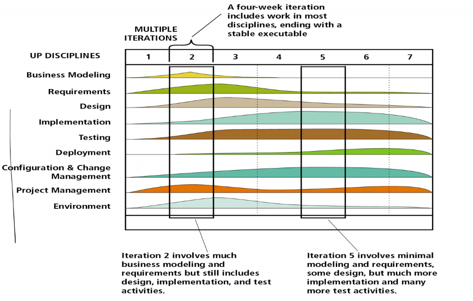

# Lecture 7

- [Lecture 7](#lecture-7)
  - [Today's Agenda](#todays-agenda)
  - [Last class](#last-class)
  - [ToDo: Benefits of an iterative model](#todo-benefits-of-an-iterative-model)
  - [Unified Development Process](#unified-development-process)
  - [Iterations](#iterations)
    - [benefits](#benefits)
  - [Summary](#summary)

## Today's Agenda

- Unified Development Process

## Last class

- Waterfall mdoel
- Spiral model
- Iterative model
- incremental model

## ToDo: Benefits of an iterative model

## Unified Development Process

- here we have 4 phases
  - inception
  - elaboration
  - construction
  - transition
- it is an iterative model
- divide big proj into number of iterations
- and in each iteration, we will do all parts : designing, planning, testing, coding
- some iterations will give me the product releases
- each iteration produces a working, executable, product that *might not be a deliverable*
- no rush to code
- **agroUML, starUML** - open source UML tools
- early iterations seek feedback from the customer. Risk and value to customer is managed through early feedback
- Customer is engaged continuously in evaluation and requirements gathering
- Arcchitecture is built during early iterations

- Component Based software development
  - build s/w system as a set of s/w components interconnected via interfaces
- uses the UML
- **use case driven**
  - a use case is a piece of functionality in the system that gives a user a result of value
  - use cases capture functional requirements
  - use case answers the quesion *what is the system supposed to do for the user*
- **architecture-centric**
  - similar to architecture for building a house
  - embodies the omst significant static and dynamic aspects of the system
  - influenced by platform, OS, DbMS, etc
  - related as ***function*** (use case) and ***form*** (architecture)
- **iterative and incremental**
  - commercial projects continue many months and years
  - to be most effective - break the project into *iterations*
  - every iteration - identify use cases, create a design, implement the design
  - every iteration is a complete development process
  - 

## Iterations

- must be selected & developed in a planned way i.e. in a logcal order - early iterations must offer utility to the users
  - iteration based on gp of use cases extensing the usability of the system developed so far
  - iterations deal with the most imp risks first
  - not all iterationsa re additive - some replace earlier iterations

### benefits

- risks are mitigated earlier
- change is more manageable

## Summary

